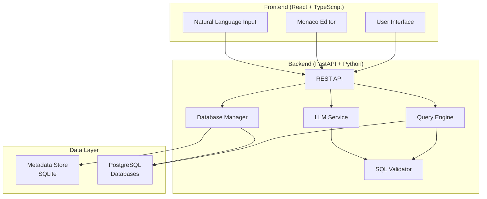

# Design Document

## Overview

The Database Query Tool is a web-based application that provides a user-friendly interface for connecting to PostgreSQL databases, exploring their metadata, and executing SQL queries through both direct SQL input and natural language processing. The system consists of a Python FastAPI backend with TypeScript React frontend, designed with safety and usability as primary concerns.

## Architecture

The system follows a three-tier architecture:

1. **Frontend Layer**: React application with TypeScript, Ant Design components, and Monaco Editor
2. **Backend Layer**: FastAPI application with Python services for database management, query execution, and LLM integration
3. **Data Layer**: SQLite database for metadata storage and PostgreSQL databases for querying



## Components and Interfaces

### Backend Components

#### Database Manager
- **Purpose**: Manages database connections and metadata extraction
- **Key Methods**:
  - `add_database(name: str, url: str, description: str) -> DatabaseConnection`
  - `get_databases() -> List[DatabaseConnection]`
  - `get_database_metadata(name: str) -> DatabaseMetadata`
  - `extract_metadata(connection: DatabaseConnection) -> DatabaseMetadata`

#### SQL Validator
- **Purpose**: Validates and sanitizes SQL queries using sqlglot
- **Key Methods**:
  - `validate_sql(query: str) -> ValidationResult`
  - `add_limit_if_missing(query: str) -> str`
  - `ensure_select_only(query: str) -> bool`

#### Query Engine
- **Purpose**: Executes validated SQL queries against databases
- **Key Methods**:
  - `execute_query(database_name: str, sql: str) -> QueryResult`
  - `format_results(raw_results: Any) -> Dict[str, Any]`

#### LLM Service
- **Purpose**: Converts natural language to SQL using OpenAI API
- **Key Methods**:
  - `generate_sql(prompt: str, metadata: DatabaseMetadata) -> str`
  - `build_context(metadata: DatabaseMetadata) -> str`

### Frontend Components

#### DatabaseList Component
- **Purpose**: Displays all configured database connections
- **Props**: `databases: Database[], onSelect: (db: Database) => void`

#### DatabaseForm Component
- **Purpose**: Form for adding new database connections
- **Props**: `onSubmit: (data: DatabaseFormData) => void`

#### MetadataViewer Component
- **Purpose**: Tree view of database schema (tables, views, columns)
- **Props**: `metadata: DatabaseMetadata, selectedDatabase: string`

#### QueryEditor Component
- **Purpose**: Monaco Editor for SQL input with syntax highlighting
- **Props**: `value: string, onChange: (value: string) => void, onExecute: () => void`

#### QueryResults Component
- **Purpose**: Data table displaying query results with export options
- **Props**: `results: QueryResult, loading: boolean`

#### NaturalLanguageInput Component
- **Purpose**: Text input for natural language queries
- **Props**: `onSubmit: (prompt: string) => void, onSqlGenerated: (sql: string) => void`

## Data Models

### Database Connection Model
```typescript
interface DatabaseConnection {
  name: string;
  url: string;
  description: string;
  createdAt: Date;
  lastConnected?: Date;
  status: 'active' | 'inactive' | 'error';
}
```

### Database Metadata Model
```typescript
interface DatabaseMetadata {
  databaseName: string;
  tables: TableInfo[];
  views: ViewInfo[];
  extractedAt: Date;
}

interface TableInfo {
  name: string;
  schema: string;
  columns: ColumnInfo[];
  rowCount?: number;
}

interface ColumnInfo {
  name: string;
  dataType: string;
  isNullable: boolean;
  isPrimaryKey: boolean;
  defaultValue?: string;
}
```

### Query Result Model
```typescript
interface QueryResult {
  columns: string[];
  rows: Record<string, any>[];
  rowCount: number;
  executionTime: number;
  query: string;
}
```

### API Response Models
```python
class DatabaseResponse(BaseModel):
    name: str
    url: str = Field(..., description="Database connection URL")
    description: str
    created_at: datetime
    last_connected: Optional[datetime] = None
    status: Literal["active", "inactive", "error"]

class QueryRequest(BaseModel):
    sql: str = Field(..., description="SQL query to execute")

class NaturalLanguageRequest(BaseModel):
    prompt: str = Field(..., description="Natural language query")

class QueryResponse(BaseModel):
    columns: List[str]
    rows: List[Dict[str, Any]]
    row_count: int
    execution_time: float
    query: str
```

## Correctness Properties

*A property is a characteristic or behavior that should hold true across all valid executions of a system-essentially, a formal statement about what the system should do. Properties serve as the bridge between human-readable specifications and machine-verifiable correctness guarantees.*

Based on the prework analysis, the following properties have been identified for testing:

### Property 1: Database Connection Storage
*For any* valid database connection data (name, URL, description), storing the connection should result in the data being retrievable from the metadata store with all fields intact.
**Validates: Requirements 1.1, 1.2**

### Property 2: Connection Validation
*For any* PostgreSQL connection string, the validation process should correctly identify valid connections and reject invalid ones with descriptive error messages.
**Validates: Requirements 1.3, 1.4**

### Property 3: Metadata Extraction and Storage
*For any* successfully connected database, extracting metadata should result in complete table and view information being stored in the metadata store.
**Validates: Requirements 2.1, 2.2, 2.3**

### Property 4: Metadata Extraction Error Handling
*For any* database connection that fails during metadata extraction, the system should return an error without storing incomplete data.
**Validates: Requirements 2.5**

### Property 5: SQL Validation
*For any* SQL query string, the validator should correctly identify syntactically valid SELECT statements and reject invalid or non-SELECT statements with descriptive errors.
**Validates: Requirements 3.1, 3.2, 3.3**

### Property 6: Automatic LIMIT Addition
*For any* SELECT query without a LIMIT clause, the query engine should automatically append "LIMIT 1000" before execution.
**Validates: Requirements 3.4**

### Property 7: Query Result Formatting
*For any* successfully executed query, the results should be returned in JSON format with camelCase field names.
**Validates: Requirements 3.5**

### Property 8: Query Execution Error Handling
*For any* query that fails during execution, the system should return a descriptive error message without crashing.
**Validates: Requirements 3.6**

### Property 9: Natural Language SQL Generation
*For any* natural language prompt and database metadata context, the LLM service should generate syntactically valid SQL that references actual tables and columns from the metadata.
**Validates: Requirements 4.1, 4.2**

### Property 10: LLM-Generated Query Validation
*For any* SQL query generated by the LLM service, it should pass through the SQL validator before execution.
**Validates: Requirements 4.3**

### Property 11: LLM Error Handling
*For any* natural language input that causes LLM processing to fail, the service should return a descriptive error message.
**Validates: Requirements 4.4**

### Property 12: Database Selection UI State
*For any* database selection change in the UI, the displayed schema information should update to reflect the selected database's metadata.
**Validates: Requirements 5.3, 6.6**

### Property 13: Query Results Display
*For any* executed query with results, the UI should display the data in table format with export options for CSV and JSON.
**Validates: Requirements 6.3, 6.4**

### Property 14: SQL Editor Syntax Highlighting
*For any* SQL text entered in the Monaco Editor, appropriate syntax highlighting should be applied.
**Validates: Requirements 6.2**

### Property 15: Natural Language Processing UI Flow
*For any* natural language input submitted through the UI, the system should send it to the LLM service and display both generated SQL and execution results.
**Validates: Requirements 7.2, 7.3**

### Property 16: UI Error Display
*For any* error that occurs during natural language processing, the UI should display the error message clearly to the user.
**Validates: Requirements 7.4**

### Property 17: Generated SQL Editability
*For any* SQL generated by the LLM service, the user should be able to edit it before execution.
**Validates: Requirements 7.5**

### Property 18: Application Startup Data Loading
*For any* application startup, all previously stored database connections should be loaded from the metadata store.
**Validates: Requirements 8.2**

### Property 19: Metadata Persistence
*For any* metadata update operation, the changes should be persisted to the metadata store.
**Validates: Requirements 8.3**

### Property 20: Database Initialization
*For any* application startup where the SQLite database doesn't exist, the system should create it with the required schema.
**Validates: Requirements 8.5**

### Property 21: API CORS Support
*For any* API request, the response should include appropriate CORS headers to allow all origins.
**Validates: Requirements 9.1**

### Property 22: API Endpoint Behavior
*For any* valid API request to the defined endpoints, the system should return the expected data format and structure.
**Validates: Requirements 9.2, 9.3, 9.4, 9.5, 9.6**

### Property 23: API Response Format
*For any* API response, the JSON data should use camelCase field names consistently.
**Validates: Requirements 9.7**

### Property 24: Error Message Quality
*For any* system error, the returned error message should be descriptive and help users understand the issue.
**Validates: Requirements 10.1, 10.2, 10.3, 10.4**

### Property 25: UI Error Formatting
*For any* error displayed in the UI, it should be formatted in a user-friendly manner with appropriate styling.
**Validates: Requirements 10.5**

<function_calls>
<invoke name="prework">
<parameter name="featureName">database-query-tool

## Error Handling

### Database Connection Errors
- **Network Issues**: Timeout errors, connection refused, host unreachable
- **Authentication Errors**: Invalid credentials, insufficient permissions
- **Configuration Errors**: Malformed connection strings, unsupported database versions

### SQL Validation Errors
- **Syntax Errors**: Malformed SQL detected by sqlglot parser
- **Security Violations**: Non-SELECT statements, potentially dangerous operations
- **Semantic Errors**: References to non-existent tables or columns

### Query Execution Errors
- **Runtime Errors**: Division by zero, type conversion failures
- **Permission Errors**: Insufficient database privileges
- **Resource Errors**: Query timeouts, memory limitations

### LLM Service Errors
- **API Errors**: OpenAI service unavailable, rate limiting, authentication failures
- **Generation Errors**: Unable to generate valid SQL from natural language input
- **Context Errors**: Insufficient or corrupted metadata context

### Error Response Format
All errors follow a consistent JSON structure:
```json
{
  "error": {
    "type": "validation_error" | "connection_error" | "execution_error" | "llm_error",
    "message": "Human-readable error description",
    "details": {
      "code": "ERROR_CODE",
      "context": "Additional context information"
    }
  }
}
```

## Testing Strategy

### Dual Testing Approach
The system employs both unit testing and property-based testing for comprehensive coverage:

- **Unit Tests**: Verify specific examples, edge cases, and error conditions
- **Property Tests**: Verify universal properties across all inputs using generated test data

### Property-Based Testing Configuration
- **Framework**: Hypothesis for Python backend, fast-check for TypeScript frontend
- **Test Iterations**: Minimum 100 iterations per property test
- **Test Tagging**: Each property test references its design document property
- **Tag Format**: `Feature: database-query-tool, Property {number}: {property_text}`

### Backend Testing Strategy

#### Unit Tests
- Database connection validation with various connection string formats
- SQL parsing with valid and invalid queries
- Metadata extraction with different database schemas
- Error handling for network failures and authentication issues
- API endpoint behavior with valid and invalid requests

#### Property Tests
- **Property 1**: Database connection storage and retrieval consistency
- **Property 5**: SQL validation across all query types
- **Property 7**: Query result formatting consistency
- **Property 9**: Natural language to SQL generation validity

### Frontend Testing Strategy

#### Unit Tests
- Component rendering with various props
- User interaction handling (form submissions, button clicks)
- Error display formatting and styling
- Export functionality for CSV and JSON formats

#### Property Tests
- **Property 12**: UI state management during database selection
- **Property 13**: Query results display consistency
- **Property 15**: Natural language processing UI flow

### Integration Testing
- End-to-end database connection and query execution
- Natural language processing pipeline from input to results
- Error propagation from backend to frontend display
- File export functionality with various result sets

### Test Data Management
- **Mock Databases**: SQLite databases with known schemas for testing
- **Generated Queries**: Property-based generation of valid and invalid SQL
- **Synthetic Metadata**: Generated database schemas for metadata testing
- **Natural Language Samples**: Curated set of natural language queries for LLM testing

### Performance Testing
- Query execution time limits (30 second timeout)
- Large result set handling (up to 1000 rows)
- Concurrent user simulation for API endpoints
- Memory usage monitoring during metadata extraction

### Security Testing
- SQL injection prevention through query validation
- Connection string sanitization
- CORS configuration verification
- Input validation for all user-provided data