# Codex 工具调用机制详解

## 1. 概述

工具调用（Tool Calling）是 Codex 与外部世界交互的核心机制。通过工具调用，Codex 能够：
- 读取和修改文件
- 执行系统命令
- 搜索代码库
- 运行测试
- 与 API 交互

本文档详细解读 Codex 如何发现、选择、调用工具以及处理工具返回结果的完整机制。

## 2. 工具发现与注册机制

### 2.1 工具定义与元数据

每个工具都有严格的定义和元数据描述：

```python
# 工具定义结构
class ToolDefinition:
    def __init__(self):
        self.name: str = ""                    # 工具名称
        self.description: str = ""              # 工具功能描述
        self.category: str = ""                 # 工具分类
        self.parameters: Dict[str, Parameter] = {}  # 参数定义
        self.return_type: str = ""              # 返回类型
        self.examples: List[Example] = []       # 使用示例
        self.constraints: List[Constraint] = [] # 约束条件
        self.side_effects: List[str] = []       # 副作用说明

# 参数定义
class Parameter:
    def __init__(self):
        self.name: str = ""
        self.type: str = ""                     # 参数类型
        self.description: str = ""              # 参数描述
        self.required: bool = False             # 是否必需
        self.default: Any = None                # 默认值
        self.validation: Callable = None        # 验证函数

# 使用示例
class Example:
    def __init__(self):
        self.input: Dict = {}
        self.output: Any = None
        self.description: str = ""
```

### 2.2 工具注册流程

工具在系统启动时通过装饰器或显式注册：

```python
# 方式1：使用装饰器注册
@register_tool(
    name="read_file",
    description="读取文件内容",
    category="file_operations"
)
def read_file(file_path: str, offset: int = 0, limit: int = -1) -> str:
    """
    读取文件内容

    Args:
        file_path: 文件的绝对路径
        offset: 起始行号（从0开始）
        limit: 读取行数（-1表示全部）

    Returns:
        文件内容字符串

    Example:
        >>> read_file("/app/main.py")
        "# Main application\\n..."
    """
    with open(file_path, 'r') as f:
        lines = f.readlines()
        if offset > 0:
            lines = lines[offset:]
        if limit > 0:
            lines = lines[:limit]
        return ''.join(lines)

# 方式2：显式注册
class ToolRegistry:
    def __init__(self):
        self.tools: Dict[str, ToolDefinition] = {}
        self.categories: Dict[str, List[str]] = {}

    def register(self, tool_def: ToolDefinition):
        # 注册工具
        self.tools[tool_def.name] = tool_def

        # 添加到分类
        if tool_def.category not in self.categories:
            self.categories[tool_def.category] = []
        self.categories[tool_def.category].append(tool_def.name)

        # 验证工具定义
        self._validate_tool(tool_def)

    def _validate_tool(self, tool_def: ToolDefinition):
        # 检查名称唯一性
        if tool_def.name in self.tools:
            raise ValueError(f"工具 {tool_def.name} 已存在")

        # 检查参数完整性
        for param_name, param in tool_def.parameters.items():
            if param.required and param.default is not None:
                raise ValueError(f"必需参数 {param_name} 不应有默认值")

        # 检查函数签名
        if not callable(tool_def.function):
            raise ValueError(f"工具 {tool_def.name} 必须是可调用对象")
```

### 2.3 工具发现与索引

工具注册后，系统构建索引以便快速查找：

```python
class ToolRegistry:
    def __init__(self):
        self.tools: Dict[str, ToolDefinition] = {}
        self.categories: Dict[str, List[str]] = {}
        self.semantic_index: Dict[str, List[str]] = {}  # 语义索引
        self.usage_stats: Dict[str, UsageStats] = {}     # 使用统计

    def build_indices(self):
        """构建各种索引以加速工具查找"""

        # 1. 分类索引
        for tool_name, tool_def in self.tools.items():
            category = tool_def.category
            if category not in self.categories:
                self.categories[category] = []
            self.categories[category].append(tool_name)

        # 2. 语义索引（基于关键词）
        keywords = self._extract_keywords(self.tools)
        for keyword, tool_names in keywords.items():
            self.semantic_index[keyword] = tool_names

        # 3. 初始化使用统计
        for tool_name in self.tools.keys():
            self.usage_stats[tool_name] = UsageStats()

    def _extract_keywords(self, tools: Dict[str, ToolDefinition]) -> Dict[str, List[str]]:
        """从工具描述中提取关键词"""
        from collections import defaultdict

        keyword_map = defaultdict(list)

        for tool_name, tool_def in tools.items():
            # 从描述中提取关键词
            words = tool_def.description.lower().split()
            for word in words:
                if len(word) > 3:  # 忽略短词
                    keyword_map[word].append(tool_name)

            # 从工具名中提取
            tool_words = tool_name.lower().split('_')
            for word in tool_words:
                keyword_map[word].append(tool_name)

        return dict(keyword_map)
```

### 2.4 工具清单生成

为 LLM 生成工具清单：

```python
def generate_tool_manifest(registry: ToolRegistry) -> str:
    """生成 LLM 可理解的工具清单"""

    manifest = "# 可用工具清单\n\n"

    # 按类别组织
    for category, tool_names in registry.categories.items():
        manifest += f"## {category}\n\n"

        for tool_name in tool_names:
            tool_def = registry.tools[tool_name]

            manifest += f"### {tool_name}\n"
            manifest += f"**描述**: {tool_def.description}\n\n"

            # 参数列表
            if tool_def.parameters:
                manifest += "**参数**:\n"
                for param_name, param in tool_def.parameters.items():
                    required = "必需" if param.required else "可选"
                    default = f", 默认: {param.default}" if param.default is not None else ""
                    manifest += f"- `{param_name}` ({param.type}, {required}{default}): {param.description}\n"

            # 返回类型
            manifest += f"**返回**: {tool_def.return_type}\n\n"

            # 使用示例
            if tool_def.examples:
                manifest += "**示例**:\n"
                for example in tool_def.examples:
                    manifest += f"```python\n{example.input}\n```\n"
                    manifest += f"结果: `{example.output}`\n\n"

            # 副作用说明
            if tool_def.side_effects:
                manifest += f"**副作用**: {', '.join(tool_def.side_effects)}\n\n"

            manifest += "---\n\n"

    return manifest
```

### 2.5 工具清单示例

```markdown
# 可用工具清单

## 文件操作

### read_file
**描述**: 读取文件内容，支持指定行范围

**参数**:
- `file_path` (str, 必需): 文件的绝对路径
- `offset` (int, 可选): 起始行号，默认: 0
- `limit` (int, 可选): 读取行数，默认: -1（全部）

**返回**: str - 文件内容字符串

**示例**:
```python
read_file("/app/main.py", offset=0, limit=10)
```
结果: `"# Main application\nimport sys\n..."`

---

### write_file
**描述**: 写入文件内容，如果文件存在则覆盖

**参数**:
- `file_path` (str, 必需): 文件的绝对路径
- `content` (str, 必需): 要写入的内容

**返回**: None

**副作用**: 会修改或创建文件

**示例**:
```python
write_file("/app/config.py", "DEBUG = True\n")
```

---

## 代码执行

### run_command
**描述**: 在 shell 中执行命令并返回输出

**参数**:
- `command` (str, 必需): 要执行的命令
- `timeout` (int, 可选): 超时时间（秒），默认: 30
- `working_dir` (str, 可选): 工作目录，默认: 当前目录

**返回**: Dict - 包含 stdout, stderr, return_code

**副作用**: 执行系统命令，可能修改文件系统

**示例**:
```python
run_command("ls -la", timeout=10)
```
结果: `{"stdout": "total 16...", "stderr": "", "return_code": 0}`

---
```

## 3. 工具选择机制

### 3.1 工具选择流程

```python
def select_tool(
    registry: ToolRegistry,
    task_description: str,
    current_context: Dict,
    memory: WorkingMemory
) -> Tuple[str, Dict]:
    """选择合适的工具和参数"""

    # 阶段1：理解需求
    intent = analyze_intent(task_description, current_context)

    # 阶段2：候选工具检索
    candidates = retrieve_candidate_tools(registry, intent)

    # 阶段3：工具排序与评估
    ranked_tools = rank_tools(candidates, intent, current_context, memory)

    # 阶段4：参数推断与验证
    selected_tool, parameters = infer_and_validate_parameters(
        ranked_tools[0],
        task_description,
        current_context,
        memory
    )

    return selected_tool, parameters
```

### 3.2 意图分析

```python
def analyze_intent(task_description: str, current_context: Dict) -> Intent:
    """分析用户意图"""

    intent_prompt = f"""
    # 任务描述
    {task_description}

    # 当前上下文
    {format_context(current_context)}

    请分析这个任务需要什么类型的操作：

    1. **操作类型**：
       - 文件读取 (read)
       - 文件写入 (write)
       - 文件编辑 (edit)
       - 代码搜索 (search)
       - 命令执行 (execute)
       - 测试运行 (test)
       - 其他 (other)

    2. **目标对象**：
       - 文件路径
       - 目录
       - 代码片段
       - 配置

    3. **约束条件**：
       - 必须执行的操作
       - 禁止的操作
       - 特殊要求

    输出 JSON 格式的意图分析。
    """

    response = llm_call(intent_prompt)
    intent = parse_intent(response)

    return intent
```

### 3.3 候选工具检索

```python
def retrieve_candidate_tools(registry: ToolRegistry, intent: Intent) -> List[str]:
    """检索候选工具"""

    candidates = set()

    # 1. 基于类别检索
    if intent.operation_type in registry.categories:
        candidates.update(registry.categories[intent.operation_type])

    # 2. 基于关键词检索
    for keyword in intent.keywords:
        if keyword in registry.semantic_index:
            candidates.update(registry.semantic_index[keyword])

    # 3. 基于历史成功模式检索
    if intent.operation_type in memory.success_patterns:
        successful_tools = memory.success_patterns[intent.operation_type]
        candidates.update(successful_tools)

    # 4. 过滤掉不合适的工具
    candidates = filter_suitable_tools(registry, candidates, intent)

    return list(candidates)

def filter_suitable_tools(registry, candidates, intent):
    """过滤不合适的工具"""

    suitable = []

    for tool_name in candidates:
        tool_def = registry.tools[tool_name]

        # 检查约束条件
        if not check_constraints(tool_def, intent):
            continue

        # 检查副作用是否可接受
        if not check_side_effects(tool_def, intent):
            continue

        suitable.append(tool_name)

    return suitable
```

### 3.4 工具排序与评估

```python
def rank_tools(
    candidates: List[str],
    intent: Intent,
    context: Dict,
    memory: WorkingMemory,
    registry: ToolRegistry
) -> List[str]:
    """对候选工具进行排序"""

    scores = []

    for tool_name in candidates:
        tool_def = registry.tools[tool_name]

        # 计算多维度评分
        score = calculate_tool_score(tool_def, intent, context, memory, registry)
        scores.append((tool_name, score))

    # 按分数排序
    scores.sort(key=lambda x: x[1], reverse=True)

    return [tool_name for tool_name, _ in scores]

def calculate_tool_score(
    tool_def: ToolDefinition,
    intent: Intent,
    context: Dict,
    memory: WorkingMemory,
    registry: ToolRegistry
) -> float:
    """计算工具的适用性分数"""

    score = 0.0

    # 1. 语义匹配度 (0-30分)
    semantic_score = calculate_semantic_match(tool_def, intent)
    score += semantic_score

    # 2. 参数满足度 (0-25分)
    param_score = calculate_parameter_match(tool_def, intent, context)
    score += param_score

    # 3. 历史成功率 (0-20分)
    stats = registry.usage_stats.get(tool_def)
    if stats:
        success_rate = stats.success_count / max(stats.total_count, 1)
        score += success_rate * 20

    # 4. 最近使用频率 (0-15分)
    recent_usage = memory.get_recent_usage(tool_name, window=10)
    score += min(recent_usage / 10 * 15, 15)

    # 5. 工具复杂度惩罚 (0-10分)
    complexity_penalty = calculate_complexity_penalty(tool_def)
    score -= complexity_penalty

    # 6. 上下文相关性 (0-10分)
    context_score = calculate_context_relevance(tool_def, context)
    score += context_score

    return max(0, min(100, score))

def calculate_semantic_match(tool_def: ToolDefinition, intent: Intent) -> float:
    """计算语义匹配度"""

    # 使用嵌入向量计算相似度
    tool_embedding = get_embedding(tool_def.description + " " + tool_def.name)
    intent_embedding = get_embedding(" ".join(intent.keywords))

    similarity = cosine_similarity(tool_embedding, intent_embedding)

    return similarity * 30
```

### 3.5 参数推断与验证

```python
def infer_and_validate_parameters(
    tool_name: str,
    task_description: str,
    context: Dict,
    memory: WorkingMemory,
    registry: ToolRegistry
) -> Tuple[str, Dict]:
    """推断并验证工具参数"""

    tool_def = registry.tools[tool_name]

    # 阶段1：参数推断
    parameters = infer_parameters(tool_def, task_description, context, memory)

    # 阶段2：参数验证
    validation_result = validate_parameters(tool_def, parameters)

    if not validation_result.valid:
        # 验证失败，尝试修复
        parameters = fix_parameters(tool_def, parameters, validation_result.errors)

    # 阶段3：参数完整性检查
    parameters = ensure_parameter_completeness(tool_def, parameters, context)

    return tool_name, parameters

def infer_parameters(
    tool_def: ToolDefinition,
    task_description: str,
    context: Dict,
    memory: WorkingMemory
) -> Dict:
    """从任务描述中推断参数"""

    inference_prompt = f"""
    # 工具
    {tool_def.name}: {tool_def.description}

    # 参数定义
    {format_parameters(tool_def.parameters)}

    # 任务描述
    {task_description}

    # 可用上下文
    {format_context(context)}

    # 最近操作历史
    {format_recent_history(memory)}

    请为这个工具调用推断合适的参数值：

    1. 从任务描述中提取明确的参数值
    2. 从上下文中推断隐含的参数值
    3. 从历史记录中找到相关的参数值
    4. 使用合理的默认值

    输出 JSON 格式的参数对象。
    """

    response = llm_call(inference_prompt)
    parameters = parse_json(response)

    return parameters

def validate_parameters(tool_def: ToolDefinition, parameters: Dict) -> ValidationResult:
    """验证参数"""

    result = ValidationResult(valid=True, errors=[])

    # 1. 检查必需参数
    for param_name, param_def in tool_def.parameters.items():
        if param_def.required and param_name not in parameters:
            result.valid = False
            result.errors.append(f"缺少必需参数: {param_name}")

    # 2. 检查参数类型
    for param_name, param_value in parameters.items():
        if param_name not in tool_def.parameters:
            result.valid = False
            result.errors.append(f"未知参数: {param_name}")
            continue

        param_def = tool_def.parameters[param_name]
        if not isinstance(param_value, param_def.type):
            result.valid = False
            result.errors.append(
                f"参数类型错误: {param_name} 应为 {param_def.type}, 实际为 {type(param_value)}"
            )

    # 3. 执行自定义验证
    for param_name, param_def in tool_def.parameters.items():
        if param_name in parameters and param_def.validation:
            try:
                param_def.validation(parameters[param_name])
            except ValueError as e:
                result.valid = False
                result.errors.append(f"参数验证失败: {param_name} - {str(e)}")

    # 4. 检查参数约束
    if not check_parameter_constraints(tool_def, parameters):
        result.valid = False
        result.errors.append("参数约束检查失败")

    return result
```

## 4. 工具执行与调用流程

### 4.1 工具调用执行器

```python
class ToolExecutor:
    def __init__(self, registry: ToolRegistry):
        self.registry = registry
        self.execution_history = []
        self.sandbox = Sandbox()  # 沙箱环境

    def execute(
        self,
        tool_name: str,
        parameters: Dict,
        context: ExecutionContext
    ) -> ToolResult:
        """执行工具调用"""

        # 阶段1：执行前检查
        pre_check_result = self._pre_execute_check(tool_name, parameters, context)
        if not pre_check_result.success:
            return ToolResult(
                status="error",
                error=pre_check_result.error,
                metadata=pre_check_result.metadata
            )

        # 阶段2：参数预处理
        processed_params = self._preprocess_parameters(tool_name, parameters, context)

        # 阶段3：安全检查
        security_check = self._security_check(tool_name, processed_params, context)
        if not security_check.passed:
            return ToolResult(
                status="rejected",
                error=f"安全检查失败: {security_check.reason}",
                metadata=security_check.metadata
            )

        # 阶段4：执行工具
        execution_result = self._execute_tool(tool_name, processed_params, context)

        # 阶段5：结果后处理
        final_result = self._post_process_result(execution_result, context)

        # 阶段6：更新统计
        self._update_statistics(tool_name, final_result)

        # 阶段7：记录历史
        self._record_execution(tool_name, parameters, final_result)

        return final_result
```

### 4.2 执行前检查

```python
def _pre_execute_check(
    self,
    tool_name: str,
    parameters: Dict,
    context: ExecutionContext
) -> PreCheckResult:
    """执行前的全面检查"""

    result = PreCheckResult(success=True)

    # 1. 工具存在性检查
    if tool_name not in self.registry.tools:
        result.success = False
        result.error = f"工具不存在: {tool_name}"
        return result

    tool_def = self.registry.tools[tool_name]

    # 2. 参数完整性检查
    for param_name, param_def in tool_def.parameters.items():
        if param_def.required and param_name not in parameters:
            result.success = False
            result.error = f"缺少必需参数: {param_name}"
            return result

    # 3. 参数类型检查
    for param_name, param_value in parameters.items():
        if param_name in tool_def.parameters:
            param_def = tool_def.parameters[param_name]
            if not isinstance(param_value, param_def.type):
                result.success = False
                result.error = f"参数类型错误: {param_name}"
                return result

    # 4. 资源可用性检查
    if not self._check_resources_available(tool_name, parameters):
        result.success = False
        result.error = "资源不足"
        return result

    # 5. 权限检查
    if not self._check_permissions(tool_name, parameters, context):
        result.success = False
        result.error = "权限不足"
        return result

    # 6. 依赖检查
    if not self._check_dependencies(tool_name, parameters):
        result.success = False
        result.error = "依赖缺失"
        return result

    return result

def _check_resources_available(self, tool_name: str, parameters: Dict) -> bool:
    """检查资源是否可用"""

    # 检查磁盘空间
    if tool_name in ["write_file", "create_directory"]:
        required_space = estimate_required_space(parameters)
        available_space = get_available_disk_space()
        if available_space < required_space:
            return False

    # 检查内存
    available_memory = get_available_memory()
    if available_memory < MIN_MEMORY_REQUIRED:
        return False

    # 检查文件句柄
    if tool_name == "read_file":
        file_path = parameters.get("file_path")
        if file_path and not file_handle_available(file_path):
            return False

    return True

def _check_permissions(
    self,
    tool_name: str,
    parameters: Dict,
    context: ExecutionContext
) -> bool:
    """检查操作权限"""

    # 危险操作需要明确授权
    dangerous_operations = {
        "delete_file", "remove_directory",
        "git_push", "git_reset_hard",
        "install_package", "uninstall_package"
    }

    if tool_name in dangerous_operations:
        # 检查是否有明确授权
        if not context.has_explicit_permission(tool_name):
            return False

    # 文件系统权限检查
    if tool_name in ["write_file", "edit_file", "delete_file"]:
        file_path = parameters.get("file_path")
        if file_path and not is_writable(file_path):
            return False

    # 系统命令权限检查
    if tool_name == "run_command":
        command = parameters.get("command")
        if is_dangerous_command(command):
            return False

    return True
```

### 4.3 安全检查

```python
def _security_check(
    self,
    tool_name: str,
    parameters: Dict,
    context: ExecutionContext
) -> SecurityCheckResult:
    """安全检查"""

    result = SecurityCheckResult(passed=True)

    # 1. 路径遍历攻击检查
    if tool_name in ["read_file", "write_file", "edit_file"]:
        file_path = parameters.get("file_path", "")
        if contains_path_traversal(file_path):
            result.passed = False
            result.reason = "检测到路径遍历攻击"
            return result

    # 2. 命令注入检查
    if tool_name == "run_command":
        command = parameters.get("command", "")
        if contains_command_injection(command):
            result.passed = False
            result.reason = "检测到命令注入"
            return result

    # 3. 资源限制检查
    if tool_name == "run_command":
        timeout = parameters.get("timeout", 30)
        if timeout > MAX_COMMAND_TIMEOUT:
            result.passed = False
            result.reason = f"超时时间超过限制 ({MAX_COMMAND_TIMEOUT}s)"
            return result

    # 4. 沙箱约束检查
    if tool_name == "run_command":
        if not self.sandbox.is_command_allowed(parameters.get("command")):
            result.passed = False
            result.reason = "命令不允许在沙箱中执行"
            return result

    # 5. 敏感信息检查
    if contains_sensitive_info(parameters):
        result.passed = False
        result.reason = "参数包含敏感信息"
        return result

    return result

def contains_path_traversal(file_path: str) -> bool:
    """检测路径遍历攻击"""
    dangerous_patterns = ["../", "..\\", "%2e%2e"]
    return any(pattern in file_path for pattern in dangerous_patterns)

def contains_command_injection(command: str) -> bool:
    """检测命令注入"""
    dangerous_chars = [";", "&", "|", "`", "$", "(", ")", "\n", "\r"]
    return any(char in command for char in dangerous_chars)
```

### 4.4 工具执行

```python
def _execute_tool(
    self,
    tool_name: str,
    parameters: Dict,
    context: ExecutionContext
) -> ToolResult:
    """实际执行工具"""

    tool_def = self.registry.tools[tool_name]

    try:
        # 在沙箱中执行
        if self._requires_sandbox(tool_name):
            result = self.sandbox.execute(tool_def.function, parameters)
        else:
            result = tool_def.function(**parameters)

        # 构建成功结果
        return ToolResult(
            status="success",
            data=result,
            tool_name=tool_name,
            parameters=parameters,
            execution_time=time.time() - context.start_time,
            metadata={
                "timestamp": time.time(),
                "context_id": context.id
            }
        )

    except TimeoutError as e:
        return ToolResult(
            status="timeout",
            error=f"执行超时: {str(e)}",
            tool_name=tool_name,
            parameters=parameters
        )

    except PermissionError as e:
        return ToolResult(
            status="permission_denied",
            error=f"权限不足: {str(e)}",
            tool_name=tool_name,
            parameters=parameters
        )

    except FileNotFoundError as e:
        return ToolResult(
            status="not_found",
            error=f"文件不存在: {str(e)}",
            tool_name=tool_name,
            parameters=parameters
        )

    except Exception as e:
        return ToolResult(
            status="error",
            error=f"执行失败: {str(e)}",
            traceback=traceback.format_exc(),
            tool_name=tool_name,
            parameters=parameters
        )
```

### 4.5 沙箱执行环境

```python
class Sandbox:
    """沙箱执行环境"""

    def __init__(self):
        self.allowed_directories = set()
        self.resource_limits = ResourceLimits()
        self.network_policy = NetworkPolicy()

    def execute(self, func: Callable, parameters: Dict) -> Any:
        """在沙箱中执行函数"""

        # 1. 设置资源限制
        self._set_resource_limits()

        # 2. 设置文件系统隔离
        self._setup_filesystem_isolation()

        # 3. 设置网络策略
        self._setup_network_policy()

        # 4. 执行函数
        try:
            with ResourceLimit(
                max_memory=self.resource_limits.max_memory,
                max_cpu_time=self.resource_limits.max_cpu_time,
                max_wall_time=self.resource_limits.max_wall_time
            ):
                result = func(**parameters)
                return result

        except ResourceExceededError as e:
            raise SandboxViolation(f"资源限制超出: {str(e)}")

        except FilesystemViolation as e:
            raise SandboxViolation(f"文件系统违规: {str(e)}")

        except NetworkViolation as e:
            raise SandboxViolation(f"网络访问违规: {str(e)}")

    def _set_resource_limits(self):
        """设置资源限制"""
        import resource
        resource.setrlimit(resource.RLIMIT_AS, (self.resource_limits.max_memory, -1))
        resource.setrlimit(resource.RLIMIT_CPU, (self.resource_limits.max_cpu_time, -1))

    def _setup_filesystem_isolation(self):
        """设置文件系统隔离"""
        # 使用 chroot 或类似机制
        pass

    def _setup_network_policy(self):
        """设置网络策略"""
        # 默认禁用网络
        pass

    def is_command_allowed(self, command: str) -> bool:
        """检查命令是否允许执行"""
        # 危险命令黑名单
        dangerous_commands = [
            "rm -rf /", "dd if=/dev/zero",
            "mkfs", "fdisk", "shutdown",
            "reboot", "halt"
        ]

        for dangerous in dangerous_commands:
            if dangerous in command:
                return False

        return True
```

## 5. 工具返回结果处理

### 5.1 结果标准化

```python
@dataclass
class ToolResult:
    """标准化的工具结果"""

    # 执行状态
    status: str  # success, error, timeout, rejected, permission_denied, not_found

    # 结果数据
    data: Any = None

    # 错误信息
    error: str = ""
    traceback: str = ""

    # 元数据
    tool_name: str = ""
    parameters: Dict = field(default_factory=dict)
    execution_time: float = 0.0
    metadata: Dict = field(default_factory=dict)

    # 结果格式
    format: str = "raw"  # raw, json, markdown, code

    def is_success(self) -> bool:
        """是否成功"""
        return self.status == "success"

    def is_error(self) -> bool:
        """是否失败"""
        return self.status in ["error", "timeout", "rejected", "permission_denied", "not_found"]

    def to_dict(self) -> Dict:
        """转换为字典"""
        return asdict(self)

    def to_json(self) -> str:
        """转换为 JSON"""
        return json.dumps(self.to_dict(), ensure_ascii=False, indent=2)

    def to_markdown(self) -> str:
        """转换为 Markdown 格式"""
        if self.is_success():
            return f"**✓ {self.tool_name}**\n\n{self._format_data()}"
        else:
            return f"**✗ {self.tool_name}**\n\n错误: {self.error}"

    def _format_data(self) -> str:
        """格式化数据"""
        if isinstance(self.data, str):
            return self.data
        elif isinstance(self.data, dict):
            return json.dumps(self.data, ensure_ascii=False, indent=2)
        else:
            return str(self.data)
```

### 5.2 结果解析与提取

```python
class ResultProcessor:
    """结果处理器"""

    def __init__(self):
        self.parsers = {
            "read_file": self._parse_read_file_result,
            "run_command": self._parse_command_result,
            "search_code": self._parse_search_result,
            "run_tests": self._parse_test_result,
            # ... 其他工具的解析器
        }

    def process(self, result: ToolResult) -> ProcessedResult:
        """处理工具结果"""

        # 1. 获取对应的解析器
        parser = self.parsers.get(result.tool_name, self._parse_generic_result)

        # 2. 解析结果
        processed = parser(result)

        # 3. 提取关键信息
        processed.key_info = self._extract_key_info(result)

        # 4. 生成摘要
        processed.summary = self._generate_summary(result, processed)

        return processed

    def _parse_read_file_result(self, result: ToolResult) -> ProcessedResult:
        """解析文件读取结果"""
        processed = ProcessedResult()

        if result.is_success():
            content = result.data

            # 统计信息
            processed.stats = {
                "line_count": len(content.split('\n')),
                "char_count": len(content),
                "byte_count": len(content.encode('utf-8'))
            }

            # 语言检测
            processed.language = detect_language(content)

            # 关键部分提取
            processed.sections = extract_code_sections(content)

        return processed

    def _parse_command_result(self, result: ToolResult) -> ProcessedResult:
        """解析命令执行结果"""
        processed = ProcessedResult()

        if result.is_success():
            output = result.data

            # 提取输出
            processed.stdout = output.get("stdout", "")
            processed.stderr = output.get("stderr", "")
            processed.return_code = output.get("return_code", -1)

            # 判断成功
            processed.success = (processed.return_code == 0)

            # 提取关键信息
            if processed.return_code != 0:
                processed.error_type = classify_command_error(processed.stderr)

        return processed

    def _parse_test_result(self, result: ToolResult) -> ProcessedResult:
        """解析测试结果"""
        processed = ProcessedResult()

        if result.is_success():
            test_output = result.data

            # 提取测试统计
            processed.total_tests = test_output.get("total", 0)
            processed.passed_tests = test_output.get("passed", 0)
            processed.failed_tests = test_output.get("failed", 0)
            processed.skipped_tests = test_output.get("skipped", 0)

            # 提取失败详情
            if processed.failed_tests > 0:
                processed.failures = extract_test_failures(test_output)

            # 计算通过率
            if processed.total_tests > 0:
                processed.pass_rate = processed.passed_tests / processed.total_tests

        return processed

    def _extract_key_info(self, result: ToolResult) -> Dict:
        """提取关键信息"""
        key_info = {
            "tool": result.tool_name,
            "status": result.status,
            "execution_time": result.execution_time,
            "has_data": result.data is not None,
            "has_error": bool(result.error)
        }

        if result.is_success():
            # 提取成功的关键指标
            if result.tool_name == "read_file":
                key_info["file_size"] = len(result.data)
            elif result.tool_name == "run_command":
                key_info["return_code"] = result.data.get("return_code")

        return key_info

    def _generate_summary(self, result: ToolResult, processed: ProcessedResult) -> str:
        """生成结果摘要"""
        if result.is_error():
            return f"❌ {result.tool_name} 失败: {result.error}"

        if result.tool_name == "read_file":
            return f"✓ 读取文件: {processed.stats['line_count']} 行"

        if result.tool_name == "run_command":
            if processed.return_code == 0:
                return f"✓ 命令执行成功"
            else:
                return f"✗ 命令失败 (退出码: {processed.return_code})"

        if result.tool_name == "run_tests":
            return f"✓ 测试完成: {processed.passed_tests}/{processed.total_tests} 通过"

        return f"✓ {result.tool_name} 执行完成"
```

### 5.3 结果过滤与清理

```python
def sanitize_result(result: ToolResult, max_length: int = 10000) -> ToolResult:
    """清理和过滤结果"""

    # 1. 移除敏感信息
    result = remove_sensitive_info(result)

    # 2. 截断过长的输出
    result = truncate_result(result, max_length)

    # 3. 清理 ANSI 码
    if result.data and isinstance(result.data, str):
        result.data = strip_ansi_codes(result.data)

    # 4. 归一化路径
    result = normalize_paths(result)

    # 5. 格式化输出
    result = format_output(result)

    return result

def remove_sensitive_info(result: ToolResult) -> ToolResult:
    """移除敏感信息"""

    sensitive_patterns = [
        r'password["\']?\s*[:=]\s*["\']?[\w]+',
        r'api_key["\']?\s*[:=]\s*["\']?[\w]+',
        r'token["\']?\s*[:=]\s*["\']?[\w-]+',
        r'secret["\']?\s*[:=]\s*["\']?[\w]+',
    ]

    if result.data and isinstance(result.data, str):
        for pattern in sensitive_patterns:
            result.data = re.sub(pattern, '[REDACTED]', result.data, flags=re.IGNORECASE)

    if result.error:
        for pattern in sensitive_patterns:
            result.error = re.sub(pattern, '[REDACTED]', result.error, flags=re.IGNORECASE)

    return result

def truncate_result(result: ToolResult, max_length: int) -> ToolResult:
    """截断过长的结果"""

    if result.data and isinstance(result.data, str):
        if len(result.data) > max_length:
            truncated = result.data[:max_length]
            result.data = truncated + f"\n\n... (剩余 {len(result.data) - max_length} 字符已截断)"

    return result
```

## 6. 工具调用成功判断机制

### 6.1 多维度成功判断

```python
def determine_tool_success(result: ToolResult) -> SuccessJudgment:
    """判断工具调用是否成功"""

    judgment = SuccessJudgment(
        is_success=False,
        confidence=0.0,
        reasons=[],
        suggestions=[]
    )

    # 维度1: 基础状态检查
    if result.status == "success":
        judgment.is_success = True
        judgment.confidence += 0.4
        judgment.reasons.append("工具执行状态为成功")
    else:
        judgment.reasons.append(f"工具执行状态为: {result.status}")
        return judgment  # 状态非成功，直接返回

    # 维度2: 返回值完整性检查
    if result.data is not None:
        judgment.confidence += 0.2
        judgment.reasons.append("有返回数据")
    else:
        judgment.confidence -= 0.1
        judgment.reasons.append("缺少返回数据")
        judgment.suggestions.append("检查工具是否应该返回数据")

    # 维度3: 预期结果匹配检查
    expected_format = get_expected_format(result.tool_name)
    if check_format_match(result.data, expected_format):
        judgment.confidence += 0.2
        judgment.reasons.append(f"返回数据符合预期格式: {expected_format}")
    else:
        judgment.confidence -= 0.2
        judgment.reasons.append(f"返回数据格式不符合预期: {expected_format}")
        judgment.suggestions.append("检查参数是否正确")

    # 维度4: 执行时间检查
    if is_reasonable_execution_time(result.tool_name, result.execution_time):
        judgment.confidence += 0.1
        judgment.reasons.append("执行时间正常")
    else:
        judgment.confidence -= 0.05
        judgment.reasons.append(f"执行时间异常: {result.execution_time:.2f}s")
        judgment.suggestions.append("可能存在性能问题")

    # 维度5: 数据质量检查
    quality_score = check_data_quality(result.tool_name, result.data)
    judgment.confidence += quality_score * 0.1
    if quality_score < 0.5:
        judgment.reasons.append("数据质量较低")
        judgment.suggestions.append("检查返回数据的完整性")

    # 综合判断
    if judgment.confidence >= 0.7:
        judgment.is_success = True
    else:
        judgment.is_success = False

    return judgment

def check_format_match(data: Any, expected_format: str) -> bool:
    """检查数据格式是否匹配"""

    if expected_format == "string":
        return isinstance(data, str)

    elif expected_format == "json":
        try:
            json.loads(data) if isinstance(data, str) else True
            return True
        except:
            return False

    elif expected_format == "dict":
        return isinstance(data, dict)

    elif expected_format == "list":
        return isinstance(data, list)

    elif expected_format == "file_content":
        return isinstance(data, str) and len(data) > 0

    return True

def check_data_quality(tool_name: str, data: Any) -> float:
    """检查数据质量"""

    if data is None:
        return 0.0

    quality_score = 1.0

    # 检查数据完整性
    if tool_name == "read_file":
        if not data or len(data) == 0:
            quality_score -= 0.5
        if has_encoding_issues(data):
            quality_score -= 0.3

    elif tool_name == "run_command":
        if isinstance(data, dict):
            if data.get("return_code", 0) != 0:
                quality_score -= 0.4
            if data.get("stderr"):
                quality_score -= 0.2

    elif tool_name == "search_code":
        if isinstance(data, list) and len(data) == 0:
            quality_score -= 0.3  # 可能为空结果，不一定是质量问题

    return max(0.0, quality_score)
```

### 6.2 工具特定的成功判断

```python
# 不同工具的成功判断标准
TOOL_SUCCESS_CRITERIA = {
    "read_file": {
        "required": ["data"],
        "data_checks": [
            lambda d: isinstance(d, str),
            lambda d: len(d) > 0
        ],
        "forbidden": ["error"]
    },

    "write_file": {
        "required": [],
        "data_checks": [],  # 成功时可能没有返回数据
        "forbidden": ["error"]
    },

    "run_command": {
        "required": ["data"],
        "data_checks": [
            lambda d: isinstance(d, dict),
            lambda d: "return_code" in d,
            lambda d: d.get("return_code") == 0
        ],
        "forbidden": ["error", "timeout"]
    },

    "search_code": {
        "required": ["data"],
        "data_checks": [
            lambda d: isinstance(d, list)
        ],
        "forbidden": ["error"]
    },

    "run_tests": {
        "required": ["data"],
        "data_checks": [
            lambda d: isinstance(d, dict),
            lambda d: "passed" in d,
            lambda d: "total" in d
        ],
        "additional_checks": [
            lambda d: d.get("passed", 0) >= d.get("total", 0) * 0.8  # 至少80%通过
        ],
        "forbidden": ["error"]
    }
}

def check_tool_specific_success(tool_name: str, result: ToolResult) -> bool:
    """工具特定的成功检查"""

    if tool_name not in TOOL_SUCCESS_CRITERIA:
        # 默认检查
        return result.status == "success"

    criteria = TOOL_SUCCESS_CRITERIA[tool_name]

    # 1. 检查必需字段
    for field in criteria.get("required", []):
        if not hasattr(result, field) or getattr(result, field) is None:
            return False

    # 2. 检查禁止状态
    if result.status in criteria.get("forbidden", []):
        return False

    # 3. 检查数据
    data_checks = criteria.get("data_checks", [])
    for check in data_checks:
        if not check(result.data):
            return False

    # 4. 附加检查
    additional_checks = criteria.get("additional_checks", [])
    for check in additional_checks:
        if not check(result.data):
            return False

    return True
```

### 6.3 语义级别的成功判断

```python
def semantic_success_check(
    result: ToolResult,
    intent: Intent,
    context: Dict
) -> SuccessJudgment:
    """语义级别的成功判断"""

    # 构建判断提示词
    judgment_prompt = f"""
    # 工具调用
    工具: {result.tool_name}
    参数: {result.parameters}

    # 执行结果
    状态: {result.status}
    数据: {truncate_string(str(result.data), 1000)}
    错误: {result.error}

    # 用户意图
    {intent.description}

    # 上下文
    {format_context(context)}

    请判断这次工具调用是否成功：

    1. **技术层面**：工具是否正常执行？
    2. **语义层面**：是否达到了用户的目的？
    3. **数据层面**：返回的数据是否有用？
    4. **问题层面**：是否存在潜在问题？

    输出 JSON 格式：
    {{
        "is_success": true/false,
        "confidence": 0.0-1.0,
        "reasons": ["原因1", "原因2"],
        "suggestions": ["建议1", "建议2"]
    }}
    """

    response = llm_call(judgment_prompt)
    judgment = parse_success_judgment(response)

    return judgment
```

### 6.4 成功判断决策树

```python
def make_final_success_judgment(result: ToolResult, intent: Intent, context: Dict) -> bool:
    """做出最终成功判断"""

    # 层级1: 技术层面检查
    technical_success = (
        result.status == "success" and
        check_tool_specific_success(result.tool_name, result)
    )

    if not technical_success:
        return False

    # 层级2: 语义层面检查（对于重要操作）
    if is_important_operation(result.tool_name):
        semantic_judgment = semantic_success_check(result, intent, context)
        if not semantic_judgment.is_success:
            return False

    # 层级3: 用户反馈（如果可用）
    if has_user_feedback(result):
        if not check_user_satisfaction(result):
            return False

    # 层级4: 一致性检查（如果是重复操作）
    if is_repeated_operation(result, context):
        if not check_consistency(result, context):
            return False

    return True
```

## 7. 完整工具调用流程 Mermaid 图

```mermaid
flowchart TB
    Start([用户请求]) --> Intent[分析意图]

    Intent --> |提取关键词| ExtractKW[提取关键词]
    Intent --> |识别操作类型| IdentifyOp[识别操作类型]
    Intent --> |确定目标对象| IdentifyTarget[确定目标]

    ExtractKW --> Retrieve
    IdentifyOp --> Retrieve
    IdentifyTarget --> Retrieve[检索候选工具]

    Retrieve --> |类别索引| CategoryIdx[类别索引]
    Retrieve --> |关键词索引| KeywordIdx[关键词索引]
    Retrieve --> |历史模式| HistoryIdx[历史成功模式]

    CategoryIdx --> Filter
    KeywordIdx --> Filter
    HistoryIdx --> Filter[过滤不合适工具]

    Filter --> |检查约束| CheckConstraint[约束检查]
    Filter --> |检查副作用| CheckSideEffect[副作用检查]

    CheckConstraint --> Rank
    CheckSideEffect --> Rank[工具评分排序]

    Rank --> |语义匹配| SemanticMatch[语义匹配 30分]
    Rank --> |参数满足| ParamMatch[参数满足 25分]
    Rank --> |历史成功率| SuccessRate[历史成功率 20分]
    Rank --> |最近频率| RecentFreq[最近频率 15分]
    Rank --> |复杂度惩罚| ComplexityPenalty[复杂度 -10分]
    Rank --> |上下文相关| ContextRelevance[上下文 10分]

    SemanticMatch --> CalcScore
    ParamMatch --> CalcScore
    SuccessRate --> CalcScore
    RecentFreq --> CalcScore
    ComplexityPenalty --> CalcScore
    ContextRelevance --> CalcScore[计算总分]

    CalcScore --> SelectTop[选择最高分工具]

    SelectTop --> InferParams[推断参数]

    InferParams --> |从描述提取| ExtractParam[提取明确参数]
    InferParams --> |从上下文推断| InferParam[推断隐含参数]
    InferParams --> |从历史获取| HistoryParam[获取历史参数]
    InferParams --> |使用默认值| DefaultParam[使用默认值]

    ExtractParam --> Validate
    InferParam --> Validate[参数验证]
    HistoryParam --> Validate
    DefaultParam --> Validate

    Validate --> |必需参数| CheckRequired[检查必需参数]
    Validate --> |类型检查| CheckType[检查类型]
    Validate --> |自定义验证| CheckCustom[自定义验证]
    Validate --> |约束检查| CheckParamConstraint[约束检查]

    CheckRequired --> ValidResult{验证通过?}
    CheckType --> ValidResult
    CheckCustom --> ValidResult
    CheckParamConstraint --> ValidResult

    ValidResult -->|否| FixParams[尝试修复参数]
    FixParams --> Validate

    ValidResult -->|是| PreExec[执行前检查]

    PreExec --> |工具存在| CheckExist[检查工具存在]
    PreExec --> |资源可用| CheckResource[检查资源]
    PreExec --> |权限检查| CheckPermission[检查权限]
    PreExec --> |依赖检查| CheckDep[检查依赖]

    CheckExist --> PreResult{前检查通过?}
    CheckResource --> PreResult
    CheckPermission --> PreResult
    CheckDep --> PreResult

    PreResult -->|否| ReturnPreError[返回前检查错误]
    ReturnPreError --> End

    PreResult -->|是| Security[安全检查]

    Security --> |路径遍历| PathTraversal[路径遍历检查]
    Security --> |命令注入| CommandInject[命令注入检查]
    Security --> |资源限制| ResourceLimit[资源限制检查]
    Security --> |沙箱策略| SandboxPolicy[沙箱策略检查]
    Security --> |敏感信息| SensitiveCheck[敏感信息检查]

    PathTraversal --> SecurityResult{安全检查通过?}
    CommandInject --> SecurityResult
    ResourceLimit --> SecurityResult
    SandboxPolicy --> SecurityResult
    SensitiveCheck --> SecurityResult

    SecurityResult -->|否| ReturnSecurityError[返回安全错误]
    ReturnSecurityError --> End

    SecurityResult -->|是| ParamProcess[参数预处理]

    ParamProcess --> |类型转换| TypeConv[类型转换]
    ParamProcess --> |路径规范化| PathNorm[路径规范化]
    ParamProcess --> |默认值填充| FillDefault[填充默认值]

    TypeConv --> ExecTool
    PathNorm --> ExecTool
    FillDefault --> ExecTool[执行工具]

    ExecTool --> |需要沙箱?| SandboxCheck{需要沙箱?}
    SandboxCheck -->|是| SandboxExec[沙箱执行]
    SandboxCheck -->|否| DirectExec[直接执行]

    SandboxExec --> TryExec
    DirectExec --> TryExec[尝试执行]

    TryExec --> |成功| SuccessResult[成功结果]
    TryExec --> |超时| TimeoutResult[超时结果]
    TryExec --> |权限错误| PermissionResult[权限错误]
    TryExec --> |文件不存在| NotFoundResult[未找到结果]
    TryExec --> |其他错误| ErrorResult[错误结果]

    SuccessResult --> PostProcess
    TimeoutResult --> PostProcess[后处理]
    PermissionResult --> PostProcess
    NotFoundResult --> PostProcess
    ErrorResult --> PostProcess

    PostProcess --> |移除敏感信息| RemoveSensitive[移除敏感信息]
    PostProcess --> |截断过长输出| TruncateOutput[截断输出]
    PostProcess --> |清理ANSI码| StripANSI[清理ANSI]
    PostProcess --> |归一化路径| NormalizePath[归一化路径]
    PostProcess --> |格式化输出| FormatOutput[格式化输出]

    RemoveSensitive --> ParseResult
    TruncateOutput --> ParseResult[解析结果]
    StripANSI --> ParseResult
    NormalizePath --> ParseResult
    FormatOutput --> ParseResult

    ParseResult --> |工具特定解析| SpecificParse[特定解析]
    ParseResult --> |提取关键信息| ExtractKey[提取关键信息]
    ParseResult --> |生成摘要| GenSummary[生成摘要]
    ParseResult --> |统计信息| CalcStats[计算统计]

    SpecificParse --> JudgeSuccess
    ExtractKey --> JudgeSuccess[判断成功]
    GenSummary --> JudgeSuccess
    CalcStats --> JudgeSuccess

    JudgeSuccess --> |基础状态| BasicStatus[基础状态检查]
    JudgeSuccess --> |返回值完整性| DataComplete[数据完整性检查]
    JudgeSuccess --> |格式匹配| FormatMatch[格式匹配检查]
    JudgeSuccess --> |执行时间| ExecTime[执行时间检查]
    JudgeSuccess --> |数据质量| DataQuality[数据质量检查]
    JudgeSuccess --> |工具特定| ToolSpecific[工具特定检查]

    BasicStatus --> CalcConfidence
    DataComplete --> CalcConfidence
    FormatMatch --> CalcConfidence
    ExecTime --> CalcConfidence
    DataQuality --> CalcConfidence
    ToolSpecific --> CalcConfidence[计算置信度]

    CalcConfidence --> |重要操作?| ImportantCheck{重要操作?}

    ImportantCheck -->|是| SemanticCheck[语义成功检查]
    ImportantCheck -->|否| FinalDecision{置信度 >= 0.7?}

    SemanticCheck --> FinalDecision

    FinalDecision -->|是| MarkSuccess[标记为成功]
    FinalDecision -->|否| MarkFailure[标记为失败]

    MarkSuccess --> UpdateStats[更新统计]
    MarkFailure --> UpdateStats[更新使用统计]

    UpdateStats --> RecordHistory[记录执行历史]
    RecordHistory --> ReturnResult[返回结果]

    ReturnResult --> End([流程结束])

    style Start fill:#e1f5e1
    style End fill:#e1f5e1
    style Retrieve fill:#fff3cd
    style Rank fill:#d1ecf1
    style Validate fill:#f8d7da
    style Security fill:#f8d7da
    style ExecTool fill:#d4edda
    style JudgeSuccess fill:#d5f4e6
    style SuccessResult fill:#d4edda
    style ErrorResult fill:#f8d7da
```



## 8. 工具调用示例

### 示例1：读取文件

```python
# 1. 用户意图
user_request = "查看 main.py 的内容"

# 2. 意图分析
intent = Intent(
    operation_type="read",
    keywords=["main.py", "内容", "查看"],
    target_file="main.py"
)

# 3. 工具选择
candidates = ["read_file", "search_code", "get_file_info"]
selected_tool = "read_file"  # 最高分

# 4. 参数推断
parameters = {
    "file_path": "/app/main.py",
    "offset": 0,
    "limit": -1
}

# 5. 参数验证
validation = validate_parameters("read_file", parameters)
# ✓ 通过

# 6. 执行前检查
pre_check = pre_execute_check("read_file", parameters)
# ✓ 工具存在，文件可读，权限足够

# 7. 安全检查
security_check = security_check("read_file", parameters)
# ✓ 无路径遍历，无敏感信息

# 8. 执行工具
result = execute_tool("read_file", parameters)
# status: "success"
# data: "# Main application\nimport sys\n..."

# 9. 后处理
processed = process_result(result)
# line_count: 150
# language: "python"
# summary: "✓ 读取文件: 150 行"

# 10. 成功判断
judgment = judge_success(result)
# is_success: true
# confidence: 0.95
# reasons: ["工具执行状态为成功", "有返回数据", "返回数据符合预期格式"]
```

### 示例2：运行命令（失败情况）

```python
# 1. 用户意图
user_request = "运行测试套件"

# 2. 工具选择
selected_tool = "run_command"
parameters = {
    "command": "pytest tests/",
    "timeout": 60
}

# 3. 执行
result = execute_tool("run_command", parameters)
# status: "success" (命令执行成功)
# data: {
#     "stdout": "...",
#     "stderr": "FAILED tests/test_api.py::test_get_user",
#     "return_code": 1
# }

# 4. 工具特定检查
tool_check = check_tool_specific_success("run_command", result)
# ✗ return_code != 0

# 5. 数据质量检查
quality = check_data_quality("run_command", result.data)
# score: 0.6 (有stderr输出)

# 6. 最终判断
judgment = make_final_success_judgment(result, intent, context)
# is_success: false
# confidence: 0.5
# reasons: ["命令返回非零退出码", "存在错误输出"]
# suggestions: ["检查测试失败原因", "查看详细错误日志"]
```

## 9. 总结

Codex 的工具调用机制是一个多层级的复杂系统，包含以下关键能力：

### 9.1 核心能力

1. **智能发现**：自动注册、索引和分类工具
2. **精确选择**：基于语义、上下文和历史的多维度评分
3. **安全执行**：沙箱隔离、权限控制、资源限制
4. **智能推断**：从意图、上下文和历史中推断参数
5. **严格验证**：多层次的前置检查和安全验证
6. **语义判断**：超越技术层面的语义成功判断

### 9.2 设计原则

**SOLID 应用**：
- 工具接口统一（依赖倒置）
- 易于扩展新工具（开闭原则）
- 每个组件职责单一（单一职责）

**KISS 原则**：
- 工具定义简单清晰
- 调用流程直观明了

**DRY 原则**：
- 复用验证逻辑
- 统一结果格式

**安全优先**：
- 多层安全检查
- 沙箱隔离执行
- 最小权限原则

### 9.3 关键创新

1. **语义索引**：基于关键词的快速检索
2. **多维度评分**：综合考虑多个因素的工具选择
3. **沙箱执行**：安全的工具调用环境
4. **语义级判断**：理解工具调用的真实意图
5. **自适应学习**：从历史使用中优化工具选择

这个机制使 Codex 能够：
- 准确选择合适的工具
- 安全地执行工具调用
- 智能地处理返回结果
- 可靠地判断成功与否
- 持续地优化工具使用

工具调用是 Codex 实现复杂任务的基石，通过这套机制，Codex 能够像人类开发者一样使用各种开发工具，完成编程任务。
