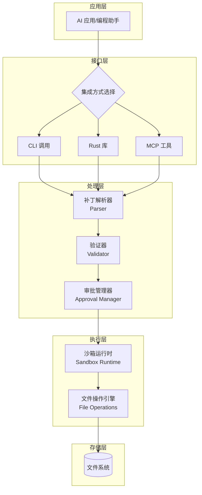
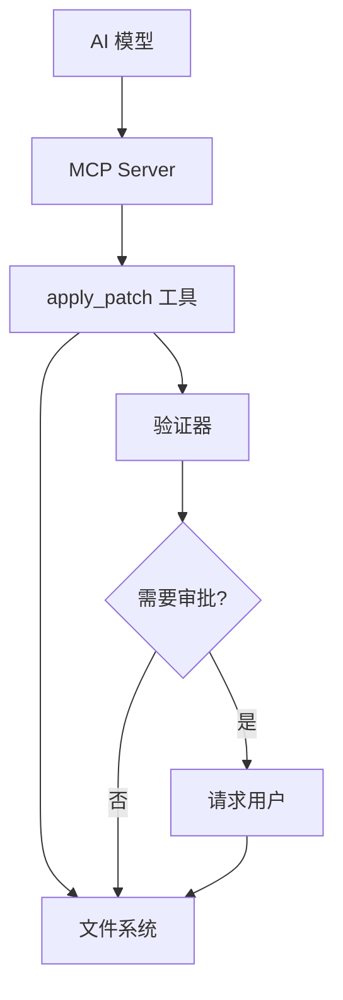
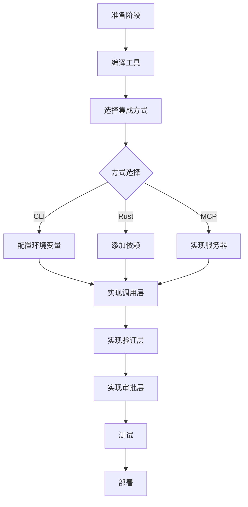
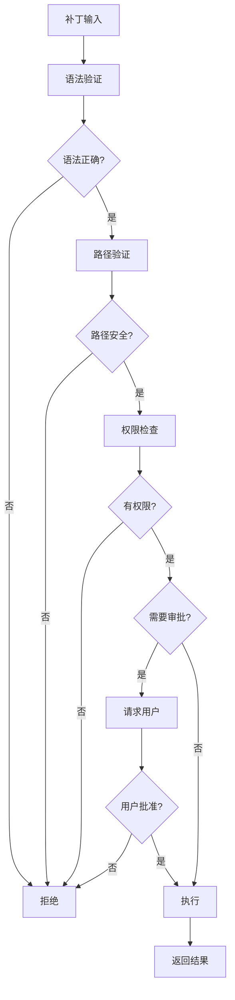

# Codex Apply_Patch 工具集成指南

## 目录

1. [概述](#概述)
2. [架构设计](#架构设计)
3. [核心组件](#核心组件)
4. [集成方式](#集成方式)
5. [补丁语法](#补丁语法)
6. [实施步骤](#实施步骤)
7. [使用示例](#使用示例)
8. [安全机制](#安全机制)
9. [最佳实践](#最佳实践)
10. [故障排查](#故障排查)

---

## 概述

`codex apply_patch` 是一个专为 AI 代码编辑场景设计的文件补丁应用工具。它提供了一种安全、可靠的方式来批量修改文件系统中的文件，特别适合 AI 编程助手、代码生成工具和自动化重构系统。

### 主要特性

- ✅ **安全的文件操作**：支持添加、删除、更新、移动文件
- ✅ **原子性保证**：要么全部成功，要么失败回滚
- ✅ **上下文感知**：基于代码上下文精确定位修改位置
- ✅ **多语言支持**：通过 tree-sitter 实现语法感知
- ✅ **沙箱执行**：支持在隔离环境中运行
- ✅ **用户审批机制**：可配置的安全策略
- ✅ **智能合并**：自动处理冲突和上下文匹配

### 适用场景

- AI 编程助手的代码编辑功能
- 自动化代码重构工具
- 批量文件修改系统
- 代码审查和修正工具
- 模板生成和定制系统

---

## 架构设计

### 系统架构图



### 数据流图


---

## 核心组件

### 1. 解析器（Parser）

**位置**: `apply-patch/src/parser.rs`

**职责**:
- 解析补丁文本为结构化数据
- 验证语法正确性
- 构建 `Hunk` 对象

**核心数据结构**:

```rust
pub enum Hunk {
    AddFile {
        path: PathBuf,
        contents: String,
    },
    DeleteFile {
        path: PathBuf,
    },
    UpdateFile {
        path: PathBuf,
        move_path: Option<PathBuf>,
        chunks: Vec<UpdateFileChunk>,
    },
}

pub struct UpdateFileChunk {
    pub change_context: Option<String>,  // 上下文定位
    pub old_lines: Vec<String>,           // 要删除的行
    pub new_lines: Vec<String>,           // 要添加的行
    pub is_end_of_file: bool,             // 是否文件结尾
}
```

### 2. 应用引擎（Apply Engine）

**位置**: `apply-patch/src/lib.rs`

**核心函数**:
- `apply_patch()`: 主入口，接受补丁文本
- `apply_hunks()`: 应用解析后的 hunks
- `compute_replacements()`: 计算文本替换位置
- `apply_replacements()`: 执行替换操作

### 3. 沙箱运行时（Sandbox Runtime）

**位置**: `core/src/tools/runtimes/apply_patch.rs`

**特性**:
- 隔离执行环境
- 权限控制
- 超时管理
- 资源限制

### 4. 工具处理器（Tool Handler）

**位置**: `core/src/tools/handlers/apply_patch.rs`

**职责**:
- 接收工具调用请求
- 协调验证和执行流程
- 管理用户审批
- 返回格式化结果

---

## 集成方式

### 方式对比

| 方式 | 难度 | 灵活性 | 性能 | 推荐场景 |
|-----|------|--------|------|----------|
| CLI 调用 | ⭐ 简单 | ⭐⭐ 中 | ⭐⭐⭐ 良好 | 快速集成、跨语言 |
| Rust 库 | ⭐⭐⭐ 复杂 | ⭐⭐⭐⭐ 高 | ⭐⭐⭐⭐ 优秀 | Rust 项目、深度定制 |
| MCP 工具 | ⭐⭐ 中等 | ⭐⭐⭐ 良好 | ⭐⭐⭐ 良好 | Claude 集成、AI 助手 |

### 方式 1: CLI 命令调用

**适用场景**: Python、Node.js、Go 等非 Rust 项目

#### 工作流程


#### 实施步骤

**1. 编译独立可执行文件**

```bash
cd vendors/codex/codex-rs/apply-patch
cargo build --release
```

生成的二进制文件位于:
- Linux/macOS: `target/release/apply_patch`
- Windows: `target/release/apply_patch.exe`

**2. 配置环境**

```bash
# 添加到 PATH
export PATH="$PATH:/path/to/codex-rs/apply-patch/target/release"

# 或复制到系统目录
sudo cp target/release/apply_patch /usr/local/bin/
```

**3. 调用示例**

```python
import subprocess
import json

def apply_patch(patch_content: str, cwd: str = ".") -> dict:
    """
    应用补丁到文件系统

    Args:
        patch_content: 补丁文本
        cwd: 工作目录

    Returns:
        {
            "success": bool,
            "added": [str],
            "modified": [str],
            "deleted": [str],
            "error": str | None
        }
    """
    try:
        result = subprocess.run(
            ["apply_patch", patch_content],
            cwd=cwd,
            capture_output=True,
            text=True,
            timeout=30
        )

        if result.returncode == 0:
            # 解析输出
            output = result.stdout
            return parse_success_output(output)
        else:
            return {
                "success": False,
                "error": result.stderr
            }
    except subprocess.TimeoutExpired:
        return {"success": False, "error": "Timeout"}
    except Exception as e:
        return {"success": False, "error": str(e)}

def parse_success_output(output: str) -> dict:
    """解析成功输出"""
    lines = output.strip().split('\n')
    added = []
    modified = []
    deleted = []

    for line in lines[1:]:  # 跳过第一行标题
        if line.startswith('A '):
            added.append(line[2:])
        elif line.startswith('M '):
            modified.append(line[2:])
        elif line.startswith('D '):
            deleted.append(line[2:])

    return {
        "success": True,
        "added": added,
        "modified": modified,
        "deleted": deleted
    }
```

**完整示例**:

```python
# 示例：批量修改配置文件
patch = """*** Begin Patch
*** Update File: config/app.yaml
@@
-debug: true
+debug: false
*** Update File: config/database.yaml
@@
-host: localhost
+host: prod.example.com
*** End Patch
"""

result = apply_patch(patch, cwd="./my-project")
if result["success"]:
    print(f"✅ 成功修改 {len(result['modified'])} 个文件")
    for file in result["modified"]:
        print(f"  - {file}")
else:
    print(f"❌ 失败: {result['error']}")
```

#### 优缺点

**优点**:
- ✅ 零依赖，无需 Rust 环境
- ✅ 跨语言支持
- ✅ 进程隔离，安全性高
- ✅ 简单快速

**缺点**:
- ❌ 进程启动开销
- ❌ 输出解析复杂
- ❌ 错误处理有限

---

### 方式 2: Rust 库集成

**适用场景**: Rust 项目、需要深度定制

#### 依赖配置

在 `Cargo.toml` 中添加:

```toml
[dependencies]
codex-apply-patch = { path = "vendors/codex/codex-rs/apply-patch" }
anyhow = "1.0"
thiserror = "1.0"
```

#### 基础用法

```rust
use codex_apply_patch::{apply_patch, parse_patch};
use std::fs;
use std::io::{BufWriter, Cursor};

pub fn apply_patch_to_filesystem(
    patch_text: &str,
) -> anyhow::Result<PatchResult> {
    // 1. 解析补丁
    let parsed = parse_patch(patch_text)?;

    // 2. 应用补丁
    let mut stdout = BufWriter::new(Cursor::new(Vec::new()));
    let mut stderr = BufWriter::new(Cursor::new(Vec::new()));

    match apply_patch(patch_text, &mut stdout, &mut stderr) {
        Ok(()) => {
            // 解析输出
            let stdout_str = String::from_utf8(stdout.into_inner().into_inner())?;
            Ok(PatchResult::from_output(stdout_str))
        }
        Err(e) => {
            let stderr_str = String::from_utf8(stderr.into_inner().into_inner())?;
            Err(anyhow::anyhow!("Patch failed: {}\n{}", e, stderr_str))
        }
    }
}

#[derive(Debug)]
pub struct PatchResult {
    pub added: Vec<String>,
    pub modified: Vec<String>,
    pub deleted: Vec<String>,
}

impl PatchResult {
    fn from_output(output: String) -> Self {
        let mut added = Vec::new();
        let mut modified = Vec::new();
        let mut deleted = Vec::new();

        for line in output.lines() {
            if let Some(path) = line.strip_prefix("A ") {
                added.push(path.to_string());
            } else if let Some(path) = line.strip_prefix("M ") {
                modified.push(path.to_string());
            } else if let Some(path) = line.strip_prefix("D ") {
                deleted.push(path.to_string());
            }
        }

        Self { added, modified, deleted }
    }
}
```

#### 高级用法：自定义验证

```rust
use codex_apply_patch::{
    parse_patch,
    Hunk,
    ApplyPatchArgs,
};

pub struct PatchValidator {
    allowed_paths: Vec<std::path::PathBuf>,
    max_file_size: usize,
}

impl PatchValidator {
    pub fn new() -> Self {
        Self {
            allowed_paths: vec![],
            max_file_size: 1024 * 1024, // 1MB
        }
    }

    pub fn validate(&self, patch_text: &str) -> anyhow::Result<Vec<String>> {
        let parsed = parse_patch(patch_text)?;
        let mut warnings = Vec::new();

        for hunk in &parsed.hunks {
            match hunk {
                Hunk::AddFile { path, contents } => {
                    // 检查文件大小
                    if contents.len() > self.max_file_size {
                        warnings.push(format!(
                            "File {} exceeds size limit ({} bytes)",
                            path.display(),
                            contents.len()
                        ));
                    }

                    // 检查路径权限
                    if !self.is_path_allowed(path) {
                        anyhow::bail!("Path {} is not allowed", path.display());
                    }
                }
                Hunk::DeleteFile { path } => {
                    if !self.is_path_allowed(path) {
                        anyhow::bail!("Cannot delete {}", path.display());
                    }
                }
                Hunk::UpdateFile { path, .. } => {
                    if !self.is_path_allowed(path) {
                        anyhow::bail!("Cannot modify {}", path.display());
                    }
                }
            }
        }

        Ok(warnings)
    }

    fn is_path_allowed(&self, path: &std::path::Path) -> bool {
        // 实现路径白名单检查
        true
    }
}
```

#### 集成到 AI 应用

```rust
use codex_apply_patch::apply_patch;
use tokio::io::{AsyncWriteExt, BufWriter};

pub async fn ai_edit_files(
    patch_prompt: &str,
    workspace: &std::path::Path,
) -> anyhow::Result<String> {
    // 1. 调用 AI 生成补丁
    let patch_text = generate_patch_with_ai(patch_prompt).await?;

    // 2. 应用补丁
    let mut stdout = Vec::new();
    let mut stderr = Vec::new();

    apply_patch(&patch_text, &mut stdout, &mut stderr)?;

    // 3. 返回结果
    Ok(String::from_utf8(stdout)?)
}
```

---

### 方式 3: MCP (Model Context Protocol) 工具

**适用场景**: Claude、GPT 等大模型集成

#### 架构图



#### 实施步骤

**1. 定义 MCP 工具规范**

```json
{
  "name": "apply_patch",
  "description": "批量修改文件系统中的文件",
  "inputSchema": {
    "type": "object",
    "properties": {
      "patch": {
        "type": "string",
        "description": "补丁文本"
      },
      "cwd": {
        "type": "string",
        "description": "工作目录",
        "default": "."
      },
      "dry_run": {
        "type": "boolean",
        "description": "预演模式",
        "default": false
      }
    },
    "required": ["patch"]
  }
}
```

**2. 实现 MCP Server**

```rust
use jsonrpsee::server::{ServerBuilder, RpcModule};
use codex_apply_patch::apply_patch;

#[tokio::main]
async fn main() -> anyhow::Result<()> {
    let server = ServerBuilder::default()
        .build("127.0.0.1:3000".parse()?)
        .await?;

    let mut module = RpcModule::new(());
    module.register_async_method(
        "tools/apply_patch",
        apply_patch_handler,
    )?;

    let addr = server.start(module)?;
    println!("MPC Server listening on {}", addr);

    Ok(())
}

async fn apply_patch_handler(
    params: ApplyPatchParams,
) -> Result<ApplyPatchResult, Error> {
    let mut stdout = Vec::new();
    let mut stderr = Vec::new();

    // 验证阶段
    validate_patch(&params.patch)?;

    // 审批阶段（如果需要）
    if requires_approval(&params) {
        request_user_approval(&params).await?;
    }

    // 执行阶段
    apply_patch(&params.patch, &mut stdout, &mut stderr)?;

    // 返回结果
    Ok(ApplyPatchResult::from_output(stdout))
}

#[derive(serde::Deserialize)]
struct ApplyPatchParams {
    patch: String,
    #[serde(default)]
    cwd: String,
    #[serde(default)]
    dry_run: bool,
}
```

**3. 集成到 Claude**

```python
from mcp import ClientSession, StdioServerParameters
from mcp.client.stdio import stdio_client

async def apply_patch_with_claude(patch_text: str):
    # 连接到 MCP Server
    server_params = StdioServerParameters(
        command="apply-patch-mcp-server"
    )

    async with stdio_client(server_params) as (read, write):
        async with ClientSession(read, write) as session:
            # 初始化
            await session.initialize()

            # 调用工具
            result = await session.call_tool(
                "apply_patch",
                arguments={"patch": patch_text, "cwd": "./"}
            )

            return result
```

---

## 补丁语法

### 完整语法规则

```mermaid
graph TD
    A[Patch] --> B[Begin Patch]
    A --> C[FileOp+]
    A --> D[End Patch]

    C --> E[AddFile]
    C --> F[DeleteFile]
    C --> G[UpdateFile]

    G --> H[MoveTo?]
    G --> I[Hunk+]

    I --> J[@@ Context?]
    I --> K[HunkLine+]

    K --> L[+ Line]
    K --> M[- Line]
    K --> N[Space Line]
```

### 语法结构

```
Patch := Begin { FileOp } End
Begin := "*** Begin Patch" NEWLINE
End := "*** End Patch" NEWLINE
FileOp := AddFile | DeleteFile | UpdateFile

AddFile := "*** Add File: " path NEWLINE { "+" line NEWLINE }
DeleteFile := "*** Delete File: " path NEWLINE
UpdateFile := "*** Update File: " path NEWLINE [ MoveTo ] { Hunk }

MoveTo := "*** Move to: " newPath NEWLINE
Hunk := "@@" [ header ] NEWLINE { HunkLine } [ "*** End of File" NEWLINE ]
HunkLine := (" " | "-" | "+") text NEWLINE
```

### 操作类型

#### 1. 添加文件

```
*** Begin Patch
*** Add File: src/new_module.py
+def hello():
+    print("Hello, World!")
*** End Patch
```

**注意**:
- 每行必须以 `+` 开头
- 路径必须是相对路径
- 自动创建父目录

#### 2. 删除文件

```
*** Begin Patch
*** Delete File: obsolete.py
*** End Patch
```

#### 3. 更新文件

**简单替换**:

```
*** Begin Patch
*** Update File: config.yaml
@@
-debug: true
+debug: false
*** End Patch
```

**带上下文的替换**:

```
*** Begin Patch
*** Update File: src/app.py
@@ def main():
     print("Starting")
-    old_function()
+    new_function()
     print("Done")
*** End Patch
```

**多块修改**:

```
*** Begin Patch
*** Update File: src/app.py
@@
-def foo():
-    pass
+def foo():
+    return "bar"
@@
-def baz():
-    pass
+def baz():
+    return "qux"
*** End Patch
```

**移动并修改**:

```
*** Begin Patch
*** Update File: src/old.py
*** Move to: src/new.py
@@
-old_name
+new_name
*** End Patch
```

**文件末尾添加**:

```
*** Begin Patch
*** Update File: README.md
@@
+# New Section
*** End of File
*** End Patch
```

### 上下文定位语法

当文件中有重复代码时，使用 `@@` 进行精确定位:

**单层定位**:

```
@@ class UserService
[3 行上下文]
- 旧代码
+ 新代码
[3 行上下文]
```

**多层定位**:

```
@@ class UserService
@@     def update_profile():
[3 行上下文]
- 旧代码
+ 新代码
[3 行上下文]
```

### Lark 语法定义

```lark
start: begin_patch hunk+ end_patch
begin_patch: "*** Begin Patch" LF
end_patch: "*** End Patch" LF?

hunk: add_hunk | delete_hunk | update_hunk
add_hunk: "*** Add File: " filename LF add_line+
delete_hunk: "*** Delete File: " filename LF
update_hunk: "*** Update File: " filename LF change_move? change?

filename: /(.+)/
add_line: "+" /(.*)/ LF -> line

change_move: "*** Move to: " filename LF
change: (change_context | change_line)+ eof_line?
change_context: ("@@" | "@@ " /(.+)/) LF
change_line: ("+" | "-" | " ") /(.*)/ LF
eof_line: "*** End of File" LF

%import common.LF
```

---

## 实施步骤

### 完整集成流程



### 阶段 1: 准备工作

#### 1.1 编译 apply_patch

```bash
# 克隆或获取 codex 源码
cd vendors/codex/codex-rs/apply-patch

# 编译发布版本
cargo build --release

# 验证编译结果
./target/release/apply_patch --version
```

#### 1.2 测试基础功能

```bash
# 创建测试目录
mkdir -p /tmp/apply-patch-test
cd /tmp/apply-patch-test

# 创建测试文件
echo "line1
line2
line3" > test.txt

# 应用测试补丁
cat << 'EOF' | ./target/release/apply_patch
*** Begin Patch
*** Update File: test.txt
@@
-line2
+modified
*** End Patch
EOF

# 检查结果
cat test.txt
```

### 阶段 2: 集成实现

#### 2.1 CLI 方式集成

**步骤清单**:

- [ ] 编译可执行文件
- [ ] 配置 PATH 或使用绝对路径
- [ ] 实现子进程调用
- [ ] 实现输出解析
- [ ] 实现错误处理
- [ ] 添加日志记录
- [ ] 编写单元测试

**代码模板**:

```python
# apply_patch_wrapper.py
import subprocess
import tempfile
from pathlib import Path
from typing import Optional, List, Dict
import logging

logger = logging.getLogger(__name__)

class ApplyPatchError(Exception):
    """补丁应用失败异常"""
    pass

class ApplyPatchWrapper:
    def __init__(self, executable_path: str = "apply_patch"):
        self.executable_path = executable_path

    def apply(
        self,
        patch: str,
        cwd: Optional[str] = None,
        timeout: int = 30,
    ) -> Dict[str, List[str]]:
        """
        应用补丁

        Args:
            patch: 补丁文本
            cwd: 工作目录
            timeout: 超时时间（秒）

        Returns:
            {
                "added": ["path1", "path2"],
                "modified": ["path3"],
                "deleted": ["path4"]
            }

        Raises:
            ApplyPatchError: 应用失败
        """
        try:
            result = subprocess.run(
                [self.executable_path, patch],
                cwd=cwd,
                capture_output=True,
                text=True,
                timeout=timeout,
                check=True,
            )

            return self._parse_output(result.stdout)

        except subprocess.TimeoutExpired as e:
            logger.error(f"Timeout applying patch: {e}")
            raise ApplyPatchError(f"Timeout after {timeout}s")

        except subprocess.CalledProcessError as e:
            logger.error(f"Patch failed: {e.stderr}")
            raise ApplyPatchError(e.stderr)

        except Exception as e:
            logger.error(f"Unexpected error: {e}")
            raise ApplyPatchError(str(e))

    def _parse_output(self, output: str) -> Dict[str, List[str]]:
        """解析输出"""
        result = {
            "added": [],
            "modified": [],
            "deleted": [],
        }

        for line in output.strip().split('\n'):
            if line.startswith('A '):
                result["added"].append(line[2:])
            elif line.startswith('M '):
                result["modified"].append(line[2:])
            elif line.startswith('D '):
                result["deleted"].append(line[2:])

        return result

    def validate_patch(self, patch: str) -> bool:
        """验证补丁语法"""
        # 基础验证
        if not patch.startswith('*** Begin Patch'):
            return False
        if not patch.strip().endswith('*** End Patch'):
            return False

        return True
```

#### 2.2 Rust 库方式集成

**步骤清单**:

- [ ] 添加 Cargo 依赖
- [ ] 实现包装模块
- [ ] 实现验证逻辑
- [ ] 实现错误处理
- [ ] 添加日志集成
- [ ] 编写单元测试
- [ ] 性能测试

**代码模板**:

```rust
// src/patch_manager.rs
use anyhow::{Context, Result};
use codex_apply_patch::{apply_patch, parse_patch, Hunk};
use std::io::BufWriter;
use std::path::Path;
use tracing::{debug, info, warn};

pub struct PatchManager {
    workspace: std::path::PathBuf,
    dry_run: bool,
}

impl PatchManager {
    pub fn new(workspace: impl AsRef<Path>) -> Self {
        Self {
            workspace: workspace.as_ref().to_path_buf(),
            dry_run: false,
        }
    }

    pub fn dry_run(mut self) -> Self {
        self.dry_run = true;
        self
    }

    pub fn apply(&self, patch_text: &str) -> Result<PatchResult> {
        info!("Applying patch in workspace: {}", self.workspace.display());

        // 1. 解析
        debug!("Parsing patch");
        let parsed = parse_patch(patch_text)
            .context("Failed to parse patch")?;

        // 2. 验证
        debug!("Validating patch");
        self.validate(&parsed)?;

        // 3. 预览（可选）
        if self.dry_run {
            return Ok(self.preview(&parsed));
        }

        // 4. 应用
        debug!("Applying patch");
        let mut stdout = BufWriter::new(Vec::new());
        let mut stderr = BufWriter::new(Vec::new());

        apply_patch(patch_text, &mut stdout, &mut stderr)
            .context("Failed to apply patch")?;

        // 5. 解析结果
        let stdout_str = String::from_utf8(stdout.into_inner().into_inner())?;
        let result = PatchResult::from_output(stdout_str);

        info!(
            "Patch applied: {} added, {} modified, {} deleted",
            result.added.len(),
            result.modified.len(),
            result.deleted.len()
        );

        Ok(result)
    }

    fn validate(&self, parsed: &codex_apply_patch::ApplyPatchArgs) -> Result<()> {
        for hunk in &parsed.hunks {
            match hunk {
                Hunk::AddFile { path, .. } => {
                    let full_path = self.workspace.join(path);
                    if !self.is_safe_path(&full_path) {
                        anyhow::bail!("Unsafe path: {}", path.display());
                    }
                }
                _ => {}
            }
        }
        Ok(())
    }

    fn is_safe_path(&self, path: &Path) -> bool {
        // 确保路径在工作空间内
        path.canonicalize()
            .map(|p| p.starts_with(&self.workspace))
            .unwrap_or(false)
    }

    fn preview(&self, parsed: &codex_apply_patch::ApplyPatchArgs) -> PatchResult {
        // 生成预览信息
        let mut result = PatchResult::default();
        for hunk in &parsed.hunks {
            match hunk {
                Hunk::AddFile { path, .. } => {
                    result.added.push(path.display().to_string());
                }
                Hunk::DeleteFile { path } => {
                    result.deleted.push(path.display().to_string());
                }
                Hunk::UpdateFile { path, .. } => {
                    result.modified.push(path.display().to_string());
                }
            }
        }
        result
    }
}

#[derive(Debug, Default)]
pub struct PatchResult {
    pub added: Vec<String>,
    pub modified: Vec<String>,
    pub deleted: Vec<String>,
}

impl PatchResult {
    fn from_output(output: String) -> Self {
        let mut result = Self::default();

        for line in output.lines() {
            if let Some(path) = line.strip_prefix("A ") {
                result.added.push(path.to_string());
            } else if let Some(path) = line.strip_prefix("M ") {
                result.modified.push(path.to_string());
            } else if let Some(path) = line.strip_prefix("D ") {
                result.deleted.push(path.to_string());
            }
        }

        result
    }
}
```

#### 2.3 MCP 工具方式集成

**步骤清单**:

- [ ] 实现 MCP Server
- [ ] 注册工具
- [ ] 实现验证
- [ ] 实现审批流程
- [ ] 实现错误处理
- [ ] 添加日志
- [ ] 测试工具调用

---

## 使用示例

### 示例 1: AI 代码编辑助手

```python
class CodeEditor:
    def __init__(self):
        self.patch_wrapper = ApplyPatchWrapper()

    async def edit_with_ai(self, instruction: str, file_path: str):
        """
        使用 AI 编辑文件

        Args:
            instruction: 自然语言指令，如 "将所有的 var 改为 const"
            file_path: 要修改的文件路径
        """
        # 1. 读取文件内容
        with open(file_path) as f:
            content = f.read()

        # 2. 调用 AI 生成补丁
        patch = await self.generate_patch_with_ai(
            instruction=instruction,
            file_content=content,
            file_path=file_path
        )

        # 3. 应用补丁
        result = self.patch_wrapper.apply(
            patch=patch,
            cwd=os.path.dirname(file_path)
        )

        return result

    async def generate_patch_with_ai(
        self,
        instruction: str,
        file_content: str,
        file_path: str
    ) -> str:
        """
        使用 AI 生成补丁

        这里可以调用 OpenAI、Claude 等大模型
        """
        # 实现 AI 调用逻辑
        pass
```

**使用**:

```python
editor = CodeEditor()
result = await editor.edit_with_ai(
    "将所有的 console.log 改为 console.info",
    "src/app.js"
)

print(f"修改了 {len(result['modified'])} 个文件")
```

### 示例 2: 批量重构

```python
class RefactoringTool:
    def __init__(self):
        self.patch_wrapper = ApplyPatchWrapper()

    def rename_function(self, old_name: str, new_name: str, workspace: str):
        """
        在整个项目中重命名函数

        Args:
            old_name: 旧函数名
            new_name: 新函数名
            workspace: 工作区路径
        """
        # 1. 查找所有使用该函数的文件
        files = self.find_files_using_function(old_name, workspace)

        # 2. 生成补丁
        hunks = []
        for file in files:
            hunks.append(f"""*** Update File: {file}
@@
-{old_name}(
+{new_name}(""")

        patch = f"""*** Begin Patch
{chr(10).join(hunks)}
*** End Patch
"""

        # 3. 应用补丁
        result = self.patch_wrapper.apply(patch, cwd=workspace)

        return result

    def find_files_using_function(self, func_name: str, workspace: str) -> List[str]:
        """
        查找使用函数的文件
        """
        # 实现文件搜索逻辑
        pass
```

**使用**:

```python
tool = RefactoringTool()
result = tool.rename_function(
    "oldFunction",
    "newFunction",
    "./my-project"
)

print(f"✅ 重命名完成，修改了 {len(result['modified'])} 个文件")
```

### 示例 3: 配置管理

```python
class ConfigManager:
    def __init__(self, config_dir: str):
        self.config_dir = config_dir
        self.patch_wrapper = ApplyPatchWrapper()

    def update_config(self, updates: Dict[str, Any]):
        """
        更新配置文件

        Args:
            updates: 配置更新字典
                {
                    "app.yaml": {"debug": False},
                    "db.yaml": {"host": "prod.example.com"}
                }
        """
        hunks = []

        for filename, changes in updates.items():
            filepath = os.path.join(self.config_dir, filename)
            hunks.append(self._generate_config_hunk(filepath, changes))

        patch = f"""*** Begin Patch
{chr(10).join(hunks)}
*** End Patch
"""

        result = self.patch_wrapper.apply(patch, cwd=self.config_dir)
        return result

    def _generate_config_hunk(self, filepath: str, changes: Dict[str, Any]) -> str:
        """生成配置修改的 hunk"""
        # 读取当前配置
        with open(filepath) as f:
            lines = f.readlines()

        # 生成修改块
        hunk_lines = [f"*** Update File: {os.path.basename(filepath)}"]
        for key, value in changes.items():
            hunk_lines.append("@@")
            hunk_lines.append(f"-{key}: {self._get_old_value(lines, key)}")
            hunk_lines.append(f"+{key}: {value}")

        return "\n".join(hunk_lines)

    def _get_old_value(self, lines: List[str], key: str) -> str:
        """获取旧值"""
        for line in lines:
            if line.startswith(f"{key}:"):
                return line.split(":", 1)[1].strip()
        return "None"
```

---

## 安全机制

### 安全架构



### 1. 语法验证

**自动验证项**:

- ✅ 补丁格式正确
- ✅ 操作类型有效
- ✅ 路径格式合法
- ✅ 上下文标记正确

**实现**:

```python
class PatchValidator:
    def validate_syntax(self, patch: str) -> ValidationResult:
        """
        验证补丁语法
        """
        errors = []
        warnings = []

        # 检查基本结构
        if not patch.startswith('*** Begin Patch'):
            errors.append("Missing '*** Begin Patch' marker")

        if not patch.strip().endswith('*** End Patch'):
            errors.append("Missing '*** End Patch' marker")

        # 检查操作块
        lines = patch.split('\n')
        for i, line in enumerate(lines):
            if line.startswith('*** Update File:'):
                if i + 1 >= len(lines) or not lines[i + 1].startswith('@@'):
                    errors.append(f"Line {i}: Update block missing @@ marker")

        return ValidationResult(
            is_valid=len(errors) == 0,
            errors=errors,
            warnings=warnings
        )
```

### 2. 路径验证

**安全规则**:

- ❌ 不允许绝对路径
- ❌ 不允许路径遍历（`../`）
- ❌ 不允许敏感路径（`/etc`, `~/.ssh`）
- ✅ 只允许工作区内的相对路径

**实现**:

```python
import os
from pathlib import Path

class PathValidator:
    def __init__(self, workspace: str):
        self.workspace = os.path.abspath(workspace)
        self.forbidden_patterns = [
            '../',
            '..\\',
            '/etc/',
            '/root/',
            '/home/',
            '~/.ssh',
            '~/.aws',
        ]

    def validate_path(self, path: str) -> bool:
        """
        验证路径是否安全
        """
        # 检查绝对路径
        if os.path.isabs(path):
            return False

        # 检查危险模式
        for pattern in self.forbidden_patterns:
            if pattern in path:
                return False

        # 解析为绝对路径
        full_path = os.path.abspath(os.path.join(self.workspace, path))

        # 确保在工作区内
        if not full_path.startswith(self.workspace):
            return False

        return True

    def validate_patch_paths(self, patch: str) -> ValidationResult:
        """
        验证补丁中的所有路径
        """
        errors = []
        warnings = []

        lines = patch.split('\n')
        for i, line in enumerate(lines):
            if line.startswith('*** Add File: '):
                path = line[14:].strip()
                if not self.validate_path(path):
                    errors.append(f"Line {i}: Unsafe path '{path}'")

            elif line.startswith('*** Delete File: '):
                path = line[16:].strip()
                if not self.validate_path(path):
                    errors.append(f"Line {i}: Unsafe path '{path}'")

            elif line.startswith('*** Update File: '):
                path = line[17:].strip()
                if not self.validate_path(path):
                    errors.append(f"Line {i}: Unsafe path '{path}'")

        return ValidationResult(
            is_valid=len(errors) == 0,
            errors=errors,
            warnings=warnings
        )
```

### 3. 审批机制

**审批策略**:

| 策略 | 描述 | 适用场景 |
|-----|------|----------|
| Never | 自动批准所有操作 | 开发环境、CI/CD |
| OnFirstUse | 首次使用后批准整个会话 | 交互式开发 |
| Always | 每次操作都需要批准 | 生产环境、敏感项目 |
| DangerousOnly | 仅危险操作需要批准 | 平衡安全和效率 |

**实现**:

```python
from enum import Enum
from typing import Optional

class ApprovalPolicy(Enum):
    NEVER = "never"
    ON_FIRST_USE = "on_first_use"
    ALWAYS = "always"
    DANGEROUS_ONLY = "dangerous_only"

class ApprovalManager:
    def __init__(self, policy: ApprovalPolicy = ApprovalPolicy.ON_FIRST_USE):
        self.policy = policy
        self.approved_cache: set = set()

    def should_approve(
        self,
        patch: str,
        is_dangerous: bool = False
    ) -> bool:
        """
        判断是否应该批准补丁

        Args:
            patch: 补丁文本
            is_dangerous: 是否是危险操作

        Returns:
            True 如果应该自动批准，False 如果需要用户确认
        """
        # NEVER 策略：总是自动批准
        if self.policy == ApprovalPolicy.NEVER:
            return True

        # 计算补丁的哈希作为缓存键
        patch_hash = hash(patch)

        # 检查缓存
        if patch_hash in self.approved_cache:
            return True

        # DANGEROUS_ONLY 策略
        if self.policy == ApprovalPolicy.DANGEROUS_ONLY:
            return not is_dangerous

        # ALWAYS 策略：总是需要确认
        if self.policy == ApprovalPolicy.ALWAYS:
            return False

        # ON_FIRST_USE 策略：需要首次确认
        if self.policy == ApprovalPolicy.ON_FIRST_USE:
            return False

        return False

    def mark_approved(self, patch: str):
        """标记补丁为已批准"""
        if self.policy == ApprovalPolicy.ON_FIRST_USE:
            self.approved_cache.add(hash(patch))

    def is_dangerous_operation(self, patch: str) -> bool:
        """
        判断是否是危险操作

        危险操作包括：
        - 删除文件
        - 修改配置文件
        - 修改多个文件
        """
        dangerous_indicators = [
            '*** Delete File:',
            'config',
            '.env',
            'credentials',
        ]

        patch_lower = patch.lower()
        return any(indicator in patch_lower for indicator in dangerous_indicators)
```

**使用**:

```python
approval_manager = ApprovalManager(ApprovalPolicy.ON_FIRST_USE)

def apply_patch_with_approval(patch: str):
    # 1. 检查是否需要审批
    is_dangerous = approval_manager.is_dangerous_operation(patch)
    should_approve = approval_manager.should_approve(patch, is_dangerous)

    if not should_approve:
        # 2. 显示补丁摘要
        summary = generate_patch_summary(patch)
        print(f"📋 补丁摘要:\n{summary}")

        # 3. 请求用户确认
        response = input("是否应用此补丁? (y/n): ").strip().lower()

        if response != 'y':
            print("❌ 用户取消操作")
            return None

        # 4. 标记为已批准
        approval_manager.mark_approved(patch)

    # 5. 应用补丁
    result = patch_wrapper.apply(patch)
    return result
```

### 4. 沙箱执行

**沙箱特性**:

- 📂 隔离文件系统
- 🌐 网络隔离
- 💾 资源限制
- ⏱️ 超时控制

**实现** (使用 Firejail):

```python
class SandboxExecutor:
    def __init__(self, workspace: str):
        self.workspace = os.path.abspath(workspace)
        self.sandbox_dir = f"/tmp/sandbox-{os.getpid()}"

    def apply_in_sandbox(self, patch: str) -> dict:
        """
        在沙箱中应用补丁
        """
        # 1. 创建沙箱目录
        os.makedirs(self.sandbox_dir, exist_ok=True)

        # 2. 复制工作区到沙箱
        shutil.copytree(self.workspace, f"{self.sandbox_dir}/workspace")

        # 3. 在沙箱中应用补丁
        cmd = [
            "firejail",
            "--private={}".format(self.sandbox_dir),
            "--quiet",
            "apply_patch", patch
        ]

        result = subprocess.run(
            cmd,
            cwd=f"{self.sandbox_dir}/workspace",
            capture_output=True,
            text=True,
            timeout=30
        )

        # 4. 如果成功，复制回原目录
        if result.returncode == 0:
            # 这里可以添加额外的验证
            pass
        else:
            # 回滚
            pass

        return result
```

---

## 最佳实践

### 1. 错误处理

**完整的错误处理流程**:

```python
class ApplyPatchError(Exception):
    """基础错误类"""
    pass

class PatchSyntaxError(ApplyPatchError):
    """语法错误"""
    pass

class PatchValidationError(ApplyPatchError):
    """验证错误"""
    pass

class PatchExecutionError(ApplyPatchError):
    """执行错误"""
    pass

def safe_apply_patch(patch: str, workspace: str) -> dict:
    """
    安全地应用补丁，包含完整的错误处理
    """
    try:
        # 1. 语法验证
        if not validate_syntax(patch):
            raise PatchSyntaxError("Invalid patch syntax")

        # 2. 路径验证
        path_validation = validate_paths(patch, workspace)
        if not path_validation.is_valid:
            raise PatchValidationError(
                f"Invalid paths: {', '.join(path_validation.errors)}"
            )

        # 3. 审批检查
        if needs_approval(patch):
            if not request_user_approval(patch):
                print("用户取消操作")
                return {"status": "cancelled"}

        # 4. 应用补丁
        result = apply_patch(patch, cwd=workspace)

        # 5. 验证结果
        if not verify_result(result, workspace):
            raise PatchExecutionError("Patch verification failed")

        return {
            "status": "success",
            "result": result
        }

    except PatchSyntaxError as e:
        logger.error(f"Syntax error: {e}")
        return {"status": "error", "error": str(e)}

    except PatchValidationError as e:
        logger.error(f"Validation error: {e}")
        return {"status": "error", "error": str(e)}

    except PatchExecutionError as e:
        logger.error(f"Execution error: {e}")
        # 尝试回滚
        rollback_patch(patch, workspace)
        return {"status": "error", "error": str(e)}

    except Exception as e:
        logger.error(f"Unexpected error: {e}")
        return {"status": "error", "error": str(e)}
```

### 2. 日志记录

```python
import logging
import json
from datetime import datetime

class PatchLogger:
    def __init__(self, log_file: str = "patches.log"):
        self.logger = logging.getLogger("apply_patch")
        handler = logging.FileHandler(log_file)
        formatter = logging.Formatter(
            '%(asctime)s - %(name)s - %(levelname)s - %(message)s'
        )
        handler.setFormatter(formatter)
        self.logger.addHandler(handler)
        self.logger.setLevel(logging.INFO)

    def log_patch_attempt(self, patch: str, metadata: dict):
        """记录补丁尝试"""
        self.logger.info("Patch attempt", extra={
            "patch": patch,
            "metadata": metadata,
            "timestamp": datetime.now().isoformat()
        })

    def log_patch_success(self, result: dict):
        """记录补丁成功"""
        self.logger.info("Patch success", extra={
            "result": result,
            "timestamp": datetime.now().isoformat()
        })

    def log_patch_failure(self, error: str):
        """记录补丁失败"""
        self.logger.error("Patch failure", extra={
            "error": error,
            "timestamp": datetime.now().isoformat()
        })
```

### 3. 性能优化

**批量操作**:

```python
def batch_apply_patches(patches: list, workspace: str) -> dict:
    """
    批量应用补丁，合并多个小补丁为一个大补丁
    """
    # 合并所有补丁
    combined_patch = combine_patches(patches)

    # 一次性应用
    result = apply_patch(combined_patch, cwd=workspace)

    return result

def combine_patches(patches: list) -> str:
    """
    合并多个补丁为一个
    """
    parts = ['*** Begin Patch']

    for patch in patches:
        # 提取中间部分（去掉 Begin 和 End 标记）
        lines = patch.split('\n')
        for line in lines:
            if line.startswith('*** ') and 'File:' in line:
                parts.append(line)
            elif line.startswith(('+', '-', '@', ' ')):
                parts.append(line)

    parts.append('*** End Patch')

    return '\n'.join(parts)
```

**并行处理**:

```python
import asyncio
from concurrent.futures import ThreadPoolExecutor

async def parallel_apply_patches(patches: list, workspace: str, max_workers: int = 4):
    """
    并行应用独立的补丁
    """
    # 分组补丁（确保没有冲突）
    patch_groups = group_independent_patches(patches)

    # 并行应用
    with ThreadPoolExecutor(max_workers=max_workers) as executor:
        loop = asyncio.get_event_loop()
        tasks = [
            loop.run_in_executor(
                executor,
                apply_patch,
                patch,
                workspace
            )
            for patch in patch_groups
        ]

        results = await asyncio.gather(*tasks)

    return results
```

### 4. 测试策略

```python
import pytest
import tempfile
import shutil

class TestApplyPatch:
    @pytest.fixture
    def workspace(self):
        """创建临时工作区"""
        ws = tempfile.mkdtemp()
        yield ws
        shutil.rmtree(ws)

    def test_add_file(self, workspace):
        """测试添加文件"""
        patch = """*** Begin Patch
*** Add File: new.txt
+Hello, World!
*** End Patch
"""

        result = apply_patch(patch, cwd=workspace)

        assert len(result["added"]) == 1
        assert os.path.exists(os.path.join(workspace, "new.txt"))

    def test_update_file(self, workspace):
        """测试更新文件"""
        # 创建测试文件
        test_file = os.path.join(workspace, "test.txt")
        with open(test_file, 'w') as f:
            f.write("old\n")

        patch = """*** Begin Patch
*** Update File: test.txt
@@
-old
+new
*** End Patch
"""

        result = apply_patch(patch, cwd=workspace)

        assert len(result["modified"]) == 1

        with open(test_file) as f:
            content = f.read()
        assert content == "new\n"

    def test_delete_file(self, workspace):
        """测试删除文件"""
        # 创建测试文件
        test_file = os.path.join(workspace, "delete.txt")
        with open(test_file, 'w') as f:
            f.write("delete me\n")

        patch = """*** Begin Patch
*** Delete File: delete.txt
*** End Patch
"""

        result = apply_patch(patch, cwd=workspace)

        assert len(result["deleted"]) == 1
        assert not os.path.exists(test_file)

    def test_invalid_patch(self, workspace):
        """测试无效补丁"""
        patch = """*** Begin Patch
*** Invalid Operation: foo.txt
*** End Patch
"""

        with pytest.raises(ApplyPatchError):
            apply_patch(patch, cwd=workspace)
```

---

## 故障排查

### 常见问题

#### 1. "Failed to find expected lines"

**原因**: 补丁中的上下文与文件内容不匹配

**解决方案**:

```python
# 添加更多上下文行
patch = """*** Begin Patch
*** Update File: src/app.py
@@ def main():  # 添加函数上下文
     print("start")
-    old_function()
+    new_function()
     print("end")
*** End Patch
"""

# 或者使用智能匹配
patch = """*** Begin Patch
*** Update File: src/app.py
@@ class UserService:  # 类上下文
@@     def update(self):  # 方法上下文
-        old
+        new
*** End Patch
"""
```

#### 2. "Invalid patch hunk"

**原因**: 语法错误

**检查清单**:

- [ ] 每个 `Update File` 块后有 `@@` 标记
- [ ] `Add File` 后的每一行都以 `+` 开头
- [ ] 路径使用相对路径
- [ ] 文件标记正确（`***` 开头）

#### 3. "Permission denied"

**解决方案**:

```python
# 检查文件权限
import os
import stat

def ensure_write_permission(filepath: str):
    """确保文件有写权限"""
    if not os.access(filepath, os.W_OK):
        # 尝试添加写权限
        mode = os.stat(filepath).st_mode
        os.chmod(filepath, mode | stat.S_IWUSR)
```

#### 4. 超时问题

**解决方案**:

```python
# 增加超时时间
result = subprocess.run(
    ["apply_patch", patch],
    timeout=120,  # 2 分钟
    ...
)

# 或者分批处理大补丁
def split_large_patch(patch: str, max_operations: int = 10) -> list:
    """拆分大补丁"""
    # 实现拆分逻辑
    pass
```

### 调试技巧

**1. 启用详细日志**:

```python
import logging

logging.basicConfig(level=logging.DEBUG)
logger = logging.getLogger("apply_patch")
logger.setLevel(logging.DEBUG)
```

**2. 预演模式**:

```python
def dry_run_patch(patch: str, workspace: str) -> dict:
    """
    预演补丁，不实际修改文件
    """
    # 解析补丁
    parsed = parse_patch(patch)

    # 生成预览
    preview = {
        "added": [],
        "modified": [],
        "deleted": []
    }

    for hunk in parsed.hunks:
        if isinstance(hunk, Hunk.AddFile):
            preview["added"].append(hunk.path)
        elif isinstance(hunk, Hunk.DeleteFile):
            preview["deleted"].append(hunk.path)
        elif isinstance(hunk, Hunk.UpdateFile):
            preview["modified"].append(hunk.path)

    return preview
```

**3. 生成差异报告**:

```python
def generate_diff_report(patch: str, workspace: str) -> str:
    """
    生成详细的差异报告
    """
    parsed = parse_patch(patch)

    report = []
    for hunk in parsed.hunks:
        if isinstance(hunk, Hunk.UpdateFile):
            filepath = os.path.join(workspace, hunk.path)
            with open(filepath) as f:
                original = f.read()

            # 计算新内容
            new_content = apply_chunks(original, hunk.chunks)

            # 生成 diff
            diff = difflib.unified_diff(
                original.splitlines(keepends=True),
                new_content.splitlines(keepends=True),
                fromfile=f"a/{hunk.path}",
                tofile=f"b/{hunk.path}"
            )

            report.append(''.join(diff))

    return '\n'.join(report)
```

---

## 附录

### A. 配置文件示例

**config.yaml**:

```yaml
apply_patch:
  # 可执行文件路径
  executable: "/usr/local/bin/apply_patch"

  # 默认工作区
  workspace: "./"

  # 审批策略
  approval_policy: "on_first_use"  # never, on_first_use, always, dangerous_only

  # 安全设置
  security:
    # 允许的路径模式
    allowed_paths:
      - "src/**"
      - "tests/**"
      - "docs/**"

    # 禁止的路径模式
    forbidden_paths:
      - "**/.env"
      - "**/credentials/**"
      - "**/*.key"

    # 最大文件大小（字节）
    max_file_size: 1048576  # 1MB

  # 执行设置
  execution:
    # 超时时间（秒）
    timeout: 30

    # 沙箱模式
    sandbox: false

    # 最大并行任务数
    max_parallel_tasks: 4

  # 日志设置
  logging:
    # 日志级别
    level: "info"  # debug, info, warn, error

    # 日志文件
    file: "apply_patch.log"
```

### B. API 参考

#### CLI

```bash
apply_patch <patch> [options]

Options:
  -h, --help       显示帮助信息
  -V, --version    显示版本信息
  -v, --verbose    详细输出
  -d, --dry-run    预演模式
```

#### Rust 库

```rust
// 主函数
pub fn apply_patch(
    patch: &str,
    stdout: &mut impl Write,
    stderr: &mut impl Write
) -> Result<(), ApplyPatchError>

// 解析函数
pub fn parse_patch(patch: &str) -> Result<ApplyPatchArgs, ParseError>

// 数据结构
pub enum Hunk { ... }
pub struct ApplyPatchArgs { ... }
pub enum ApplyPatchError { ... }
```

### C. 相关资源

- **源代码**: `vendors/codex/codex-rs/apply-patch/`
- **测试**: `vendors/codex/codex-rs/apply-patch/tests/`
- **文档**: `vendors/codex/codex-rs/apply-patch/README.md`
- **语法定义**: `tool_apply_patch.lark`

### D. 贡献指南

如果你想改进 `apply_patch` 工具：

1. Fork 项目
2. 创建功能分支
3. 添加测试
4. 提交 Pull Request

---

## 总结

`codex apply_patch` 是一个强大且安全的文件补丁工具，通过本指南，你应该能够：

✅ 理解工具的架构和设计
✅ 选择合适的集成方式
✅ 实现完整的安全机制
✅ 处理各种边界情况
✅ 构建生产级的应用

祝你集成顺利！🚀
