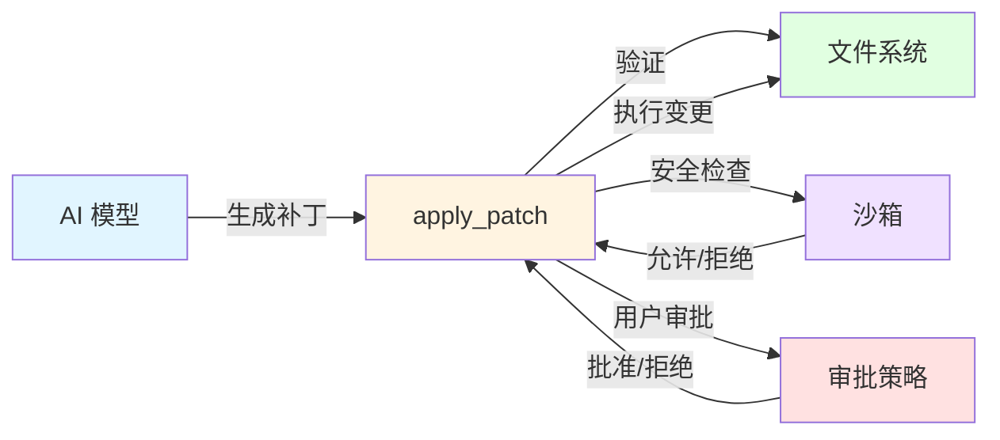
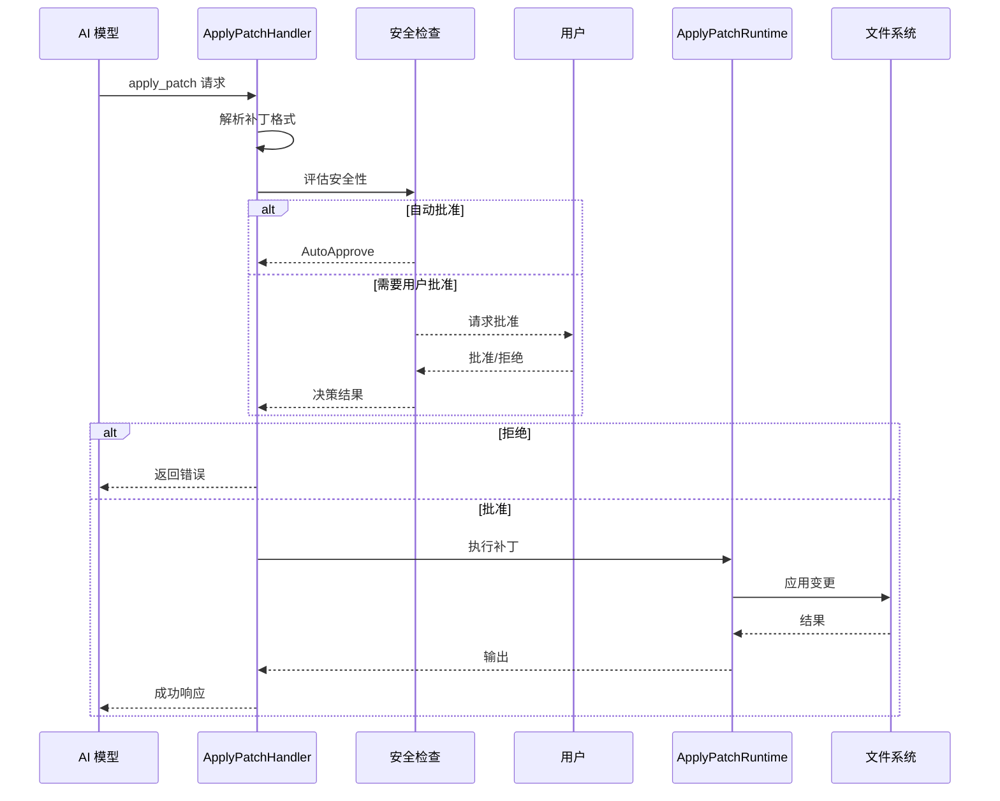
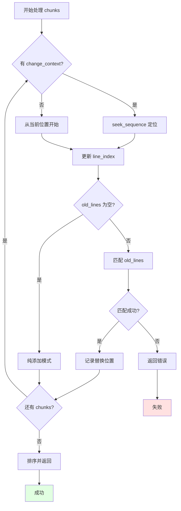
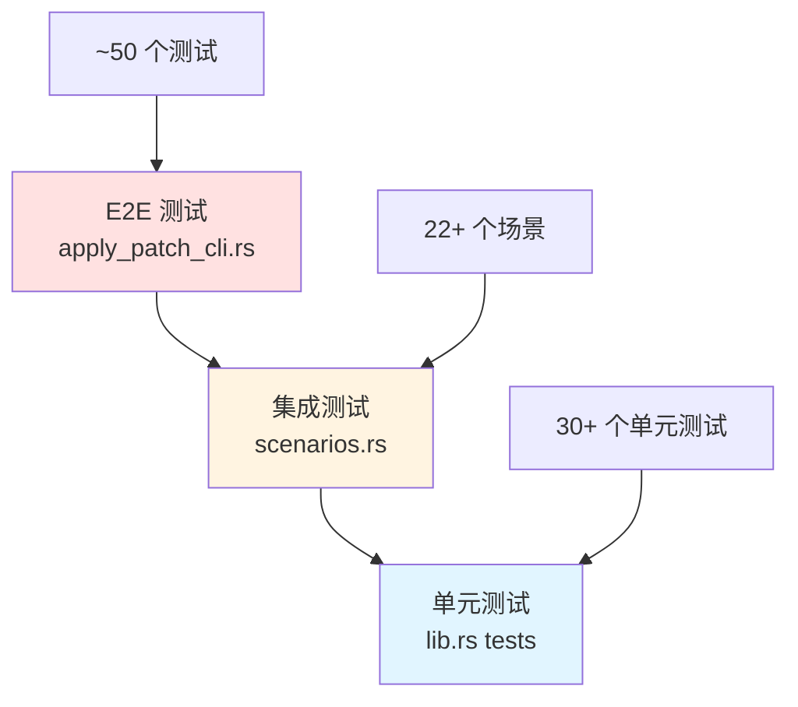

# Codex apply_patch 工具详解

> 作者: Claude AI
> 日期: 2026-01-10
> 基于: OpenAI Codex CLI (开发版)
> 位置: `./venders/codex/codex-rs/apply-patch/`

---

## 目录

1. [概述](#概述)
2. [工作原理](#工作原理)
3. [语法规范](#语法规范)
4. [实现架构](#实现架构)
5. [集成方式](#集成方式)
6. [测试策略](#测试策略)
7. [使用示例](#使用示例)
8. [最佳实践](#最佳实践)
9. [故障排查](#故障排查)

---

## 概述

### 什么是 apply_patch?

`apply_patch` 是 Codex AI 编程助手的核心工具之一,用于安全、可控地修改文件系统中的文件。它提供了一种简洁的补丁格式,让 AI 模型能够精确描述文件变更操作。

### 核心特性

- **文件操作**: 支持添加、删除、更新、移动文件
- **安全验证**: 在应用前验证补丁的正确性
- **沙箱支持**: 与 Codex 沙箱系统集成
- **上下文感知**: 使用上下文行精确定位修改位置
- **多模型支持**: 兼容 Freeform 和 Function calling 模式
- **错误恢复**: 验证失败不产生副作用

### 设计目标



---

## 工作原理

### 执行流程



### 核心组件

1. **解析器 (Parser)**
   - 解析补丁语法
   - 验证格式正确性
   - 提取操作类型

2. **安全检查器 (Safety)**
   - 路径遍历检查
   - 沙箱权限验证
   - 用户审批策略

3. **执行引擎 (Runtime)**
   - 应用文件变更
   - 处理移动操作
   - 生成 unified diff

4. **工具处理器 (Handler)**
   - 集成到工具系统
   - 发送事件通知
   - 管理补丁生命周期

---

## 语法规范

### 完整语法

```
Patch := Begin { FileOp } End
Begin := "*** Begin Patch" NEWLINE
End := "*** End Patch" NEWLINE
FileOp := AddFile | DeleteFile | UpdateFile
AddFile := "*** Add File: " path NEWLINE { "+" line NEWLINE }
DeleteFile := "*** Delete File: " path NEWLINE
UpdateFile := "*** Update File: " path NEWLINE [ MoveTo ] { Hunk }
MoveTo := "*** Move to: " newPath NEWLINE
Hunk := "@@" [ header ] NEWLINE { HunkLine } [ "*** End of File" NEWLINE ]
HunkLine := (" " | "-" | "+") text NEWLINE
```

### 操作类型

#### 1. 添加文件

```
*** Begin Patch
*** Add File: new_file.txt
+First line
+Second line
+Third line
*** End Patch
```

**规则**:
- 每行必须以 `+` 开头
- 自动创建父目录
- 覆盖已存在的文件

#### 2. 删除文件

```
*** Begin Patch
*** Delete File: obsolete.txt
*** End Patch
```

**规则**:
- 文件必须存在
- 不能删除目录

#### 3. 更新文件

```
*** Begin Patch
*** Update File: existing.txt
@@
 line 1
-line 2 old
+line 2 new
 line 3
*** End Patch
```

**规则**:
- `-` 表示删除的行
- `+` 表示添加的行
- 空格(无前缀)表示上下文行
- 默认 3 行上下文

#### 4. 移动文件

```
*** Begin Patch
*** Update File: old/path.txt
*** Move to: new/path.txt
@@
-old content
+new content
*** End Patch
```

**规则**:
- `Move to` 必须紧跟 `Update File`
- 自动创建目标目录
- 删除源文件

### 上下文定位

#### 基础上下文 (3 行)

```
*** Update File: code.py
@@
def function_a():
    pass
-def old_line
+def new_line
def function_b():
    pass
*** End Patch
```

#### 函数级上下文

```
*** Update File: code.py
@@ class MyClass
    def method_a(self):
        pass
-    old_code
+    new_code
*** End Patch
```

#### 多层上下文

```
*** Update File: code.py
@@ class MyClass
@@     def method_b
        x = 1
        y = 2
-        old
+        new
*** End Patch
```

#### EOF 定位

```
*** Update File: file.txt
@@
last_line
+new_last_line
*** End of File
*** End Patch
```

---

## 实现架构

### Crate 结构

```
codex-rs/apply-patch/
├── src/
│   ├── lib.rs                    # 库入口
│   ├── main.rs                   # 独立可执行文件
│   ├── parser.rs                 # 补丁解析器
│   ├── invocation.rs             # 命令行调用解析
│   ├── seek_sequence.rs          # 序列搜索算法
│   └── standalone_executable.rs  # 可执行文件支持
├── apply_patch_tool_instructions.md  # AI 模型指令
├── Cargo.toml
└── tests/
    ├── suite/
    │   ├── cli.rs                # CLI 集成测试
    │   ├── scenarios.rs          # 场景测试
    │   └── tool.rs               # 工具测试
    └── fixtures/
        └── scenarios/            # 测试夹具
```

### 核心数据结构

```rust
/// 补丁操作结果
pub enum MaybeApplyPatchVerified {
    Body(ApplyPatchAction),           // 成功解析
    ShellParseError(ExtractHeredocError),  // Shell 解析错误
    CorrectnessError(ApplyPatchError),     // 语义错误
    NotApplyPatch,                    // 不是补丁命令
}

/// 补丁动作
pub struct ApplyPatchAction {
    changes: HashMap<PathBuf, ApplyPatchFileChange>,
    patch: String,      // 原始补丁字符串
    cwd: PathBuf,       // 工作目录
}

/// 文件变更类型
pub enum ApplyPatchFileChange {
    Add { content: String },
    Delete { content: String },
    Update {
        unified_diff: String,
        move_path: Option<PathBuf>,
        new_content: String,
    },
}

/// 补丁块
pub enum Hunk {
    AddFile { path: PathBuf, contents: String },
    DeleteFile { path: PathBuf },
    UpdateFile {
        path: PathBuf,
        move_path: Option<PathBuf>,
        chunks: Vec<UpdateFileChunk>,
    },
}

/// 更新文件块
pub struct UpdateFileChunk {
    change_context: Option<String>,  // 上下文定位
    old_lines: Vec<String>,          // 要删除的行
    new_lines: Vec<String>,          // 要添加的行
    is_end_of_file: bool,            // 是否 EOF 定位
}
```

### 关键算法

#### 1. 上下文搜索 (seek_sequence)

```rust
pub fn seek_sequence(
    haystack: &[String],
    needle: &[String],
    start: usize,
    is_end_of_file: bool,
) -> Option<usize>
```

**功能**: 在 `haystack` 中从 `start` 位置开始查找 `needle` 序列。

**特点**:
- 支持模糊匹配 (Unicode 标点归一化)
- 支持 EOF 锚定
- 线性时间复杂度

#### 2. 替换计算 (compute_replacements)

```rust
fn compute_replacements(
    original_lines: &[String],
    path: &Path,
    chunks: &[UpdateFileChunk],
) -> Result<Vec<(usize, usize, Vec<String>)>, ApplyPatchError>
```

**流程**:


#### 3. 替换应用 (apply_replacements)

```rust
fn apply_replacements(
    mut lines: Vec<String>,
    replacements: &[(usize, usize, Vec<String>)],
) -> Vec<String>
```

**策略**: 逆序应用替换,避免索引偏移。

```rust
// 从后向前应用
for (start_idx, old_len, new_segment) in replacements.iter().rev() {
    // 删除旧行
    for _ in 0..old_len {
        lines.remove(start_idx);
    }
    // 插入新行
    for (offset, new_line) in new_segment.iter().enumerate() {
        lines.insert(start_idx + offset, new_line.clone());
    }
}
```

---

## 集成方式

### 1. 在 Codex Core 中集成

#### 调用路径

```
用户输入
  ↓
CodexAgent (事件循环)
  ↓
ApplyPatchHandler (工具处理器)
  ↓
apply_patch::apply_patch (安全检查)
  ↓
ApplyPatchRuntime (执行引擎)
  ↓
文件系统
```

#### 核心集成点

**工具注册** (`codex-rs/core/src/tools/handlers/apply_patch.rs`):

```rust
pub struct ApplyPatchHandler;

#[async_trait]
impl ToolHandler for ApplyPatchHandler {
    fn kind(&self) -> ToolKind {
        ToolKind::Function
    }

    async fn handle(&self, invocation: ToolInvocation)
        -> Result<ToolOutput, FunctionCallError>
    {
        // 1. 解析补丁输入
        let patch_input = match payload {
            ToolPayload::Function { arguments } => {
                let args: ApplyPatchToolArgs =
                    serde_json::from_str(&arguments)?;
                args.input
            }
            ToolPayload::Custom { input } => input,
            _ => return Err(...),
        };

        // 2. 验证和解析
        match codex_apply_patch::maybe_parse_apply_patch_verified(
            &command, &cwd
        ) {
            MaybeApplyPatchVerified::Body(changes) => {
                // 3. 安全检查
                match apply_patch::apply_patch(
                    session, turn, &call_id, changes
                ).await {
                    InternalApplyPatchInvocation::DelegateToExec(apply) => {
                        // 4. 执行补丁
                        let mut runtime = ApplyPatchRuntime::new();
                        let out = orchestrator
                            .run(&mut runtime, &req, &tool_ctx, ...)
                            .await;
                        // 5. 返回结果
                    }
                    ...
                }
            }
            ...
        }
    }
}
```

#### 工具规范生成

```rust
// Freeform 工具 (GPT-5+)
pub(crate) fn create_apply_patch_freeform_tool() -> ToolSpec {
    ToolSpec::Freeform(FreeformTool {
        name: "apply_patch".to_string(),
        description: "...".to_string(),
        format: FreeformToolFormat {
            r#type: "grammar".to_string(),
            syntax: "lark".to_string(),
            definition: APPLY_PATCH_LARK_GRAMMAR.to_string(),
        },
    })
}

// JSON 工具 (GPT-OSS)
pub(crate) fn create_apply_patch_json_tool() -> ToolSpec {
    ToolSpec::Function(ResponsesApiTool {
        name: "apply_patch".to_string(),
        description: APPLY_PATCH_TOOL_INSTRUCTIONS.to_string(),
        parameters: JsonSchema::Object { ... },
    })
}
```

### 2. 在沙箱中集成

#### 安全评估流程

```rust
// codex-rs/core/src/apply_patch.rs
pub(crate) async fn apply_patch(
    sess: &Session,
    turn_context: &TurnContext,
    call_id: &str,
    action: ApplyPatchAction,
) -> InternalApplyPatchInvocation {
    match assess_patch_safety(
        &action,
        turn_context.approval_policy,
        &turn_context.sandbox_policy,
        &turn_context.cwd,
    ) {
        SafetyCheck::AutoApprove {
            user_explicitly_approved,
            ..
        } => InternalApplyPatchInvocation::DelegateToExec(...),

        SafetyCheck::AskUser => {
            // 请求用户批准
            let rx_approve = sess
                .request_patch_approval(
                    turn_context,
                    call_id.to_owned(),
                    convert_apply_patch_to_protocol(&action),
                    None,
                    None,
                )
                .await;

            match rx_approve.await.unwrap_or_default() {
                ReviewDecision::Approved => {
                    InternalApplyPatchInvocation::DelegateToExec(...)
                }
                ReviewDecision::Denied => {
                    InternalApplyPatchInvocation::Output(Err(...))
                }
            }
        }

        SafetyCheck::Reject { reason } => {
            InternalApplyPatchInvocation::Output(Err(...))
        }
    }
}
```

#### 沙箱执行

```rust
// codex-rs/core/src/tools/runtimes/apply_patch.rs
impl ToolRuntime<ApplyPatchRequest, ExecToolCallOutput>
    for ApplyPatchRuntime
{
    async fn run(
        &mut self,
        req: &ApplyPatchRequest,
        attempt: &SandboxAttempt<'_>,
        ctx: &ToolCtx<'_>,
    ) -> Result<ExecToolCallOutput, ToolError> {
        // 构建命令: codex --codex-run-as-apply-patch <patch>
        let spec = Self::build_command_spec(req)?;

        // 应用沙箱环境
        let env = attempt.env_for(spec)?;

        // 执行
        let out = execute_env(
            env,
            attempt.policy,
            Self::stdout_stream(ctx)
        ).await?;

        Ok(out)
    }
}
```

### 3. 独立可执行文件

```rust
// codex-rs/apply-patch/src/main.rs
fn main() -> Result<()> {
    let args = std::env::args().collect::<Vec<_>>();

    // 检查特殊标志
    if args.len() > 1 && args[1] == CODEX_APPLY_PATCH_ARG1 {
        // 作为沙箱进程运行
        let patch = args.get(2).map(|s| s.as_str()).unwrap_or("");
        let mut stdout = std::io::stdout();
        let mut stderr = std::io::stderr();

        return apply_patch(patch, &mut stdout, &mut stderr);
    }

    // 否则作为 CLI 工具运行
    ...
}
```

---

## 测试策略

### 测试金字塔



### 1. 单元测试

**位置**: `codex-rs/apply-patch/src/lib.rs`

```rust
#[test]
fn test_add_file_hunk_creates_file_with_contents() {
    let dir = tempdir().unwrap();
    let path = dir.path().join("add.txt");
    let patch = wrap_patch(&format!(
        r#"*** Add File: {}
+ab
+cd"#,
        path.display()
    ));

    let mut stdout = Vec::new();
    let mut stderr = Vec::new();
    apply_patch(&patch, &mut stdout, &mut stderr).unwrap();

    // 验证输出
    let stdout_str = String::from_utf8(stdout).unwrap();
    assert_eq!(stdout_str, format!(
        "Success. Updated the following files:\nA {}\n",
        path.display()
    ));

    // 验证文件内容
    let contents = fs::read_to_string(path).unwrap();
    assert_eq!(contents, "ab\ncd\n");
}
```

**覆盖范围**:
- 文件添加/删除/更新
- 文件移动
- 多个块
- 上下文定位
- Unicode 支持
- 错误处理

### 2. 场景测试

**位置**: `codex-rs/apply-patch/tests/suite/scenarios.rs`

**结构**:
```
tests/fixtures/scenarios/
├── 001_add_file/
│   ├── patch.txt
│   └── expected/
│       └── bar.md
├── 002_multiple_operations/
│   ├── input/
│   ├── expected/
│   └── patch.txt
├── 003_multiple_chunks/
├── ...
└── 022_update_file_end_of_file_marker/
```

**测试循环**:
```rust
for scenario in all_scenarios() {
    // 1. 准备输入状态
    prepare_input_state(scenario);

    // 2. 读取补丁
    let patch = fs::read_to_string(scenario.patch_path())?;

    // 3. 应用补丁
    let result = apply_patch(&patch, ...);

    // 4. 验证输出
    verify_expected_state(scenario);
}
```

### 3. 集成测试

**位置**: `codex-rs/core/tests/suite/apply_patch_cli.rs`

**测试维度**:

#### a) 多模型输出

```rust
#[tokio::test]
#[test_case(ApplyPatchModelOutput::Freeform)]
#[test_case(ApplyPatchModelOutput::Function)]
#[test_case(ApplyPatchModelOutput::Shell)]
#[test_case(ApplyPatchModelOutput::ShellViaHeredoc)]
async fn apply_patch_cli_multiple_operations_integration(
    output_type: ApplyPatchModelOutput,
) -> Result<()> {
    // 测试相同补丁在不同模型输出格式下的行为
}
```

#### b) 安全性测试

```rust
#[tokio::test]
async fn apply_patch_cli_rejects_path_traversal_outside_workspace()
    -> Result<()>
{
    // 测试路径遍历攻击防护
    let patch = "*** Begin Patch\n*** Add File: ../escape.txt\n+outside\n*** End Patch";

    // 验证拒绝
    assert!(out.contains("patch rejected: writing outside of the project"));
}
```

#### c) 事件测试

```rust
#[tokio::test]
async fn apply_patch_emits_turn_diff_event_with_unified_diff()
    -> Result<()>
{
    // 监听事件流
    wait_for_event(&codex, |event| match event {
        EventMsg::TurnDiff(ev) => {
            // 验证 unified diff 格式
            assert!(diff.contains("diff --git"));
            false
        }
        EventMsg::TaskComplete(_) => true,
        _ => false,
    }).await;
}
```

### 4. 快照测试

**位置**: `codex-rs/tui/src/snapshots/`

用于验证 TUI 显示的补丁输出。

---

## 使用示例

### 示例 1: 简单文件添加

**场景**: 创建新的配置文件

```
*** Begin Patch
*** Add File: config/database.toml
+[database]
+host = "localhost"
+port = 5432
+name = "myapp"
*** End Patch
```

**输出**:
```
Success. Updated the following files:
A config/database.toml
```

### 示例 2: 多文件操作

**场景**: 重构目录结构

```
*** Begin Patch
*** Add File: src/components/Button.tsx
+export const Button = ({ children }) => {
+  return <button>{children}</button>;
+};
*** Update File: src/OldButton.tsx
*** Move to: src/deprecated/OldButton.tsx
@@
-export const Button = () => null;
+export const OldButton = () => null;
*** Delete File: src/Unused.tsx
*** End Patch
```

### 示例 3: 精确上下文定位

**场景**: 在重复代码中定位

```python
# 原始文件 utils.py
def process_a(data):
    x = 10
    y = 20
    return x + y

def process_b(data):
    x = 10      # 多个 x = 10
    y = 20
    return x * y
```

**补丁**:
```
*** Begin Patch
*** Update File: utils.py
@@ def process_b
    x = 10
-    y = 20
+    y = 30
    return x * y
*** End Patch
```

**结果**:
```python
def process_a(data):
    x = 10
    y = 20
    return x + y

def process_b(data):
    x = 10
    y = 30  # 只有这个被修改
    return x * y
```

### 示例 4: EOF 添加

**场景**: 在文件末尾添加导入

```
*** Begin Patch
*** Update File: main.py
@@
def main():
    pass
+
+from typing import Optional
*** End of File
*** End Patch
```

### 示例 5: 复杂多块更新

**场景**: 重构函数

```javascript
// 原始文件
function calculate(a, b) {
  const x = a + b;
  const y = x * 2;
  const z = y - 5;
  return z;
}

function another() {
  return 42;
}
```

**补丁**:
```
*** Begin Patch
*** Update File: calc.js
@@ function calculate
  const x = a + b;
-  const y = x * 2;
+  const y = x * 3;
  const z = y - 5;
@@
-  return z;
+  return Math.round(z);
*** End Patch
```

**结果**:
```javascript
function calculate(a, b) {
  const x = a + b;
  const y = x * 3;  // 修改 1
  const z = y - 5;
  return Math.round(z);  // 修改 2
}
```

### 示例 6: Shell 命令调用

**场景**: 通过 shell 调用 apply_patch

```bash
apply_patch <<'EOF'
*** Begin Patch
*** Add File: hello.txt
+Hello from shell!
*** End Patch
EOF
```

**或使用 heredoc**:
```bash
apply_patch '*** Begin Patch
*** Add File: quick.txt
+Quick patch
*** End Patch'
```

### 示例 7: JSON Function Calling

```json
{
  "name": "apply_patch",
  "arguments": {
    "input": "*** Begin Patch\n*** Add File: test.txt\n+content\n*** End Patch"
  }
}
```

---

## 最佳实践

### 1. 上下文使用

**✅ 推荐**:
```
*** Update File: code.py
@@
def specific_function():  # 使用具体函数名
    context = "here"
-   old_line
+   new_line
*** End Patch
```

**❌ 避免**:
```
*** Update File: code.py
@@
-   old_line  # 上下文不足
+   new_line
*** End Patch
```

### 2. 补丁大小

**✅ 推荐**: 每个补丁 < 5 个文件
**✅ 推荐**: 每个文件 < 10 个修改块
**❌ 避免**: 单个补丁 > 20 个文件

### 3. 路径规范

**✅ 推荐**: 相对路径
```
*** Add File: src/utils/helper.ts
```

**❌ 避免**: 绝对路径
```
*** Add File: /home/user/project/src/helper.ts
```

### 4. 换行符处理

**✅ 推荐**: 保持原有换行风格
```
*** Update File: file.txt
@@
line1
-line2
+line2_new
line3
*** End Patch
```

**注意**:
- 创建文件时最后一行自动添加换行符
- 更新文件时保持原有换行符

### 5. 错误恢复

**策略**: 验证失败不应用任何变更

```rust
// 先验证所有变更
for hunk in hunks {
    verify_hunk(&hunk)?;
}

// 再应用所有变更
for hunk in hunks {
    apply_hunk(&hunk)?;
}
```

### 6. 多模型兼容性

| 模型 | 格式 | 语法 |
|------|------|------|
| GPT-5+ | Freeform | Lark Grammar |
| GPT-OSS | Function | JSON Schema |
| Shell | Custom | 自由格式 |

确保补丁格式在所有模式下都有效。

---

## 故障排查

### 常见错误

#### 1. "Failed to find expected lines"

**原因**: 上下文不匹配

**诊断**:
```
apply_patch verification failed: Failed to find expected lines in src/app.py:
def old_name():
```

**解决**:
1. 检查上下文行是否完全匹配
2. 使用更多上下文行
3. 添加函数/类级别的 `@@` 定位

#### 2. "patch rejected: writing outside of the project"

**原因**: 路径遍历

**诊断**:
```
*** Add File: ../escape.txt
```

**解决**: 使用相对路径且不包含 `..`

#### 3. "Failed to read file to update"

**原因**: 文件不存在

**诊断**:
```
*** Update File: missing.txt
```

**解决**:
- 确保文件存在 (使用 `*** Add File` 创建)
- 或检查路径拼写

#### 4. "No files were modified"

**原因**: 空补丁

**诊断**:
```
*** Begin Patch
*** End Patch
```

**解决**: 添加至少一个文件操作

### 调试技巧

#### 1. 使用独立可执行文件

```bash
# 直接调用 apply_patch
codex --codex-run-as-apply-patch '*** Begin Patch
*** Add File: test.txt
+test
*** End Patch'
```

#### 2. 检查解析结果

```rust
let patch = parse_patch(&patch_string)?;
println!("Hunks: {:?}", patch.hunks);
```

#### 3. 验证 unified diff

```rust
let diff = unified_diff_from_chunks(&path, &chunks)?;
println!("Unified diff:\n{}", diff.unified_diff);
```

#### 4. 查看详细错误

```bash
# 启用详细日志
RUST_LOG=debug codex exec "apply patch"
```

### 性能优化

#### 1. 大文件处理

**问题**: 大文件搜索慢

**优化**: 使用 `@@` 定位减少搜索范围

```
*** Update File: large_file.py
@@ class SpecificClass  # 直接跳到类
@@     def specific_method  # 再跳到方法
-       old
+       new
*** End Patch
```

#### 2. 批量操作

**问题**: 多次 apply_patch 调用慢

**优化**: 合并到单个补丁

```
*** Begin Patch
*** Update File: a.txt
@@
-old_a
+new_a
*** Update File: b.txt
@@
-old_b
+new_b
*** End Patch
```

---

## 附录

### A. Lark 语法定义

**位置**: `codex-rs/core/src/tools/handlers/tool_apply_patch.lark`

```lark
?start: patch

patch: BEGIN_PATCH file_op+ END_PATCH

BEGIN_PATCH: "*** Begin Patch" NEWLINE
END_PATCH: "*** End Patch" NEWLINE

file_op: add_file | delete_file | update_file

add_file: "*** Add File:" PATH NEWLINE content_line+

delete_file: "*** Delete File:" PATH NEWLINE

update_file: "*** Update File:" PATH NEWLINE move_to? hunk+

move_to: "*** Move to:" PATH NEWLINE

hunk: "@@" header? NEWLINE hunk_line+ end_of_file?

hunk_line: (" " | "-" | "+") TEXT NEWLINE

end_of_file: "*** End of File" NEWLINE

%import common.NEWLINE
%import common.WS_INLINE
%import common.ESCAPED_STRING

PATH: /[^ \n]+/
TEXT: /.*/
```

### B. 错误码参考

| 错误码 | 描述 | 恢复方法 |
|--------|------|----------|
| `InvalidPatchError` | 补丁格式无效 | 检查语法 |
| `InvalidHunkError` | 块格式错误 | 检查行前缀 |
| `ComputeReplacements` | 上下文匹配失败 | 增加上下文 |
| `IoError` | 文件系统错误 | 检查权限/路径 |
| `ImplicitInvocation` | 隐式调用 | 显式使用 `["apply_patch", "..."]` |

### C. 性能基准

| 操作 | 文件大小 | 时间 |
|------|----------|------|
| 添加文件 | 1 KB | < 10 ms |
| 更新文件 | 10 KB | < 50 ms |
| 更新文件 | 1 MB | < 500 ms |
| 多文件操作 | 10 个文件 | < 200 ms |

### D. 相关文档

- **Codex 架构**: [codex-arch-by-claude.md](./codex-arch-by-claude.md)
- **Codex 变更**: [codex-changes-by-claude.md](./codex-changes-by-claude.md)
- **工具系统**: [codex-tool-call.md](./codex-tool-call.md) (待创建)
- **事件循环**: [codex-event-loop.md](./codex-event-loop.md) (待创建)

---

## 总结

### 核心要点

1. **安全第一**: 验证失败不产生副作用
2. **上下文关键**: 使用足够上下文精确定位
3. **简洁设计**: 简单语法,强大功能
4. **多模式支持**: Freeform、Function、Shell
5. **完整测试**: 单元、集成、E2E 覆盖

### 设计哲学

> "A file-oriented diff format designed to be easy to parse and safe to apply."

- **易于解析**: 严格的语法,无歧义
- **安全应用**: 验证、沙箱、审批
- **文件导向**: 高层操作,非行号

---

*文档生成时间: 2026-01-10*
*基于版本: OpenAI Codex CLI 0.0.0-dev*
*分析工具: Claude AI (Sonnet 4.5)*
