# Codex 架构分析文档

> 作者: Claude AI
> 日期: 2025-01-07
> 项目版本: OpenAI Codex CLI (开发版)

---

## 目录

1. [项目概述](#项目概述)
2. [整体架构](#整体架构)
3. [核心模块分析](#核心模块分析)
4. [数据流与通信协议](#数据流与通信协议)
5. [设计模式与架构决策](#设计模式与架构决策)
6. [技术栈](#技术栈)
7. [扩展性设计](#扩展性设计)

---

## 项目概述

### 项目定位

**Codex CLI** 是 OpenAI 开发的本地运行的 AI 编程助手代理。它提供了命令行界面(CLI)和终端用户界面(TUI),允许开发者通过自然语言与 AI 交互来完成编码任务。

### 核心特性

- **多模态交互**: 支持 TUI (交互式)、Exec (非交互式)、App Server 三种运行模式
- **本地执行**: 在用户本地环境中安全地执行命令和修改代码
- **多模型支持**: 支持 OpenAI API、Ollama、LM Studio 等多种模型提供商
- **MCP 集成**: 支持 Model Context Protocol (MCP) 服务器扩展
- **沙箱安全**: Linux (Landlock/Seatbelt)、Windows 提供命令执行沙箱
- **会话管理**: 支持会话持久化、历史记录、分支管理
- **代码审查**: 内置代码审查和补丁应用功能

---

## 整体架构

### 架构概览

Codex 采用**分层架构**结合**事件驱动**的设计模式,整体分为三层:

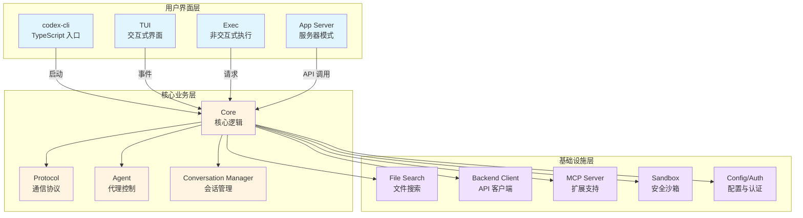

### 技术栈分层

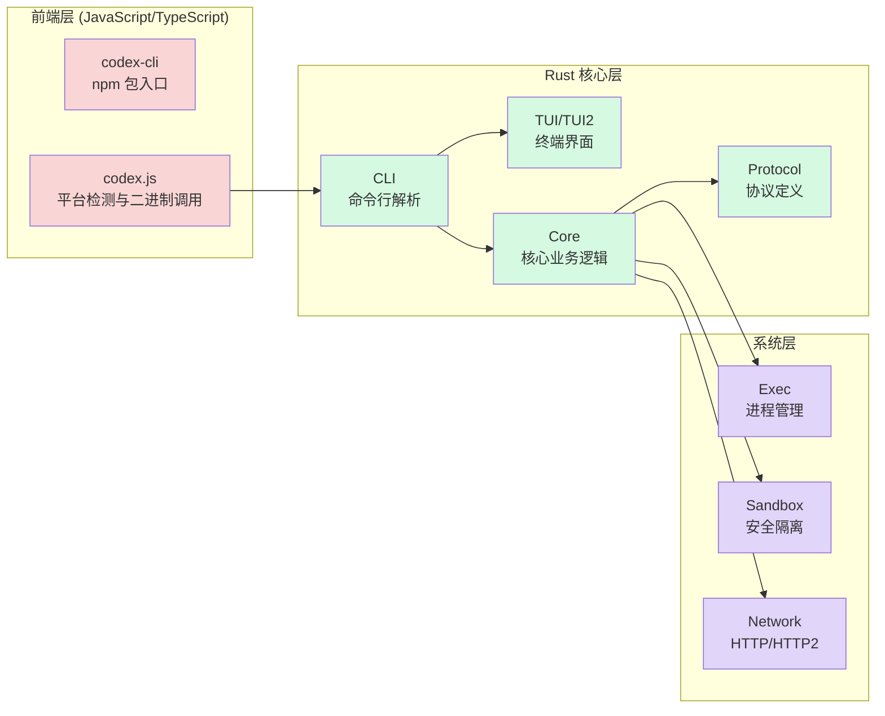

---

## 核心模块分析

### 1. codex-cli (TypeScript 入口层)

**位置**: `./codex-cli/`

**职责**:
- 跨平台二进制分发封装
- npm 包管理和版本控制
- 平台检测与二进制路由

**关键文件**:
- `bin/codex.js`: 主入口,负责平台检测并调用对应的 Rust 二进制
- `package.json`: npm 包配置

**工作流程**:
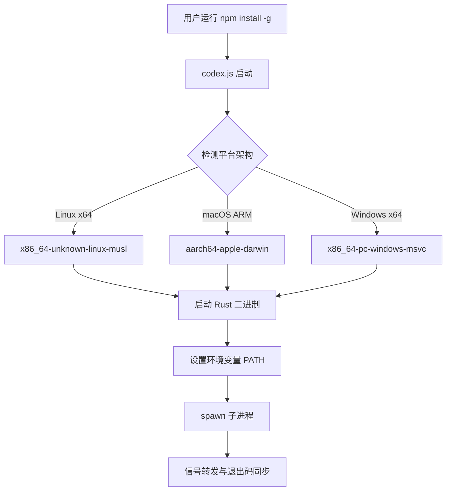

**设计亮点**:
- 使用异步 spawn 而非 spawnSync,确保信号正确处理
- 自动检测包管理器 (npm/bun) 用于更新提示
- PATH 注入机制,确保依赖工具可用

### 2. Core (核心业务逻辑)

**位置**: `./codex-rs/core/`

**职责**: Codex 的大脑,负责所有核心业务逻辑

**主要子模块**:

| 模块 | 文件数 | 职责 |
|------|--------|------|
| `agent/` | 3 | 代理控制与状态管理 |
| `auth/` | - | 认证管理 (API Key/ChatGPT/Device Code) |
| `client/` | - | LLM API 客户端封装 |
| `config/` | - | 配置加载与管理 |
| `conversation_manager/` | - | 会话生命周期管理 |
| `exec_env/` | - | 执行环境抽象 |
| `mcp/` | - | Model Context Protocol 集成 |
| `tools/` | - | 工具调用实现 |
| `shell/` | - | Shell 命令执行 |
| `apply_patch/` | - | 代码补丁应用 |

**核心类型**:

```rust
// 会话管理
pub struct CodexConversation {
    // 对话状态、历史记录、工具调用
}

// 认证管理
pub struct AuthManager {
    // API Key、OAuth 流程
}

// 配置
pub struct Config {
    // 模型选择、沙箱策略、审批策略
}
```

**架构模式**: Repository + Service Layer

### 3. Protocol (通信协议)

**位置**: `./codex-rs/protocol/`

**职责**: 定义用户与 Agent 之间的通信协议

**核心概念 - SQ/EQ 模式**:

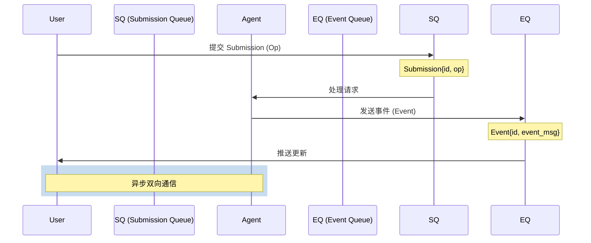

**主要数据结构**:

```rust
// 提交队列条目
pub struct Submission {
    pub id: String,
    pub op: Op,  // 操作类型
}

// 操作类型
pub enum Op {
    Interrupt,              // 中断
    UserInput { items },    // 用户输入
    UserTurn { ... },       // 完整用户轮次
    OverrideTurnContext { ... },  // 覆盖上下文
    ExecApproval { ... },   // 命令审批
    PatchApproval { ... },  // 补丁审批
    ResolveElicitation { ... },  // MCP 请求解析
    AddToHistory { ... },   // 添加历史
    // ...
}

// 事件消息
pub enum EventMsg {
    TurnStarted,
    ContentDelta { content },
    FunctionCall { name, arguments },
    ExecutionRequested { ... },
    PatchRequested { ... },
    TurnCompleted,
    TurnAborted,
    // ...
}
```

**协议特性**:
- **强类型**: Rust 类型系统确保消息正确性
- **跨语言**: 使用 `ts-rs` 自动生成 TypeScript 类型定义
- **可扩展**: 使用 `#[non_exhaustive]` 允许未来扩展
- **异步**: 基于 Tokio 运行时

### 4. TUI (终端用户界面)

**位置**: `./codex-rs/tui/` 和 `./codex-rs/tui2/`

**职责**: 提供交互式终端界面

**文件统计**: 60+ 源文件

**主要组件**:

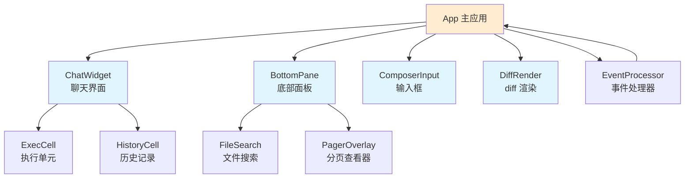

**UI 框架**: [Ratatui](https://github.com/ratatui-org/ratatui) (终端 UI 库)

**关键特性**:
- **实时流式渲染**: 支持流式显示 AI 响应
- **Markdown 渲染**: 内置 Markdown 解析和语法高亮
- **Diff 高亮**: 显示代码变更的精美 diff
- **快捷键支持**: Vim 风格快捷键
- **响应式布局**: 自适应终端大小

**样式系统**:
```rust
// 推荐的样式约定 (来自 AGENTS.md)
"text".into()                    // 普通文本
"text".red()                     // 红色
"text".dim()                     // 暗淡
vec![...].into()                 // Line 构造
```

### 5. Exec (非交互式执行)

**位置**: `./codex-rs/exec/`

**职责**: 提供非交互式命令执行模式

**核心流程**:

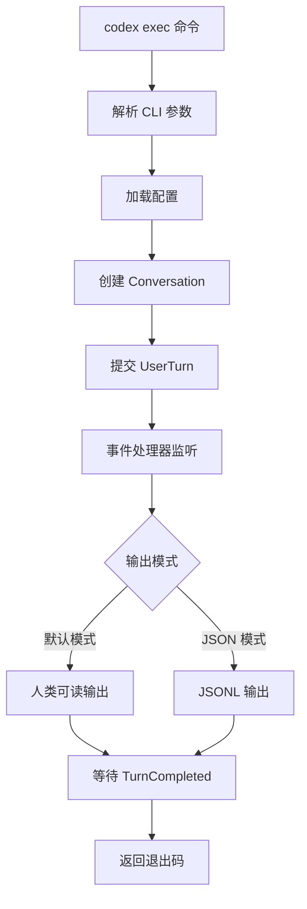

**事件处理器**:
- `EventProcessorWithHumanOutput`: 人类可读格式输出
- `EventProcessorWithJsonOutput`: JSONL 格式输出 (机器可读)

**使用场景**:
- CI/CD 集成
- 脚本自动化
- 批量处理
- JSON 模式用于结构化输出

### 6. Backend Client (后端 API 客户端)

**位置**: `./codex-rs/backend-client/`

**职责**: 与 OpenAI 后端服务通信

**主要功能**:
- 任务列表查询
- 任务详情获取
- Turn 同步与历史记录
- 云端会话管理

**类型定义**:
```rust
pub struct TaskListItem { ... }
pub struct CodeTaskDetailsResponse { ... }
pub struct TurnAttemptsSiblingTurnsResponse { ... }
```

### 7. MCP Server (Model Context Protocol)

**位置**: `./codex-rs/mcp-server/`

**职责**: 实现 MCP 协议服务器支持

**MCP 类型定义**: `./codex-rs/mcp-types/`

**支持的 MCP 功能**:
- **工具 (Tools)**: 暴露自定义工具给 AI
- **资源 (Resources)**: 提供文件/数据访问
- **提示 (Prompts)**: 预定义提示模板

**集成方式**:
```toml
# ~/.codex/config.toml
[mcp_servers.my_server]
command = "/path/to/server"
args = ["--port", "8080"]
```

### 8. Exec & Exec-Server (命令执行基础设施)

**位置**: `./codex-rs/exec/` 和 `./codex-rs/exec-server/`

**职责**: 安全地执行用户命令

**架构**:

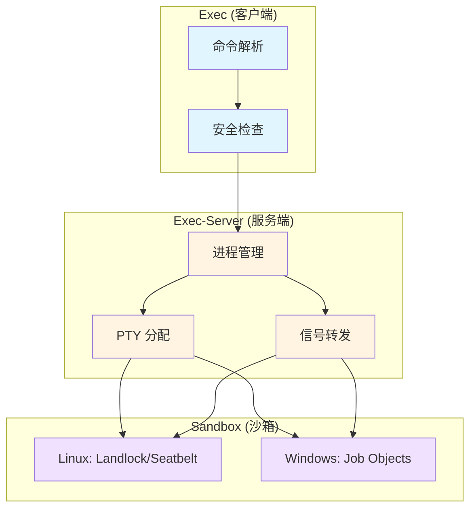

**安全机制**:

**Linux (Landlock)**:
```rust
// 文件系统访问控制
LandlockABI {
    只读路径: [项目目录],
    写入路径: [特定目录],
    网络访问: 受限,
}
```

**macOS (Seatbelt)**:
```bash
# 使用 /usr/bin/sandbox-exec
seatbelt-policy {
    allow-file-write*: ${HOME}/Downloads
    deny-network: *
}
```

**Windows**:
```rust
// Job Objects
JobObject {
    限制: 进程创建、资源使用,
    UI 限制: 桌面访问,
}
```

### 9. 其他重要模块

#### Config (配置管理)

**位置**: `./codex-rs/core/src/config/`

**配置优先级**:
1. CLI 参数覆盖
2. `./codex.toml` (项目级)
3. `~/.codex/config.toml` (用户级)
4. 默认配置

**关键配置项**:
```toml
[models]
default = "gpt-4o"

[features]
# 功能开关

[sandbox]
mode = "advanced"  # basic | advanced | none

[approvals]
exec = "ask"  # ask | auto
patch = "ask"  # ask | auto
```

#### File Search (文件搜索)

**位置**: `./codex-rs/file-search/`

**实现**: 基于 `nucleo-matcher` 的模糊搜索算法

**能力**:
- 高效文件名匹配
- 支持正则表达式
- 结果排序

#### Git Integration (Git 集成)

**位置**: `./codex-rs/utils/git/`

**功能**:
- 仓库根目录检测
- Diff 生成
- 分支信息获取
- 提交历史查询

---

## 数据流与通信协议

### 完整数据流

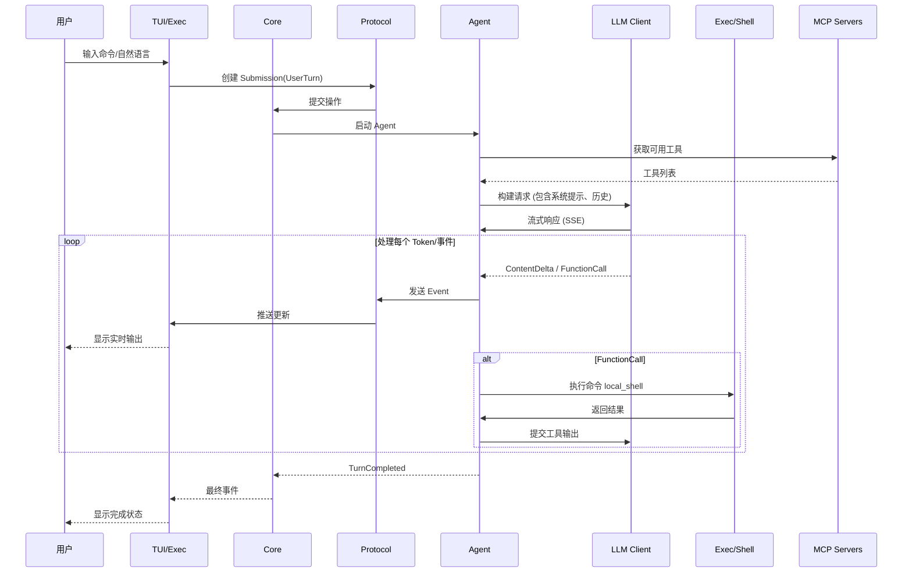

### SQ/EQ 通信模式详解

**Submission Queue (SQ)**:
- **方向**: 用户 → Agent
- **语义**: 用户的请求和决策
- **特性**: FIFO, 异步处理

**Event Queue (EQ)**:
- **方向**: Agent → 用户
- **语义**: 代理的实时状态和输出
- **特性**: 发布/订阅, 流式推送

**关键操作类型**:

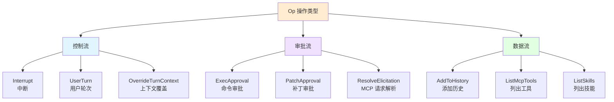

### 事件类型生命周期

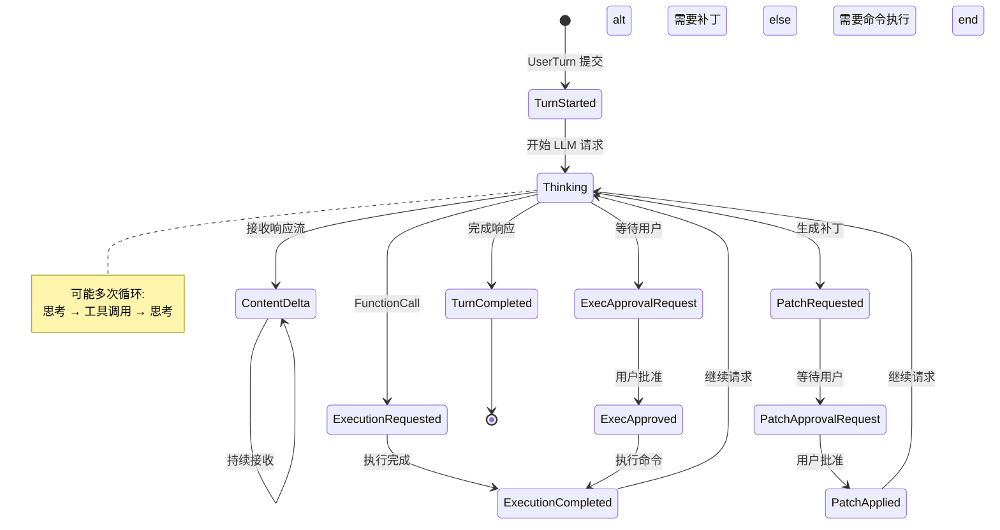

---

## 设计模式与架构决策

### 1. SQ/EQ 模式 (Submission Queue / Event Queue)

**问题**: 如何在用户和 AI Agent 之间实现高效、异步的双向通信?

**解决方案**:
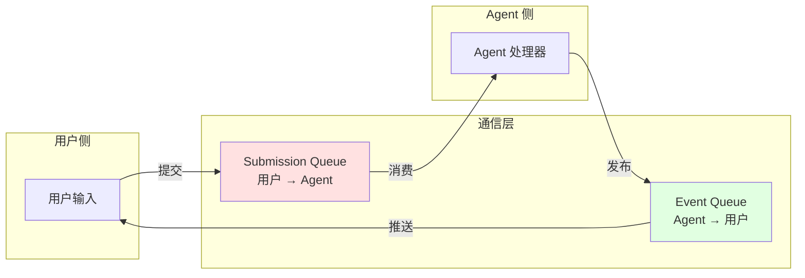

**优点**:
- **解耦**: 用户界面和 Agent 逻辑完全解耦
- **异步**: 非阻塞通信,支持流式输出
- **可扩展**: 易于添加新的操作和事件类型
- **可测试**: 可以用 Mock 队列进行单元测试

**实现细节**:
```rust
// core/src/codex.rs (简化)
pub struct Codex {
    submission_tx: mpsc::Sender<Submission>,
    event_rx: mpsc::Receiver<Event>,
}

impl Codex {
    pub async fn submit(&mut self, op: Op) -> Result<String> {
        let id = Uuid::new_v4().to_string();
        self.submission_tx.send(Submission { id, op }).await?;
        Ok(id)
    }

    pub async fn next_event(&mut self) -> Result<Event> {
        self.event_rx.recv().await.ok_or(Error::Closed)
    }
}
```

### 2. Workspace Crates 模式

**问题**: 如何组织大型 Rust 项目,既保持模块化又避免代码重复?

**解决方案**: Cargo Workspace

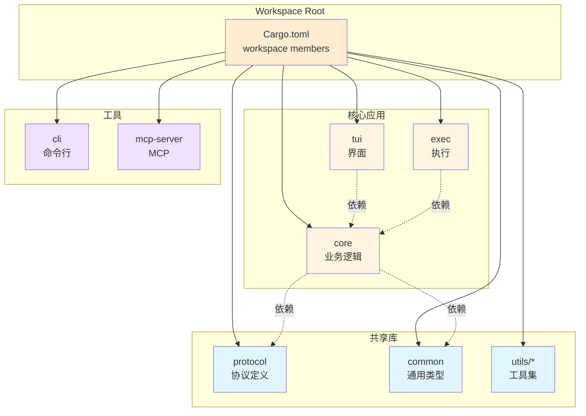

**Workspace 成员数量**: 49 个 crate

**依赖关系原则**:
- **单向依赖**: 上层可以依赖下层,下层不依赖上层
- **最小依赖**: 只依赖真正需要的模块
- **共享抽象**: 通过 `protocol` 和 `common` 共享类型

### 3. Trait-based 抽象

**示例**: 认证管理

```rust
// core/src/auth.rs
pub trait AuthManager: Send + Sync {
    async fn get_token(&self) -> Result<String>;
    async fn refresh_token(&self) -> Result<()>;
    async fn logout(&self) -> Result<()>;
}

// 实现
pub struct ChatGPTAuth { ... }
pub struct ApiKeyAuth { ... }
pub struct DeviceCodeAuth { ... }

impl AuthManager for ChatGPTAuth { ... }
impl AuthManager for ApiKeyAuth { ... }
impl AuthManager for DeviceCodeAuth { ... }
```

**优点**:
- **多态**: 运行时选择不同的认证方式
- **可测试**: 易于 Mock
- **扩展性**: 添加新认证方式无需修改现有代码

### 4. Builder 模式

**示例**: 会话创建

```rust
pub struct NewConversation {
    pub model: String,
    pub cwd: PathBuf,
    pub approval_policy: AskForApproval,
    pub sandbox_policy: SandboxPolicy,
    pub session_source: SessionSource,
    // ... 20+ 字段
}

impl ConversationManager {
    pub async fn create_conversation(&self, config: NewConversation) -> Result<CodexConversation> {
        // 构建复杂的会话对象
    }
}
```

**改进空间**: 可以使用 Builder 模式简化 API

```rust
// 建议 (未来改进)
let conv = ConversationManager::builder()
    .model("gpt-4o")
    .cwd(current_dir)
    .approval_policy(AskForApproval::Auto)
    .sandbox_policy(SandboxMode::Basic)
    .build()
    .await?;
```

### 5. 事件驱动架构

**核心思想**: 所有用户可见的输出都是事件


**优点**:
- **实时性**: 立即推送状态变化
- **解耦**: Agent 不关心 UI 实现
- **多输出**: 同一事件可输出到 TUI、JSON、文件等

**事件过滤**:
```rust
// tui/src/event_processor.rs
impl EventProcessor {
    fn should_display(&self, event: &Event) -> bool {
        match event.msg {
            EventMsg::ContentDelta { .. } => self.show_thinking,
            EventMsg::InternalDebug { .. } => self.debug_mode,
            _ => true,
        }
    }
}
```

### 6. 错误处理策略

**统一错误类型**:

```rust
// core/src/error.rs
pub enum Error {
    Auth(AuthError),
    Network(NetworkError),
    Execution(ExecError),
    Config(ConfigError),
    // ...
}

impl From<AuthError> for Error {
    fn from(err: AuthError) -> Self {
        Error::Auth(err)
    }
}
```

**使用 `anyhow` 或 `color-eyre`**:
```rust
pub async fn run_codex() -> Result<()> {
    // 使用 ? 自动转换错误
    let token = auth_manager.get_token().await?;
    let response = http_client.post(&url).json(&body).send().await?;
    Ok(())
}
```

### 7. 资源管理

**文件描述符管理**:
```rust
// 使用 drop guard 确保清理
struct ProcessGuard {
    child: Child,
}

impl Drop for ProcessGuard {
    fn drop(&mut self) {
        let _ = self.child.kill();
    }
}
```

**会话持久化**:
```rust
// core/src/rollout.rs
pub struct RolloutRecorder {
    sessions_dir: PathBuf,
}

impl RolloutRecorder {
    pub fn save_session(&self, id: &ConversationId, history: &[HistoryEntry]) -> Result<()> {
        let path = self.sessions_dir.join(id.to_string());
        fs::write(path, serde_json::to_string(history)?)?;
        Ok(())
    }
}
```

---

## 技术栈

### 编译语言

| 语言 | 用途 | 位置 |
|------|------|------|
| **Rust** | 核心实现 | `./codex-rs/` |
| **TypeScript** | CLI 入口 | `./codex-cli/` |
| **JavaScript** | 构建脚本 | `scripts/` |
| **Shell** | 构建工具 | `.github/workflows/` |
| **Starlark** | 构建配置 (内部) | - |

### 主要依赖库

#### Rust 生态系统

**异步运行时**:
- `tokio` { version = "1" } - 异步运行时
- `futures` - Future 抽象
- `async-trait` - 异步 Trait

**HTTP 客户端**:
- `reqwest` { version = "0.12" } - HTTP 客户端
- `eventsource-stream` - SSE 流处理

**终端 UI**:
- `ratatui` = "0.29.0" - TUI 框架
- `crossterm` - 终端操作
- `portable-pty` - 伪终端

**序列化**:
- `serde` = "1" - 序列化框架
- `serde_json` - JSON 支持
- `serde_yaml` - YAML 支持
- `toml` = "0.9.5" - TOML 支持

**命令行**:
- `clap` = "4" - CLI 解析
- `clap_complete` - Shell 补全

**安全与沙箱**:
- `landlock` - Linux 沙箱
- `seccompiler` - seccomp 编译

**MCP 协议**:
- `rmcp` = { version = "0.12.0" } - MCP Rust SDK

**代码处理**:
- `tree-sitter` - 代码解析
- `diffy` - Diff 生成
- `similar` - Diff 对比

**日志与追踪**:
- `tracing` - 结构化日志
- `tracing-subscriber` - 日志订阅器
- `opentelemetry` - 分布式追踪
- `sentry` - 错误监控

**测试**:
- `insta` - 快照测试
- `wiremock` - HTTP Mock
- `pretty_assertions` - 漂亮的断言

#### TypeScript/JavaScript

**包管理**:
- `npm` / `bun` - 包管理器
- `node` >= 16 - 运行时

**分发**:
- npm 包 `@openai/codex`
- Homebrew cask

### 构建工具

**Cargo**:
```bash
# 构建所有 crate
cargo build --release

# 运行测试
cargo test --all-features

# 代码检查
cargo clippy -- -D warnings

# 格式化
cargo fmt
```

**平台支持**:
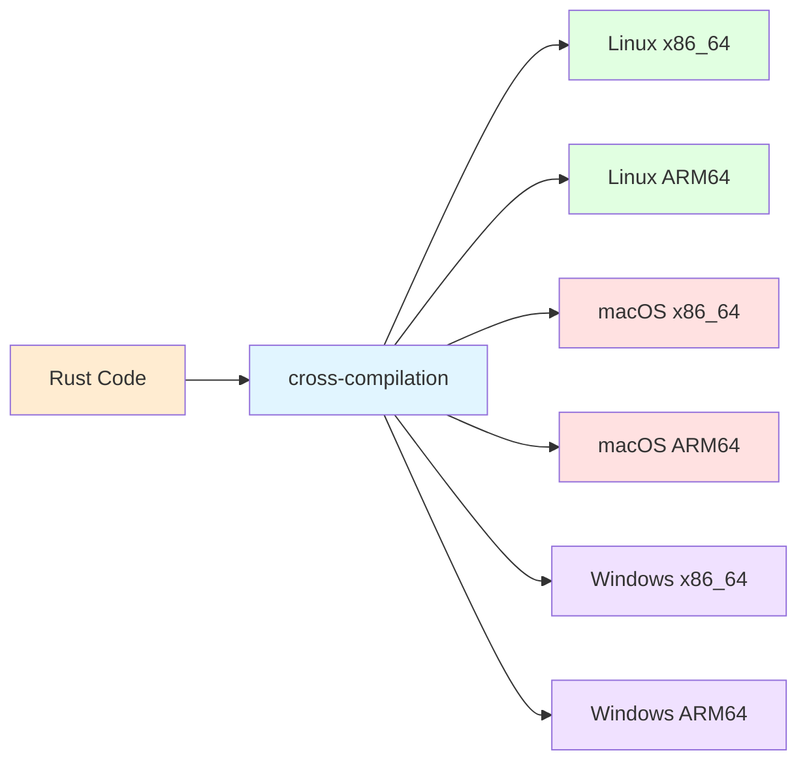

**CI/CD**: GitHub Actions
- Linux/macOS/Windows 矩阵构建
- 代码签名 (notarytool for macOS, signtool for Windows)
- 自动发布

---

## 扩展性设计

### 1. 模型提供商扩展

**接口定义**:

```rust
// core/src/models_manager.rs (概念)
pub trait ModelProvider {
    fn name(&self) -> &str;
    async fn chat_completion(&self, request: Request) -> Result<Response>;
    fn supports_streaming(&self) -> bool;
}

// 内置提供商
pub struct OpenAIProvider { ... }
pub struct OllamaProvider { ... }
pub struct LMStudioProvider { ... }

impl ModelProvider for OpenAIProvider { ... }
impl ModelProvider for OllamaProvider { ... }
impl ModelProvider for LMStudioProvider { ... }
```

**添加新提供商**:
```toml
# ~/.codex/config.toml
[oss_providers.my_provider]
type = "openai_compatible"
base_url = "https://my-api.com"
api_key = "sk-..."
models = ["my-model-1", "my-model-2"]
```

### 2. MCP 服务器集成

**工作原理**:

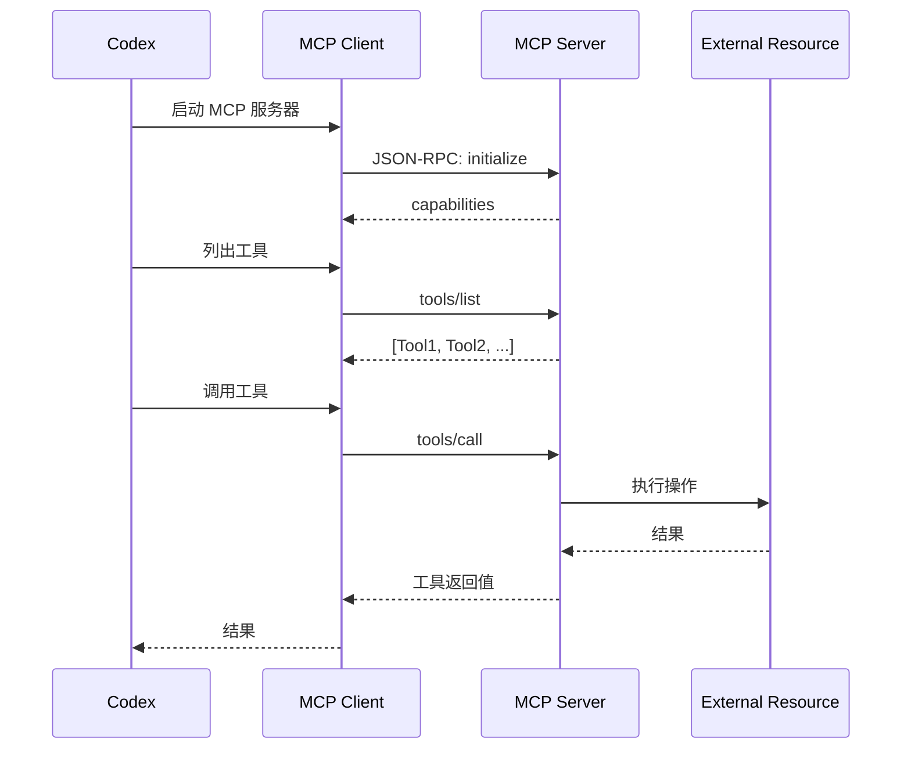

**配置示例**:
```toml
[mcp_servers.filesystem]
command = "npx"
args = ["-y", "@modelcontextprotocol/server-filesystem", "/allowed/path"]

[mcp_servers.github]
command = "npx"
args = ["-y", "@modelcontextprotocol/server-github"]
env = { "GITHUB_TOKEN" = "ghp_..." }
```

### 3. 自定义技能 (Skills)

**技能发现**:
```rust
// core/src/skills.rs (概念)
pub struct Skill {
    pub name: String,
    pub description: String,
    pub trigger: SkillTrigger,  // 文件匹配模式
    pub prompt: String,          // 自定义提示
}

// 扫描项目
let skills = discover_skills(project_dir)?;
// 生成: .codex/skills.toml
```

**技能类型**:
- **Repository Skills**: 项目级技能
- **Global Skills**: 用户级技能
- **Built-in Skills**: 内置技能

### 4. 自定义提示 (Custom Prompts)

**提示模板**:
```toml
# ~/.codex/prompts.toml
[prompts.code_review]
description = "Review code for bugs and best practices"
template = """
Review the following code for potential bugs, security issues, and best practices violations:

{code}

Provide specific suggestions for improvement.
"""

[prompts.test_generation]
description = "Generate unit tests"
template = """
Generate comprehensive unit tests for the following code:

{code}

Include edge cases and error handling tests.
"""
```

**使用方式**:
```bash
codex "Use the code_review prompt on src/main.rs"
```

### 5. 工具扩展

**内置工具**:
- `local_shell`: 执行 Shell 命令
- `read_file`: 读取文件
- `write_file`: 写入文件
- `search_files`: 搜索文件
- `list_allowed_directories`: 列出允许的目录

**添加新工具** (概念):
```rust
// core/src/tools/custom.rs
#[derive(Debug, Serialize, Deserialize)]
pub struct MyCustomTool {
    pub param1: String,
    pub param2: i32,
}

impl Tool for MyCustomTool {
    fn name(&self) -> &str {
        "my_custom_tool"
    }

    async fn execute(&self) -> Result<ToolOutput> {
        // 实现逻辑
        Ok(ToolOutput::success(result))
    }
}
```

### 6. 审批策略扩展

**当前策略**:
```rust
pub enum AskForApproval {
    Always,    // 总是询问
    Auto,      // 自动批准
    Never,     // 从不批准 (调试用)
}
```

**未来扩展**:
```rust
// 概念
pub trait ApprovalPolicy {
    async fn should_approve(&self, request: &ApprovalRequest) -> bool;
}

pub struct PatternBasedPolicy {
    allow_patterns: Vec<Regex>,
    deny_patterns: Vec<Regex>,
}

impl ApprovalPolicy for PatternBasedPolicy {
    async fn should_approve(&self, request: &ApprovalRequest) -> bool {
        // 检查命令模式
    }
}
```

### 7. 插件系统 (未来)

**可能的架构**:

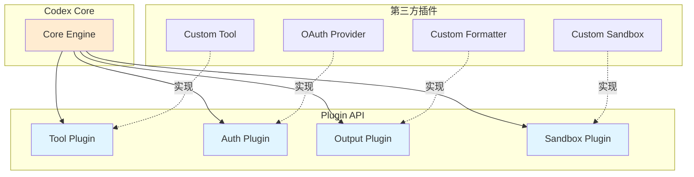

**Wasm 插件** (可能性):
```rust
// 使用 wasmtime 运行 Wasm 插件
use wasmtime::*;

pub struct WasmPlugin {
    engine: Engine,
    instance: Instance,
}

impl Plugin for WasmPlugin {
    fn execute(&self, input: &[u8]) -> Result<Vec<u8>> {
        let func = self.instance.get_typed_func::<(), i32>("run")?;
        Ok(func.call()?.to_be_bytes().to_vec())
    }
}
```

---

## 架构优势与权衡

### 优势

1. **性能**:
   - Rust 实现提供零成本抽象和内存安全
   - 异步 I/O 最大化吞吐量
   - 编译型语言提供快速启动

2. **安全性**:
   - Rust 类型系统防止内存错误
   - 沙箱机制隔离命令执行
   - 显式的错误处理

3. **跨平台**:
   - Rust 的跨平台编译支持
   - 抽象的沙箱接口 (Linux/macOS/Windows)
   - 统一的配置和协议

4. **可维护性**:
   - Workspace Crates 清晰的模块边界
   - 强类型系统减少运行时错误
   - 丰富的文档和注释

5. **用户体验**:
   - 流式实时输出
   - 精美的 TUI 界面
   - 灵活的配置选项

### 权衡与挑战

1. **复杂度**:
   - 49 个 crate 增加认知负担
   - SQ/EQ 模式需要理解异步编程
   - 大量的样板代码

2. **编译时间**:
   - Rust 编译较慢 (尤其是 release)
   - Workspace 缓解但未完全解决
   - 建议: 使用 `cargo check` 快速迭代

3. **二进制大小**:
   - Rust 静态链接导致二进制较大
   - 优化: LTO + strip = 符号
   - 权衡: 单文件分发 vs. 动态链接

4. **学习曲线**:
   - Rust 的所有权和借用机制
   - 异步编程 (async/await)
   - 终端 UI 编程 (Ratatui)

5. **调试难度**:
   - 异步代码的调用栈复杂
   - 多线程并发问题
   - 缓解: tracing 和日志

---

## 最佳实践与建议

### 1. 添加新功能

**流程**:
```bash
# 1. 确定目标 crate
cd codex-rs/<target-crate>

# 2. 开发
# ... 编写代码 ...

# 3. 格式化
just fmt

# 4. 运行 linter
just fix -p <target-crate>

# 5. 运行测试
cargo test -p <target-crate>

# 6. 如果修改了共享代码
cargo test --all-features
```

### 2. 代码风格

**遵循 AGENTS.md**:
- 内联 format! 参数: `format!("Hello {}", name)` ✅
- 避免克隆: 使用 `&str` 而非 `String` (如果可能)
- 使用方法引用: `vec.iter().map(|x| x.len())` → `vec.iter().map(str::len)`

**TUI 样式**:
```rust
// 推荐
"error".red()
vec!["  └ ".into(), "M".red(), " file.rs".dim()].into()

// 避免
Span::styled("error", Style::default().fg(Color::Red))
```

### 3. 测试策略

**单元测试**:
```rust
#[cfg(test)]
mod tests {
    use super::*;
    use pretty_assertions::assert_eq;

    #[test]
    fn test_something() {
        let result = compute();
        assert_eq!(result, expected);  // 深度比较
    }
}
```

**集成测试** (core):
```rust
// core/tests/common/mod.rs 提供工具
use core_test_support::responses;

#[tokio::test]
async fn test_user_turn() {
    let server = mock_server().await;
    let mock = responses::mount_sse_once(&server, ...).await;

    let codex = create_codex(&server).await;
    codex.submit(Op::UserTurn { ... }).await?;

    let request = mock.single_request();
    assert_eq!(request.input(), "expected input");
}
```

**快照测试** (TUI):
```bash
# 更新快照
cargo test -p codex-tui
cargo insta review -p codex-tui
cargo insta accept -p codex-tui
```

### 4. 错误处理

**使用 `thiserror`**:
```rust
use thiserror::Error;

#[derive(Error, Debug)]
pub enum CodexError {
    #[error("Authentication failed: {0}")]
    Auth(String),

    #[error("Network error: {0}")]
    Network(#[from] reqwest::Error),

    #[error("IO error: {0}")]
    Io(#[from] std::io::Error),
}
```

### 5. 日志与追踪

**结构化日志**:
```rust
use tracing::{info, error, debug, instrument};

#[instrument(skip(self))]
pub async fn process_turn(&self, turn: UserTurn) -> Result<()> {
    info!(turn_id = %turn.id, "Processing turn");
    debug!(model = %turn.model, "Using model");
    // ...
    Ok(())
}
```

### 6. 配置管理

**优先级**:
```rust
// 1. CLI 参数 (最高)
// 2. 项目配置 ./codex.toml
// 3. 用户配置 ~/.codex/config.toml
// 4. 默认值

let config = load_config_as_toml_with_cli_overrides(
    cli.config_overrides,
    cli.config_profile,
)?;
```

---

## 未来展望

### 可能的改进方向

1. **性能优化**:
   - 增量编译优化
   - 二进制大小优化
   - 内存使用优化

2. **功能增强**:
   - 插件系统
   - 更多模型提供商
   - 高级审批策略

3. **用户体验**:
   - 更丰富的 TUI 主题
   - 更好的错误提示
   - 快捷键自定义

4. **开发者工具**:
   - 调试模式
   - 性能分析
   - 事件查看器

5. **生态系统**:
   - 公共 MCP 服务器库
   - 社区插件市场
   - 技能分享平台

---

## 总结

**Codex CLI** 是一个设计精良、工程实践优秀的 AI 编程助手。它展现了:

1. **清晰的架构分层**: 从用户界面到核心逻辑到基础设施
2. **优秀的工程实践**: Rust 的类型安全、模块化设计、丰富的测试
3. **强大的扩展性**: MCP、模型提供商、自定义提示等
4. **跨平台支持**: Linux/macOS/Windows 全覆盖
5. **安全性**: 沙箱隔离、审批机制、权限控制

**核心设计模式**:
- SQ/EQ 异步通信模式
- Workspace Crates 模块化
- Trait-based 抽象
- 事件驱动架构

**技术栈**: Rust (核心) + TypeScript (入口) + Ratatui (TUI)

这是一个值得学习的现代 Rust 应用程序架构案例。

---

## 参考资源

- **官方文档**: https://developers.openai.com/codex
- **GitHub**: https://github.com/openai/codex
- **Rust Book**: https://doc.rust-lang.org/book/
- **Ratatui**: https://ratatui-org.github.io/ratatui/
- **Tokio**: https://tokio.rs/
- **MCP 协议**: https://modelcontextprotocol.io/

---

*文档生成时间: 2025-01-07*
*Codex 版本: 0.0.0-dev*
*分析工具: Claude AI (Sonnet 4.5)*
