# Codex 事件循环机制详解

## 1. 概述

Codex 是一个基于 LLM 的自主 AI Agent，其核心能力是通过**事件循环（Event Loop）**机制来不断分解任务、执行操作、接收反馈、调整策略，直到完成用户指定的目标。

## 2. 核心架构

Codex 的事件循环基于 **ReAct（Reasoning + Acting）** 范式，结合了思维链（Chain of Thought）和工具调用能力。

### 2.1 核心组件

```
┌─────────────────────────────────────────────────────────────┐
│                      User Request                            │
└────────────────────┬────────────────────────────────────────┘
                     │
                     ▼
┌─────────────────────────────────────────────────────────────┐
│                   Event Loop Controller                      │
│  ┌─────────────────────────────────────────────────────┐    │
│  │  1. Observe (观察当前状态)                            │    │
│  │  2. Reason (推理下一步行动)                           │    │
│  │  3. Act (执行工具调用)                                │    │
│  │  4. Reflect (反思与调整)                              │    │
│  └─────────────────────────────────────────────────────┘    │
└─────────────────────────────────────────────────────────────┘
                     │
         ┌───────────┼───────────┐
         ▼           ▼           ▼
    ┌────────┐  ┌────────┐  ┌────────┐
    │  Memory│  │ Planner│  │ Tools  │
    └────────┘  └────────┘  └────────┘
```

## 3. 事件循环流程详解

### 3.1 任务接收阶段

当用户发起一个任务时，Codex 首先进行任务理解和目标明确：

```python
# 伪代码示例
def receive_task(user_request):
    # 1. 解析用户意图
    intent = parse_intent(user_request)

    # 2. 提取关键信息
    context = extract_context(user_request)

    # 3. 明确成功标准
    success_criteria = define_success_criteria(intent, context)

    # 4. 初始化任务状态
    task_state = TaskState(
        goal=intent,
        context=context,
        success_criteria=success_criteria,
        status="pending"
    )

    return task_state
```

**关键要素：**
- **意图识别**：理解用户想要完成什么
- **上下文提取**：识别相关文件、代码库状态、约束条件
- **成功标准**：定义何时任务完成

### 3.2 任务分解阶段

Codex 将复杂任务分解为可执行的子任务：

```python
def decompose_task(task_state):
    # 使用 LLM 生成子任务列表
    subtasks = llm_generate(
        prompt=f"""
        目标：{task_state.goal}
        上下文：{task_state.context}

        请将此任务分解为具体、可执行的步骤。
        每个步骤应该：
        1. 可以通过工具调用完成
        2. 产出可验证的结果
        3. 依赖关系清晰
        """
    )

    # 构建任务依赖图
    task_graph = build_dependency_graph(subtasks)

    return task_graph
```

**分解原则：**
- **原子性**：每个子任务独立可执行
- **可验证性**：有明确的完成标准
- **依赖管理**：识别前置任务

### 3.3 核心事件循环

这是 Codex 的核心引擎，不断迭代直到任务完成：

```python
def event_loop(task_state, max_iterations=50):
    iteration = 0
    memory = WorkingMemory()

    while iteration < max_iterations and not task_state.is_complete:
        iteration += 1

        # === 阶段 1: 观察（Observe） ===
        current_state = observe(memory, task_state)

        # === 阶段 2: 推理（Reason） ===
        thought, action = reason(
            task_state=task_state,
            current_state=current_state,
            memory=memory,
            iteration=iteration
        )

        # === 阶段 3: 行动（Act） ===
        observation = execute_action(action, task_state)

        # === 阶段 4: 反思（Reflect） ===
        should_continue, new_thought = reflect(
            thought=thought,
            action=action,
            observation=observation,
            task_state=task_state,
            memory=memory
        )

        # 更新记忆和状态
        memory.add_step(thought, action, observation)
        task_state.update(observation)

        # 检查是否完成
        if check_completion(task_state, memory):
            task_state.is_complete = True
            break

        # 检查是否需要调整策略
        if not should_continue:
            # 重新规划
            replan(task_state, memory)

    return task_state, memory
```

## 4. 各阶段深度解析

### 4.1 观察（Observe）阶段

**目的**：收集当前环境的完整信息

**收集的信息**：
1. **文件系统状态**：当前目录结构、已修改文件
2. **代码库状态**：git 状态、未提交的更改
3. **任务进度**：已完成的子任务、待处理的子任务
4. **历史操作**：之前的工具调用和结果
5. **错误信息**：失败的操作和错误日志

```python
def observe(memory, task_state):
    observation = {
        # 文件系统状态
        "file_tree": get_directory_tree(),

        # Git 状态
        "git_status": get_git_status(),

        # 任务进度
        "completed_subtasks": task_state.completed_subtasks,
        "pending_subtasks": task_state.pending_subtasks,

        # 近期操作历史（最近 10 步）
        "recent_history": memory.get_recent_steps(n=10),

        # 累积的上下文
        "accumulated_context": memory.get_context_summary(),

        # 错误追踪
        "recent_errors": memory.get_recent_errors()
    }

    return observation
```

### 4.2 推理（Reason）阶段

**目的**：基于观察结果，决定下一步行动

**推理过程**：

```python
def reason(task_state, current_state, memory, iteration):
    # 构建推理提示词
    reasoning_prompt = f"""
    # 任务目标
    {task_state.goal}

    # 当前状态
    {format_state(current_state)}

    # 操作历史
    {format_history(memory)}

    # 第 {iteration} 次迭代

    请分析当前情况并决定下一步行动：

    1. 评估当前进度：我们已经完成了什么？还有什么待完成？
    2. 识别关键问题：当前最大的阻碍是什么？
    3. 制定计划：下一步应该采取什么行动？
    4. 预期结果：这个行动应该产生什么效果？

    输出格式：
    思考：[你的推理过程]
    行动：[具体要调用的工具和参数]
    """

    # 调用 LLM 进行推理
    response = llm_call(reasoning_prompt)

    # 解析响应
    thought = extract_thought(response)
    action = parse_action(response)

    return thought, action
```

**推理策略**：

1. **进度评估**：检查完成度
   ```
   - 已完成子任务 / 总子任务
   - 关键里程碑是否达成
   - 当前与目标的距离
   ```

2. **问题识别**：定位阻碍
   ```
   - 编译错误 / 测试失败
   - 依赖缺失
   - 逻辑矛盾
   - 资源不足
   ```

3. **决策制定**：选择行动
   ```
   - 如果有错误 → 修复错误
   - 如果有测试失败 → 调试测试
   - 如果需要新功能 → 实现功能
   - 如果需要重构 → 重构代码
   - 如果任务完成 → 验证并退出
   ```

4. **优先级判断**：
   ```
   高优先级：
   - 修复阻塞性错误
   - 完成关键路径任务

   中优先级：
   - 实现核心功能
   - 运行测试验证

   低优先级：
   - 代码优化
   - 注释完善
   ```

### 4.3 行动（Act）阶段

**目的**：执行推理阶段选择的工具调用

**可用工具集**：

```python
AVAILABLE_TOOLS = {
    # 文件操作
    "read_file": read_file,
    "write_file": write_file,
    "edit_file": edit_file,
    "search_files": search_files,

    # 代码执行
    "run_command": run_command,
    "execute_test": execute_test,
    "run_linter": run_linter,

    # 分析工具
    "analyze_code": analyze_code,
    "find_dependencies": find_dependencies,
    "detect_issues": detect_issues,

    # Git 操作
    "git_status": git_status,
    "git_diff": git_diff,
    "git_commit": git_commit,

    # 内存管理
    "search_memory": search_memory,
    "summarize_history": summarize_history
}
```

**执行流程**：

```python
def execute_action(action, task_state):
    try:
        # 1. 验证工具可用性
        if action.tool not in AVAILABLE_TOOLS:
            return {
                "status": "error",
                "message": f"工具 {action.tool} 不存在"
            }

        # 2. 验证参数
        if not validate_params(action.tool, action.params):
            return {
                "status": "error",
                "message": "参数验证失败"
            }

        # 3. 执行工具
        tool_func = AVAILABLE_TOOLS[action.tool]
        result = tool_func(**action.params)

        # 4. 格式化结果
        observation = {
            "status": "success",
            "tool": action.tool,
            "params": action.params,
            "result": result,
            "timestamp": get_timestamp()
        }

        return observation

    except Exception as e:
        # 错误处理
        return {
            "status": "error",
            "tool": action.tool,
            "error": str(e),
            "traceback": traceback.format_exc()
        }
```

**关键设计**：

1. **幂等性**：某些操作可以安全重试
2. **回滚机制**：失败后可以恢复
3. **超时控制**：防止无限等待
4. **资源限制**：内存、磁盘、时间限制

### 4.4 反思（Reflect）阶段

**目的**：评估行动结果，决定是否继续或调整策略

```python
def reflect(thought, action, observation, task_state, memory):
    # 构建反思提示词
    reflection_prompt = f"""
    # 之前的思考
    {thought}

    # 执行的行动
    Tool: {action.tool}
    Params: {action.params}

    # 观察到的结果
    {observation}

    # 任务目标
    {task_state.goal}

    请反思这次操作：

    1. 操作是否成功？
    2. 结果是否达到预期？
    3. 如果失败，原因是什么？
    4. 下一步应该继续当前策略还是改变策略？

    输出：
    - should_continue: true/false
    - reflection: [详细反思]
    - next_strategy: [如果有调整]
    """

    response = llm_call(reflection_prompt)

    # 解析响应
    should_continue = parse_should_continue(response)
    new_thought = parse_reflection(response)

    # 特殊情况处理
    if observation["status"] == "error":
        # 错误恢复策略
        should_continue = handle_error(observation, memory)

    # 检查是否陷入循环
    if is_stuck_in_loop(memory):
        should_continue = False
        new_thought = "检测到重复失败，需要重新规划"

    return should_continue, new_thought
```

**反思维度**：

1. **成功评估**：
   ```
   - 操作是否正常完成
   - 输出是否符合预期
   - 是否有副作用
   ```

2. **错误分析**：
   ```
   - 错误类型：语法错误 / 逻辑错误 / 运行时错误
   - 错误原因：参数错误 / 依赖缺失 / 逻辑缺陷
   - 修复策略：直接修复 / 绕过方案 / 重新设计
   ```

3. **进度评估**：
   ```
   - 是否向目标靠近
   - 完成度百分比
   - 剩余工作量估算
   ```

4. **策略调整**：
   ```
   - 当前策略有效 → 继续
   - 当前策略无效 → 调整
   - 多次失败 → 重新规划
   - 发现新问题 → 更新目标
   ```

## 5. 任务完成判断机制

### 5.1 多维度完成检查

```python
def check_completion(task_state, memory):
    checks = {
        # 1. 目标达成检查
        "goal_achieved": check_goal_achievement(task_state),

        # 2. 成功标准检查
        "criteria_met": check_success_criteria(task_state),

        # 3. 无错误检查
        "no_errors": check_no_blocking_errors(memory),

        # 4. 测试通过检查
        "tests_pass": check_all_tests_pass(task_state),

        # 5. 代码质量检查
        "quality_ok": check_code_quality(task_state)
    }

    # 所有检查都通过才认为完成
    is_complete = all(checks.values())

    if is_complete:
        log_completion(task_state, checks)

    return is_complete
```

### 5.2 目标达成检查

```python
def check_goal_achievement(task_state):
    # 基于目标类型进行不同检查

    goal_type = task_state.goal.type

    if goal_type == "feature_implementation":
        # 功能实现检查
        return (
            check_feature_exists(task_state) and
            check_feature_works(task_state)
        )

    elif goal_type == "bug_fix":
        # Bug 修复检查
        return (
            check_bug_reproduced(task_state) and
            check_fix_applied(task_state) and
            check_bug_not_reproduce(task_state)
        )

    elif goal_type == "refactoring":
        # 重构检查
        return (
            check_behavior_preserved(task_state) and
            check_code_improved(task_state)
        )

    elif goal_type == "test_generation":
        # 测试生成检查
        return (
            check_tests_created(task_state) and
            check_tests_pass(task_state) and
            check_coverage(task_state)
        )

    return False
```

### 5.3 自我验证机制

```python
def self_verification(task_state, memory):
    # 让 Codex 自我评估

    verification_prompt = f"""
    # 任务目标
    {task_state.goal}

    # 完成的工作
    {format_completed_work(memory)}

    # 最终状态
    {format_current_state(task_state)}

    请进行自我验证：

    1. 是否完全实现了目标？
    2. 是否有遗漏的边界情况？
    3. 代码质量是否达标？
    4. 是否引入了新的问题？
    5. 还有什么需要改进的？

    给出评分（0-100）和详细说明。
    """

    response = llm_call(verification_prompt)

    # 解析评分
    score = extract_score(response)
    issues = extract_issues(response)

    return {
        "score": score,
        "issues": issues,
        "is_satisfactory": score >= 80
    }
```

### 5.4 外部验证（如果可用）

```python
def external_validation(task_state):
    validations = []

    # 1. 运行测试套件
    if has_tests(task_state):
        test_result = run_test_suite(task_state)
        validations.append(("tests", test_result.passed))

    # 2. 代码检查
    lint_result = run_linter(task_state)
    validations.append(("lint", lint_result.clean))

    # 3. 类型检查
    if has_type_hints(task_state):
        type_check_result = run_type_checker(task_state)
        validations.append(("types", type_check_result.valid))

    # 4. 构建验证
    if is_buildable(task_state):
        build_result = build_project(task_state)
        validations.append(("build", build_result.success))

    # 所有验证都通过
    return all(passed for _, passed in validations)
```

## 6. 记忆与上下文管理

### 6.1 工作记忆结构

```python
class WorkingMemory:
    def __init__(self):
        # 短期记忆：最近的操作
        self.short_term = deque(maxlen=20)

        # 长期记忆：重要信息
        self.long_term = []

        # 错误模式：重复出现的错误
        self.error_patterns = []

        # 成功模式：有效的策略
        self.success_patterns = []

        # 上下文摘要：压缩的历史信息
        self.context_summary = ""
```

### 6.2 记忆更新策略

```python
def update_memory(memory, thought, action, observation):
    # 1. 添加到短期记忆
    memory.short_term.append({
        "thought": thought,
        "action": action,
        "observation": observation,
        "timestamp": get_timestamp()
    })

    # 2. 识别重要信息并存入长期记忆
    if is_important(observation):
        memory.long_term.append({
            "content": observation,
            "importance": calculate_importance(observation),
            "timestamp": get_timestamp()
        })

    # 3. 识别模式
    if observation["status"] == "error":
        memory.error_patterns.append({
            "error": observation["error"],
            "context": action,
            "occurrence": len(memory.short_term)
        })

    # 4. 更新上下文摘要
    if len(memory.short_term) % 5 == 0:
        memory.context_summary = summarize_context(memory.short_term)
```

### 6.3 上下文压缩

当历史过长时，需要压缩：

```python
def compress_context(memory):
    # 压缩策略：
    # 1. 保留最近的 N 步（如最近 10 步）
    # 2. 保留关键里程碑
    # 3. 压缩中间过程为摘要

    recent_steps = list(memory.short_term)[-10:]

    milestones = extract_milestones(memory.short_term)

    summary = summarize_middle_steps(
        memory.short_term,
        exclude_recent=10,
        exclude_milestones=True
    )

    compressed_memory = {
        "recent": recent_steps,
        "milestones": milestones,
        "summary": summary
    }

    return compressed_memory
```

## 7. 自我迭代与优化

### 7.1 重新规划机制

```python
def replan(task_state, memory):
    # 分析失败原因
    failure_analysis = analyze_failures(memory)

    # 生成新计划
    new_plan_prompt = f"""
    # 原始目标
    {task_state.goal}

    # 已尝试的方案
    {format_attempts(memory)}

    # 失败分析
    {failure_analysis}

    # 当前状态
    {format_current_state(task_state)}

    基于以上信息，请制定新的计划：
    1. 哪些方法已经证明无效？
    2. 有哪些替代方案？
    3. 新计划应该如何避免之前的失败？
    """

    new_plan = llm_call(new_plan_prompt)

    # 更新任务计划
    task_state.update_plan(new_plan)

    return new_plan
```

### 7.2 从错误中学习

```python
def learn_from_errors(memory):
    # 分析错误模式
    error_clusters = cluster_errors(memory.error_patterns)

    learnings = []

    for cluster in error_clusters:
        learning_prompt = f"""
        # 错误集群
        {cluster.errors}

        # 发生场景
        {cluster.contexts}

        请分析：
        1. 这些错误的共同原因是什么？
        2. 如何避免这类错误？
        3. 有什么更好的替代方法？
        """

        learning = llm_call(learning_prompt)
        learnings.append(learning)

    # 将学习成果存储为模式
    for learning in learnings:
        memory.success_patterns.append({
            "type": "error_prevention",
            "content": learning
        })
```

### 7.3 策略优化

```python
def optimize_strategy(memory):
    # 分析有效策略
    successful_actions = filter_successful(memory.short_term)

    strategy_analysis = llm_call(f"""
    # 成功的操作
    {successful_actions}

    请分析：
    1. 这些操作为什么成功？
    2. 有什么共同模式？
    3. 如何应用到未来场景？
    """)

    # 提取策略规则
    strategy_rules = extract_strategy_rules(strategy_analysis)

    # 存储为成功模式
    memory.success_patterns.extend(strategy_rules)

    return strategy_rules
```

## 8. 完整事件循环 Mermaid 图

```mermaid
flowchart TB
    Start([用户发起任务]) --> Parse[任务解析与理解]
    Parse --> Decompose{任务复杂度?}

    Decompose -->|简单| DirectExec[直接执行]
    Decompose -->|复杂| Plan[任务分解与规划]

    Plan --> SubTasks[生成子任务列表]
    SubTasks --> InitState[初始化任务状态]
    InitState --> LoopStart

    DirectExec --> LoopStart

    LoopStart((事件循环开始))
    LoopStart --> Observe[观察阶段]

    Observe --> |收集环境信息| CollectState[收集状态]
    CollectState --> |获取操作历史| GetHistory[获取历史]
    GetHistory --> |累积上下文| ContextSum[上下文摘要]
    ContextSum --> Reason

    Reason[推理阶段]
    Reason --> |LLM推理| ThoughtChain[思维链]
    ThoughtChain --> |评估进度| ProgressEval[进度评估]
    ProgressEval --> |识别问题| ProblemId[问题识别]
    ProblemId --> |制定计划| Decision[决策下一步]
    Decision --> ActionSelect[选择工具与参数]

    ActionSelect --> Act

    Act[行动阶段]
    Act --> |验证工具| ValidateTool[工具验证]
    ValidateTool --> |执行操作| Execute[执行工具调用]
    Execute --> |捕获结果| CollectResult[收集结果]

    CollectResult --> |成功?| SuccessCheck{操作成功?}

    SuccessCheck -->|是| UpdateMem[更新记忆]
    SuccessCheck -->|否| HandleError[错误处理]

    HandleError --> ErrorType{错误类型}
    ErrorType -->|可恢复| Recover[尝试恢复]
    ErrorType -->|不可恢复| RecordError[记录错误]

    Recover --> UpdateMem
    RecordError --> UpdateMem

    UpdateMem[更新记忆与状态]
    UpdateMem --> |添加历史| AddHistory[添加到历史]
    AddHistory --> |识别模式| PatternRec[模式识别]
    PatternRec --> |压缩上下文| CompressCtx[上下文压缩]

    CompressCtx --> Reflect

    Reflect[反思阶段]
    Reflect --> |评估结果| ResultEval[结果评估]
    ResultEval --> |是否达到预期?| ExpectCheck{预期检查}

    ExpectCheck -->|是| StrategyEval[策略有效性评估]
    ExpectCheck -->|否| AnalyzeFail[失败分析]

    AnalyzeFail --> |需要重试?| RetryCheck{可重试?}
    RetryCheck -->|是| AdjustAction[调整行动]
    RetryCheck -->|否| NeedReplan

    AdjustAction --> LoopStart

    StrategyEval --> |策略有效?| StrategyValid{策略有效?}
    StrategyValid -->|是| CompletionCheck
    StrategyValid -->|否| NeedReplan[需要重新规划]

    NeedReplan --> |分析失败原因| AnalyzeFailure[失败分析]
    AnalyzeFailure --> |生成新计划| GeneratePlan[生成新计划]
    GeneratePlan --> UpdatePlan[更新任务计划]
    UpdatePlan --> LoopStart

    CompletionCheck{任务完成检查}
    CompletionCheck --> |目标达成?| GoalCheck{目标检查}
    CompletionCheck --> |测试通过?| TestCheck{测试检查}
    CompletionCheck --> |无错误?| ErrorFreeCheck{错误检查}
    CompletionCheck --> |质量达标?| QualityCheck{质量检查}

    GoalCheck --> Completion
    TestCheck --> Completion
    ErrorFreeCheck --> Completion
    QualityCheck --> Completion

    Completion[综合完成判断]
    Completion --> |所有检查通过?| FinalCheck{最终验证}

    FinalCheck -->|是| SelfVerify[自我验证]
    FinalCheck -->|否| LoopStart

    SelfVerify --> |评分| Scoring[自我评分]
    Scoring --> |分数 >= 80?| Satisfactory{满意?}

    Satisfactory -->|是| Success([任务完成])
    Satisfactory -->|否| Improve[识别改进点]

    Improve --> |是否有快速修复?| QuickFix{快速修复?}
    QuickFix -->|是| AdjustAction
    QuickFix -->|否| Success

    Success --> Output[输出最终结果]
    Output --> Summary[生成总结]
    Summary --> End([流程结束])

    style Start fill:#e1f5e1
    style Success fill:#e1f5e1
    style End fill:#e1f5e1
    style Observe fill:#fff3cd
    style Reason fill:#d1ecf1
    style Act fill:#d4edda
    style Reflect fill:#f8d7da
    style LoopStart fill:#ffeaa7
    style CompletionCheck fill:#d5f4e6
```



## 9. 关键设计原则

### 9.1 SOLID 原则应用

1. **单一职责（SRP）**
   - 每个阶段（Observe/Reason/Act/Reflect）职责明确
   - 工具函数独立且专注
   - 记忆管理分离

2. **开闭原则（OCP）
   - 易于添加新工具
   - 可扩展的检查机制
   - 可插拔的策略

3. **里氏替换（LSP）
   - 工具接口统一
   - 可互换的验证器

4. **接口隔离（ISP）
   - 工具接口精简
   - 避免冗余依赖

5. **依赖倒置（DIP）
   - 依赖抽象的 LLM 接口
   - 依赖抽象的工具接口

### 9.2 KISS 原则

- 循环逻辑简单清晰
- 每个阶段职责单一
- 避免过度设计

### 9.3 DRY 原则

- 重复的错误处理提取为函数
- 通用验证逻辑复用
- 共同的记忆管理

### 9.4 YAGNI 原则

- 只实现必要的功能
- 避免过度优化
- 按需扩展

## 10. 实际案例演示

### 案例：实现一个简单的 REST API 端点

**用户请求**：
```
实现一个 GET /api/users 端点，返回所有用户列表
```

**事件循环过程**：

```
=== 迭代 1 ===
Observe: 查看项目结构，发现 Flask 应用
Reason: 需要创建路由和用户模型
Act: read_file('/app/routes.py')
Reflect: 文件存在，需要添加新路由

=== 迭代 2 ===
Observe: 查看现有路由结构
Reason: 在 routes.py 中添加 /api/users 端点
Act: edit_file('/app/routes.py', add_user_route)
Reflect: 成功添加路由

=== 迭代 3 ===
Observe: 检查是否有用户模型
Reason: 需要查询数据库
Act: read_file('/app/models.py')
Reflect: 发现 User 模型

=== 迭代 4 ===
Observe: 查看数据库配置
Reason: 实现用户列表查询
Act: edit_file('/app/routes.py', implement_user_list)
Reflect: 实现完成

=== 迭代 5 ===
Observe: 运行应用测试
Reason: 验证端点工作
Act: run_command('pytest tests/test_users.py')
Reflect: 测试失败，缺少测试文件

=== 迭代 6 ===
Observe: 创建测试文件
Reason: 编写测试用例
Act: write_file('/tests/test_users.py', test_content)
Reflect: 测试文件创建

=== 迭代 7 ===
Observe: 运行测试
Reason: 验证实现
Act: run_command('pytest tests/test_users.py')
Reflect: 测试通过 ✓

=== 迭代 8 ===
Observe: 检查代码质量
Reason: 运行 linter
Act: run_command('flake8 app/routes.py')
Reflect: 有格式问题

=== 迭代 9 ===
Observe: 修复格式
Reason: 调整代码格式
Act: edit_file('/app/routes.py', fix_formatting)
Reflect: 格式正确

=== 迭代 10 ===
Observe: 最终验证
Reason: 所有检查通过
Act: run_all_checks()
Reflect: 任务完成 ✓

=== 完成检查 ===
✓ 功能实现：GET /api/users 端点存在
✓ 测试通过：所有测试用例通过
✓ 代码质量：Lint 检查通过
✓ 无错误：没有运行时错误

=== 最终输出 ===
任务完成！实现了 GET /api/users 端点
```

## 11. 总结

Codex 的事件循环机制是一个强大的任务执行框架，通过以下关键能力实现自主编程：

1. **持续观察**：实时收集环境信息
2. **深度推理**：基于 LLM 的智能决策
3. **精确行动**：通过工具执行具体操作
4. **有效反思**：从结果中学习和调整
5. **记忆管理**：积累经验和上下文
6. **自我验证**：多维度确认任务完成

这种机制使 Codex 能够：
- 分解复杂任务
- 处理意外错误
- 调整执行策略
- 学习最优方案
- 确保代码质量

事件循环的核心价值在于**迭代式问题解决**：不是一次性生成完美代码，而是通过不断的尝试、反馈、改进，逐步达到目标。这正是人类程序员的实际工作方式，也是 AI Agent 实现复杂任务的关键。
