# Open Notebook 架构设计分析文档

> **项目**: Open Notebook - 开源 AI 研究助手
> **版本**: v1.2.4+
> **分析日期**: 2026-01-10
> **作者**: 架构分析

---

## 目录

1. [项目概述](#1-项目概述)
2. [技术栈](#2-技术栈)
3. [整体架构](#3-整体架构)
4. [核心模块详解](#4-核心模块详解)
5. [数据流分析](#5-数据流分析)
6. [架构模式](#6-架构模式)
7. [关键设计决策](#7-关键设计决策)
8. [扩展性分析](#8-扩展性分析)
9. [安全性考虑](#9-安全性考虑)
10. [性能优化](#10-性能优化)
11. [部署架构](#11-部署架构)

---

## 1. 项目概述

### 1.1 项目定位

**Open Notebook** 是一个开源、隐私优先的 Google Notebook LM 替代方案。它是一个 AI 驱动的研究助手，支持：

- 📚 **多模态内容管理**：PDF、音频、视频、网页等
- 🤖 **多 AI 提供商支持**：16+ 提供商（OpenAI、Anthropic、Ollama 等）
- 🎙️ **专业播客生成**：多说话人播客生成
- 🔍 **智能搜索**：全文搜索和向量语义搜索
- 💬 **上下文对话**：基于研究内容的 AI 对话
- 🔒 **完全本地化**：自托管选项，数据完全掌控

### 1.2 核心价值

- **隐私优先**：研究数据完全私有和安全
- **供应商无关**：支持多种 AI 提供商，无供应商锁定
- **成本可控**：选择更便宜的 AI 提供商或本地运行
- **完全可定制**：开源架构，无限扩展性

### 1.3 技术亮点

- ✅ **异步优先设计**：全栈异步处理
- ✅ **图数据库**：SurrealDB 支持关系和向量搜索
- ✅ **工作流编排**：LangGraph 状态机
- ✅ **多提供商抽象**：Esperanto 统一接口
- ✅ **自动迁移**：数据库架构自动升级

---

## 2. 技术栈

### 2.1 技术栈全景图

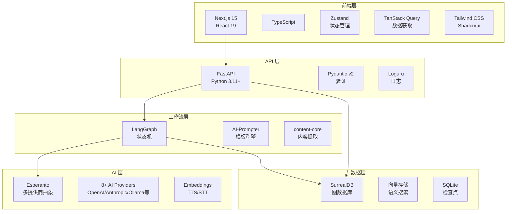
```mermaid
graph TB
    subgraph Frontend["前端层"]
        A1["Next.js 15<br/>React 19"]
        A2["TypeScript"]
        A3["Zustand<br/>状态管理"]
        A4["TanStack Query<br/>数据获取"]
        A5["Tailwind CSS<br/>Shadcn/ui"]
    end

    subgraph API["API 层"]
        B1["FastAPI<br/>Python 3.11+"]
        B2["Pydantic v2<br/>验证"]
        B3["Loguru<br/>日志"]
    end

    subgraph Workflow["工作流层"]
        C1["LangGraph<br/>状态机"]
        C2["AI-Prompter<br/>模板引擎"]
        C3["content-core<br/>内容提取"]
    end

    subgraph Data["数据层"]
        D1["SurrealDB<br/>图数据库"]
        D2["向量存储<br/>语义搜索"]
        D3["SQLite<br/>检查点"]
    end

    subgraph AI["AI 层"]
        E1["Esperanto<br/>多提供商抽象"]
        E2["8+ AI Providers<br/>OpenAI/Anthropic/Ollama等"]
        E3["Embeddings<br/>TTS/STT"]
    end

    A1 --> B1
    B1 --> C1
    C1 --> D1
    C1 --> E1
    B1 --> D1
```

### 2.2 前端技术栈

| 技术 | 版本 | 用途 |
|------|------|------|
| Next.js | 15 | React 框架 |
| React | 19 | UI 库 |
| TypeScript | - | 类型安全 |
| Zustand | - | 状态管理 |
| TanStack Query | - | 服务端状态管理 |
| Tailwind CSS | - | 样式框架 |
| Shadcn/ui | - | UI 组件库 |

### 2.3 后端技术栈

| 技术 | 版本 | 用途 |
|------|------|------|
| Python | 3.11+ | 主要语言 |
| FastAPI | 0.104+ | Web 框架 |
| Pydantic | v2 | 数据验证 |
| LangGraph | - | 工作流编排 |
| SurrealDB | - | 图数据库 |
| Esperanto | - | AI 提供商抽象 |

### 2.4 外部依赖

- **content-core**: 文件/URL 内容提取（50+ 文件类型）
- **ai-prompter**: Jinja2 模板渲染
- **surreal-commands**: 异步任务队列
- **tiktoken**: GPT token 计数

---

## 3. 整体架构

### 3.1 三层架构图

```mermaid
graph TB
    subgraph Frontend["前端 Frontend (port 3000)"]
        UI[用户界面 / React/Next.js]
        State[Zustand State / TanStack Query]
    end

    subgraph API_Gateway["API Gateway (port 5055)"]
        Router[路由层 / Routers]
        Middleware[CORS / Auth Middleware]
        Service[服务层 / Services]
    end

    subgraph Business["业务逻辑"]
        Graph[LangGraph 工作流 / 状态机]
        Domain[领域模型 / Domain Models]
        AI[AI 提供商 / Esperanto]
    end

    subgraph Data["数据持久化 (port 8000)"]
        DB[(SurrealDB / 图数据库)]
        Vector[向量存储 / 语义搜索]
        Files[文件存储 / 上传内容]
    end

    subgraph Queue["任务队列"]
        Queue[Surreal-Commands / 异步任务]
    end

    UI --> Router
    State --> Router
    Router --> Middleware
    Middleware --> Service
    Service --> Graph
    Service --> Domain
    Graph --> AI
    Domain --> DB
    Service --> DB
    Graph --> Queue
    Queue --> DB
```

### 3.2 模块依赖关系

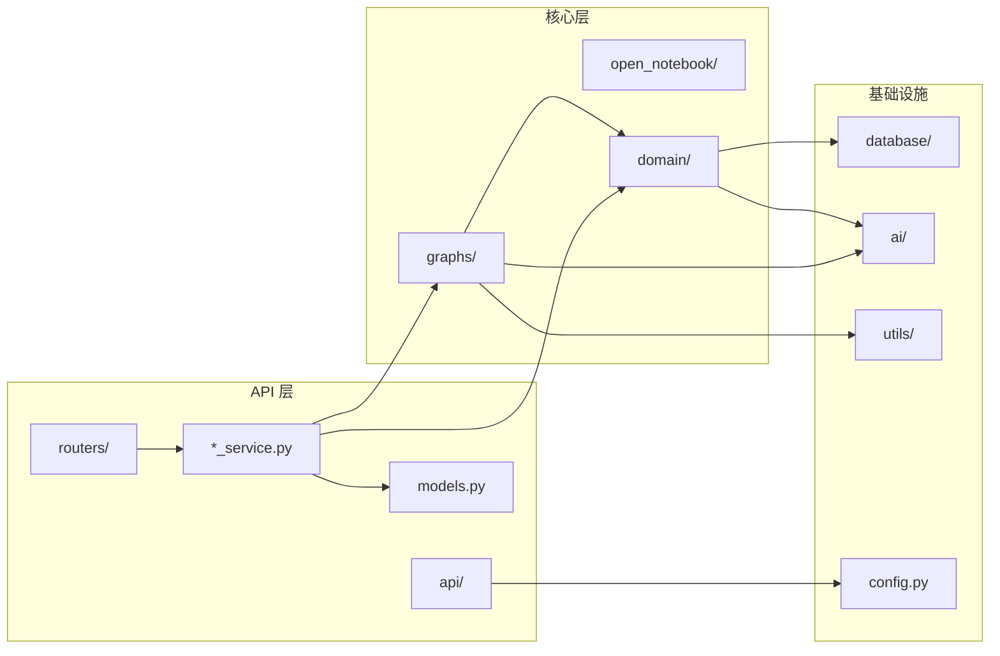
```mermaid
graph LR
    subgraph API_Layer["API 层"]
        API[api/]
        Router[routers/]
        Service[*_service.py]
        Models[models.py]
    end

    subgraph Core_Layer["核心层"]
        ON[open_notebook/]
        Graph[graphs/]
        Domain[domain/]
    end

    subgraph Infrastructure["基础设施"]
        DB[database/]
        AI[ai/]
        Utils[utils/]
        Config[config.py]
    end

    Router --> Service
    Service --> Models
    Service --> Graph
    Service --> Domain
    Graph --> AI
    Graph --> Domain
    Domain --> DB
    Domain --> AI
    Graph --> Utils
    API --> Config
```

### 3.3 目录结构

```
open-notebook/
├── frontend/                 # Next.js 前端
│   ├── app/                  # App Router
│   ├── components/           # React 组件
│   ├── lib/                  # 工具函数
│   └── stores/               # Zustand stores
│
├── api/                      # FastAPI 后端
│   ├── routers/              # REST 路由
│   │   ├── auth.py
│   │   ├── chat.py
│   │   ├── notebooks.py
│   │   ├── sources.py
│   │   ├── notes.py
│   │   ├── podcasts.py
│   │   └── ...
│   ├── chat_service.py
│   ├── podcast_service.py
│   ├── sources_service.py
│   ├── notes_service.py
│   ├── models.py
│   └── main.py               # FastAPI 应用入口
│
├── open_notebook/            # 核心业务逻辑
│   ├── domain/               # 领域模型
│   │   ├── base.py           # ObjectModel, RecordModel
│   │   ├── notebook.py       # Notebook, Source, Note
│   │   └── content_settings.py
│   ├── graphs/               # LangGraph 工作流
│   │   ├── source.py         # 内容摄取
│   │   ├── chat.py           # 对话
│   │   ├── ask.py            # 搜索合成
│   │   ├── transformation.py # 转换
│   │   └── source_chat.py    # 源对话
│   ├── ai/                   # AI 提供商管理
│   │   ├── models.py         # ModelManager
│   │   └── provision.py      # provision_langchain_model
│   ├── database/             # 数据库层
│   │   ├── repository.py     # CRUD 操作
│   │   └── async_migrate.py  # 自动迁移
│   ├── utils/                # 工具函数
│   │   ├── context_builder.py
│   │   ├── token_utils.py
│   │   └── text_utils.py
│   ├── podcasts/             # 播客生成
│   │   └── models.py
│   ├── config.py             # 配置
│   └── exceptions.py         # 异常定义
│
├── commands/                 # 异步任务命令
│   ├── embedding_commands.py
│   ├── podcast_commands.py
│   └── source_commands.py
│
├── docs/                     # 用户文档
├── tests/                    # 测试
└── docker-compose.yml        # 部署配置
```

---

## 4. 核心模块详解

### 4.1 API 层 (api/)

#### 4.1.1 架构设计

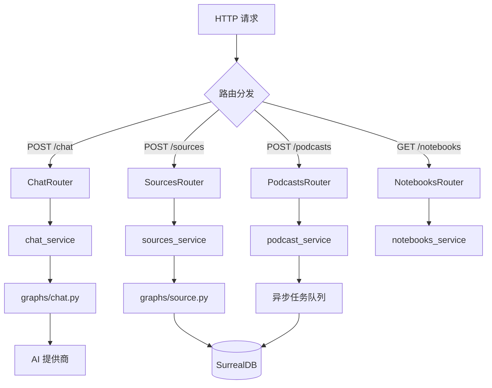
```mermaid
graph TD
    Request[HTTP 请求] --> Router{路由分发}

    Router --> |POST /chat| ChatRouter
    Router --> |POST /sources| SourcesRouter
    Router --> |POST /podcasts| PodcastsRouter
    Router --> |GET /notebooks| NotebooksRouter

    ChatRouter --> ChatService[chat_service]
    SourcesRouter --> SourcesService[sources_service]
    PodcastsRouter --> PodcastService[podcast_service]
    NotebooksRouter --> NotebooksService[notebooks_service]

    ChatService --> ChatGraph[graphs/chat.py]
    SourcesService --> SourceGraph[graphs/source.py]
    PodcastService --> Queue[异步任务队列]

    ChatGraph --> AI[AI 提供商]
    SourceGraph --> DB[(SurrealDB)]
    Queue --> DB
```

#### 4.1.2 启动流程

**api/main.py** 是应用的入口点：

```python
# 1. 环境变量加载
load_dotenv()

# 2. Lifespan 事件处理
@asynccontextmanager
async def lifespan(app: FastAPI):
    # 启动时：自动运行数据库迁移
    migration_manager = AsyncMigrationManager()
    if await migration_manager.needs_migration():
        await migration_manager.run_migration_up()

    yield

    # 关闭时：清理资源
    logger.info("API shutdown complete")

# 3. 中间件配置
# - 密码认证中间件（开发环境）
# - CORS 中间件（允许所有源）
# - 自定义异常处理器（确保 CORS 头）

# 4. 路由注册
app.include_router(auth.router, prefix="/api", tags=["auth"])
app.include_router(chat.router, prefix="/api", tags=["chat"])
# ... 其他路由
```

**关键特性**：
- ✅ **自动迁移**：每次启动自动检查并运行数据库迁移
- ✅ **CORS 支持**：前后端分离架构必需
- ✅ **认证保护**：所有端点（除配置/健康检查）需要认证
- ✅ **异常处理**：统一的错误响应格式

#### 4.1.3 服务层模式

每个功能模块都有对应的服务类：

| 服务类 | 职责 | 关键方法 |
|--------|------|----------|
| `chat_service.py` | 对话管理 | `chat()`, 处理消息历史 |
| `sources_service.py` | 内容摄取 | `create_source()`, 触发向量化和转换 |
| `notes_service.py` | 笔记管理 | `create_note()`, 关联源/洞察 |
| `podcast_service.py` | 播客生成 | `generate_podcast()`, 提交异步任务 |
| `models_service.py` | 模型配置 | `update_config()`, 管理提供商 |
| `transformations_service.py` | 内容转换 | `apply_transformation()` |

**示例：chat_service.py**

```python
class ChatService:
    async def chat(
        self,
        message: str,
        chat_session_id: str,
        model_override: Optional[str] = None
    ):
        # 1. 加载或创建 ChatSession
        session = await ChatSession.get(chat_session_id)

        # 2. 构建上下文
        context = await ContextBuilder.build(
            notebook_id=session.notebook_id,
            token_budget=120000
        )

        # 3. 调用 chat.py 图
        config = {"configurable": {"model_id": model_override}} if model_override else {}
        response = await chat_graph.ainvoke(
            {"messages": [HumanMessage(content=message)], "context": context},
            config=config
        )

        # 4. 返回响应
        return {"response": response["messages"][-1].content}
```

### 4.2 领域模型层 (open_notebook/domain/)

#### 4.2.1 基类设计

**ObjectModel** - 可变记录基类

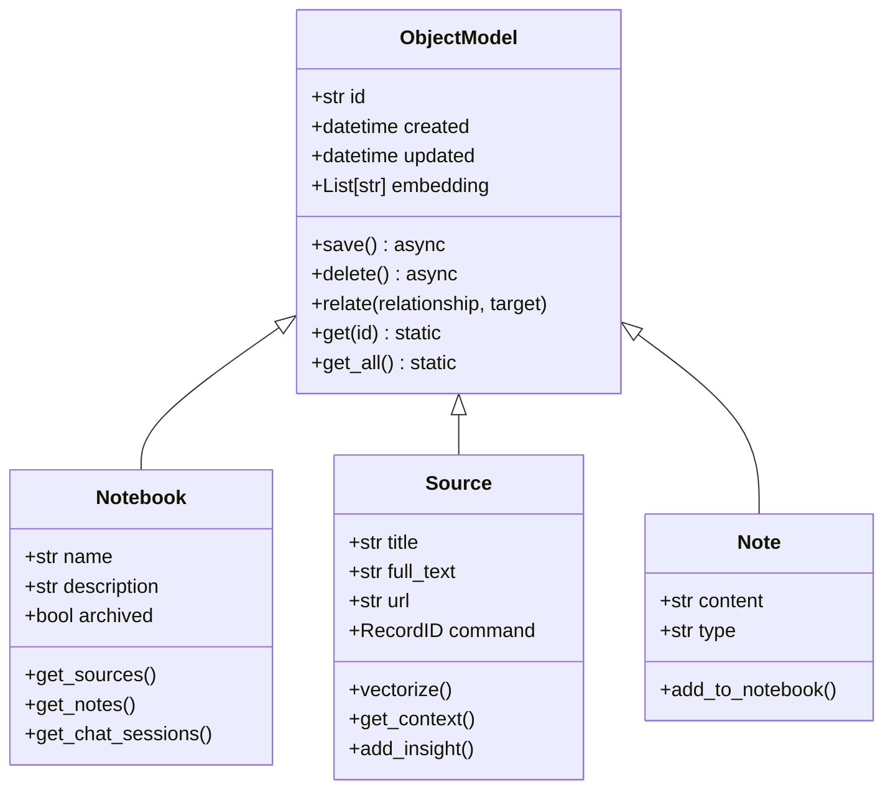
```mermaid
classDiagram
    class ObjectModel {
        +str id
        +datetime created
        +datetime updated
        +List[str] embedding
        +save() async
        +delete() async
        +relate(relationship, target)
        +get(id) static
        +get_all() static
    }

    class Notebook {
        +str name
        +str description
        +bool archived
        +get_sources()
        +get_notes()
        +get_chat_sessions()
    }

    class Source {
        +str title
        +str full_text
        +str url
        +RecordID command
        +vectorize()
        +get_context()
        +add_insight()
    }

    class Note {
        +str content
        +str type
        +add_to_notebook()
    }

    ObjectModel <|-- Notebook
    ObjectModel <|-- Source
    ObjectModel <|-- Note
```

**核心特性**：

1. **自动时间戳**：`created` 和 `updated` 自动管理
2. **自动嵌入**：`save()` 时如果 `needs_embedding()` 返回 True，自动生成向量
3. **关系管理**：`relate()` 方法创建 SurrealDB 图关系
4. **多态获取**：`ObjectModel.get(id)` 根据 ID 前缀解析子类
5. **搜索支持**：内置 `text_search()` 和 `vector_search()`

**RecordModel** - 单例配置基类

```python
class ContentSettings(RecordModel):
    record_id = "content_settings"
    # 配置字段...

class DefaultPrompts(RecordModel):
    record_id = "default_prompts"
    # 提示词模板...
```

#### 4.2.2 核心领域模型

| 模型 | 表名 | 用途 | 关系 |
|------|------|------|------|
| `Notebook` | notebook | 研究项目容器 | → Source (has), → Note (artifact) |
| `Source` | source | 内容项（文件/URL） | ← Notebook, → Note (artifact), → SourceInsight |
| `Note` | note | 笔记 | ← Notebook, ← Source (refers_to) |
| `SourceInsight` | source_insight | 源洞察 | ← Source |
| `SourceEmbedding` | source_embedding | 源向量嵌入 | ← Source |
| `ChatSession` | chat_session | 对话会话 | ← Notebook, → ChatMessage |
| `Asset` | asset | 文件引用 | ← Source |
| `Transformation` | transformation | 可重用转换提示 | - |
| `ContentSettings` | content_settings | 内容处理配置 | - |
| `EpisodeProfile` | episode_profile | 播客配置 | - |
| `SpeakerProfile` | speaker_profile | 说话人配置 | - |
| `PodcastEpisode` | podcast_episode | 播客任务 | - |

**关系图**：

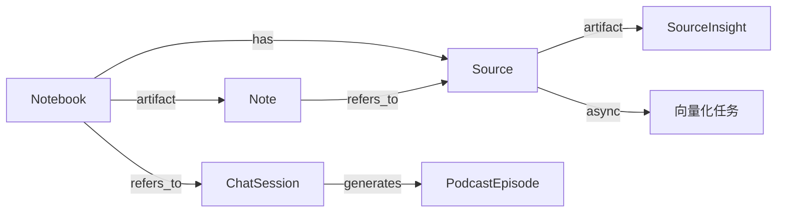
```mermaid
graph LR
    Notebook[Notebook] -->|has| Source[Source]
    Notebook -->|artifact| Note[Note]
    Source -->|artifact| SourceInsight[SourceInsight]
    Note -->|refers_to| Source
    Notebook -->|refers_to| ChatSession[ChatSession]

    Source[Source] -->|async| Vectorize[向量化任务]
    ChatSession -->|generates| Podcast[PodcastEpisode]
```

#### 4.2.3 数据持久化

**保存流程**：

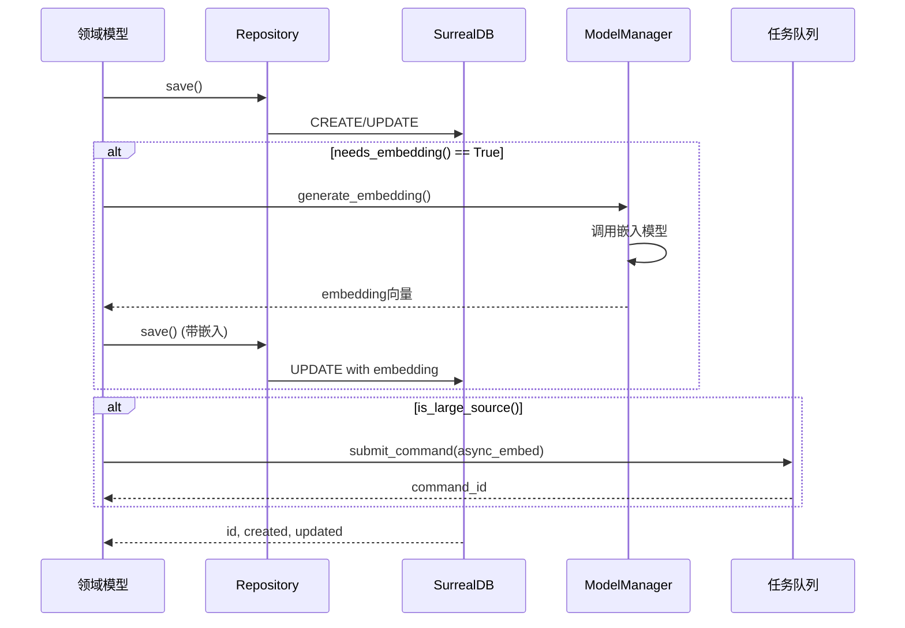
```mermaid
sequenceDiagram
    participant Model as 领域模型
    participant Repo as Repository
    participant DB as SurrealDB
    participant AI as ModelManager
    participant Queue as 任务队列

    Model->>Repo: save()
    Repo->>DB: CREATE/UPDATE

    alt needs_embedding() == True
        Model->>AI: generate_embedding()
        AI->>AI: 调用嵌入模型
        AI-->>Model: embedding向量
        Model->>Repo: save() (带嵌入)
        Repo->>DB: UPDATE with embedding
    end

    alt is_large_source()
        Model->>Queue: submit_command(async_embed)
        Queue-->>Model: command_id
    end

    DB-->>Model: id, created, updated
```

**关键方法**：

```python
# base.py
class ObjectModel(BaseModel):
    async def save(self) -> "ObjectModel":
        # 1. 准备数据
        data = self._prepare_save_data()

        # 2. 生成嵌入
        if self.needs_embedding() and self.should_embed():
            embedding = await model_manager.get_embedding(
                text=self.get_embedding_text(),
                model_id=self.embedding_model
            )
            data["embedding"] = embedding

        # 3. 创建或更新
        if hasattr(self, 'id') and self.id:
            result = await repo_upsert(self.table_name, self.id, data)
        else:
            result = await repo_create(self.table_name, data)

        # 4. 更新自身
        for key, value in result.items():
            setattr(self, key, value)

        return self
```

### 4.3 工作流层 (open_notebook/graphs/)

#### 4.3.1 LangGraph 架构


```mermaid
graph TB
    subgraph SourceGraph["source.py 内容摄取"]
        S1[content_process / 提取内容]
        S2[save_source / 保存源]
        S3[trigger_transformations / 触发转换]
        S1 --> S2 --> S3
    end

    subgraph ChatGraph["chat.py 对话"]
        C1[load_context / 加载上下文]
        C2[call_model / 调用LLM]
        C3[persist_message / 持久化消息]
        C1 --> C2 --> C3
    end

    subgraph AskGraph["ask.py 搜索合成"]
        A1[search_sources / 搜索源]
        A2[synthesize / 合成答案]
        A1 --> A2
    end

    subgraph TransformGraph["transformation.py 转换"]
        T1[apply_prompt / 应用提示]
        T2[save_result / 保存结果]
        T1 --> T2
    end

    subgraph SourceChatGraph["source_chat.py 源对话"]
        SC1[load_source / 加载源]
        SC2[chat_with_source / 与源对话]
        SC1 --> SC2
    end
```

#### 4.3.2 source.py - 内容摄取工作流

**状态定义**：

```python
class SourceState(TypedDict):
    source_id: str
    file_path: Optional[str]
    url: Optional[str]
    content: Optional[str]
    metadata: Optional[Dict[str, Any]]
    error: Optional[str]
```

**工作流图**：

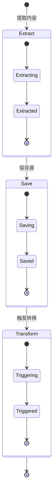
```mermaid
stateDiagram-v2
    [*] --> Extract: 提取内容
    Extract --> Save: 保存源
    Save --> Transform: 触发转换
    Transform --> [*]

    state Extract {
        [*] --> Extracting
        Extracting --> Extracted
        Extracted --> [*]
    }

    state Save {
        [*] --> Saving
        Saving --> Saved
        Saved --> [*]
    }

    state Transform {
        [*] --> Triggering
        Triggering --> Triggered
        Triggered --> [*]
    }
```

**实现**：

```python
from langgraph.graph import StateGraph

async def content_process(state: SourceState) -> SourceState:
    """提取文件或 URL 内容"""
    from content_core import extract_content

    try:
        if state.get("file_path"):
            content, metadata = await extract_content(state["file_path"])
        elif state.get("url"):
            content, metadata = await extract_content(state["url"])
        else:
            raise ValueError("Either file_path or url required")

        state["content"] = content
        state["metadata"] = metadata
        return state
    except Exception as e:
        state["error"] = str(e)
        return state

async def save_source(state: SourceState) -> SourceState:
    """保存源到数据库"""
    source = await Source.get(state["source_id"])
    source.full_text = state["content"]
    # 保留标题（如果用户未设置）
    if not source.title and state["metadata"].get("title"):
        source.title = state["metadata"]["title"]
    await source.save()
    return state

async def trigger_transformations(state: SourceState) -> SourceState:
    """触发所有转换（并行执行）"""
    source = await Source.get(state["source_id"])
    transformations = await Transformation.get_all()

    # 并行触发
    tasks = [
        transformation_graph.ainvoke(
            {"source_id": str(source.id), "transformation_id": str(transformation.id)}
        )
        for transformation in transformations
    ]
    await asyncio.gather(*tasks)

    return state

# 构建图
source_graph = StateGraph(SourceState)
source_graph.add_node("content_process", content_process)
source_graph.add_node("save_source", save_source)
source_graph.add_node("trigger_transformations", trigger_transformations)

source_graph.add_edge("content_process", "save_source")
source_graph.add_edge("save_source", "trigger_transformations")
source_graph.set_entry_point("content_process")

source_graph = source_graph.compile()
```

#### 4.3.3 chat.py - 对话工作流

**状态定义**：

```python
class ChatState(TypedDict):
    messages: List[BaseMessage]
    context: str
    notebook_id: str
    chat_session_id: str
    model_override: Optional[str]
```

**工作流图**：

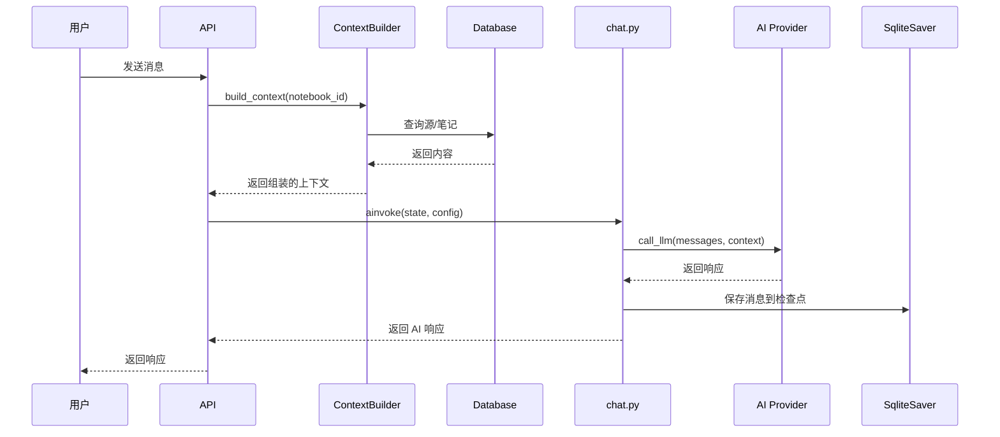
```mermaid
sequenceDiagram
    participant User as 用户
    participant API as API
    participant CB as ContextBuilder
    participant DB as Database
    participant Graph as chat.py
    participant AI as AI Provider
    participant SQLite as SqliteSaver

    User->>API: 发送消息
    API->>CB: build_context(notebook_id)
    CB->>DB: 查询源/笔记
    DB-->>CB: 返回内容
    CB-->>API: 返回组装的上下文

    API->>Graph: ainvoke(state, config)
    Graph->>AI: call_llm(messages, context)
    AI-->>Graph: 返回响应
    Graph->>SQLite: 保存消息到检查点
    Graph-->>API: 返回 AI 响应
    API-->>User: 返回响应
```

**实现**：

```python
from langgraph.checkpoint.sqlite import SqliteSaver

async def call_model(state: ChatState, config: RunnableConfig) -> ChatState:
    """调用 LLM 生成响应"""
    # 1. 准备模型
    model = await provision_langchain_model(
        type="language",
        model_id=state.get("model_override")
    )

    # 2. 构建提示
    prompt = f"""Context: {state['context']}

Conversation History:
{format_messages(state['messages'][:-1])}

User: {state['messages'][-1].content}

Respond to the user's message based on the provided context."""

    # 3. 调用模型
    response = await model.ainvoke(prompt)

    # 4. 更新状态
    state["messages"].append(AIMessage(content=response.content))
    return state

# 构建图（带检查点）
chat_graph = StateGraph(ChatState)
chat_graph.add_node("call_model", call_model)
chat_graph.set_entry_point("call_model")

# SQLite 检查点存储
checkpointer = SqliteSaver.from_conn_string(LANGGRAPH_CHECKPOINT_FILE)
chat_graph = chat_graph.compile(checkpointer=checkpointer)
```

### 4.4 AI 提供商层 (open_notebook/ai/)

#### 4.4.1 Esperanto 抽象

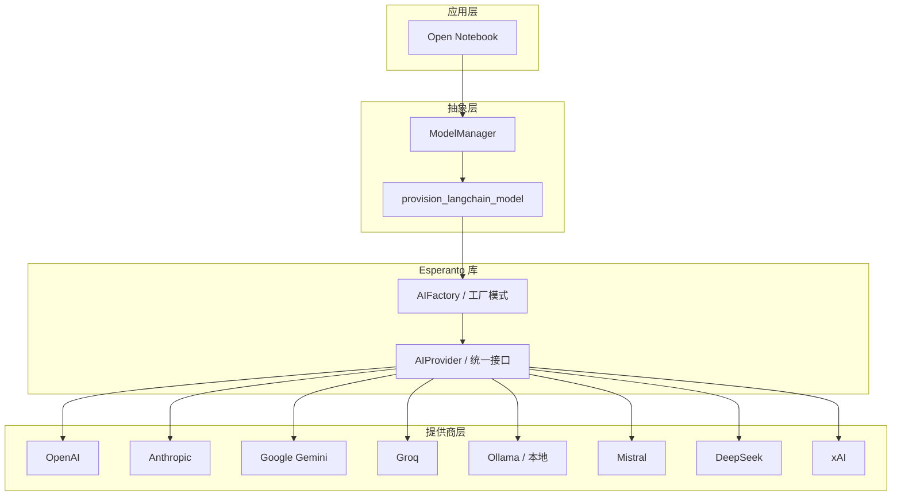
```mermaid
graph TB
    subgraph Application["应用层"]
        App[Open Notebook]
    end

    subgraph Abstraction["抽象层"]
        MM[ModelManager]
        PL[provision_langchain_model]
    end

    subgraph EsperantoLib["Esperanto 库"]
        AI[AIProvider / 统一接口]
        Factory[AIFactory / 工厂模式]
    end

    subgraph Providers["提供商层"]
        OpenAI[OpenAI]
        Anthropic[Anthropic]
        Google[Google Gemini]
        Groq[Groq]
        Ollama[Ollama / 本地]
        Mistral[Mistral]
        DeepSeek[DeepSeek]
        xAI[xAI]
    end

    App --> MM
    MM --> PL
    PL --> Factory
    Factory --> AI
    AI --> OpenAI
    AI --> Anthropic
    AI --> Google
    AI --> Groq
    AI --> Ollama
    AI --> Mistral
    AI --> DeepSeek
    AI --> xAI
```

#### 4.4.2 ModelManager

**职责**：
- 管理多个 AI 提供商的配置
- 智能模型选择（基于上下文大小）
- 失败回退逻辑
- 模型类型抽象（language, embedding, speech_to_text, text_to_speech）

**配置结构**：

```python
class ModelManager:
    default_chat_model: str = "openai:gpt-4o-mini"
    default_large_context_model: str = "anthropic:claude-3-5-sonnet-20241022"
    default_embedding_model: str = "openai:text-embedding-3-small"

    # 模型类型映射
    async def get_model(
        self,
        type: str,  # language, embedding, speech_to_text, text_to_speech
        model_id: Optional[str] = None
    ):
        if type == "language":
            return await self._get_language_model(model_id)
        elif type == "embedding":
            return await self._get_embedding_model(model_id)
        # ...
```

**智能选择逻辑**：

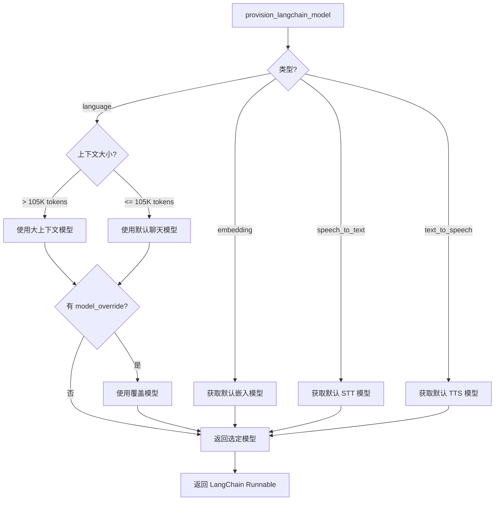
```mermaid
flowchart TD
    Start[provision_langchain_model] --> CheckType{类型?}

    CheckType -->|language| CheckContext{上下文大小?}
    CheckType -->|embedding| GetEmbedding[获取默认嵌入模型]
    CheckType -->|speech_to_text| GetSTT[获取默认 STT 模型]
    CheckType -->|text_to_speech| GetTTS[获取默认 TTS 模型]

    CheckContext -->|> 105K tokens| UseLarge[使用大上下文模型]
    CheckContext -->|<= 105K tokens| UseDefault[使用默认聊天模型]

    CheckOverride{有 model_override?}
    UseLarge --> CheckOverride
    UseDefault --> CheckOverride

    CheckOverride -->|是| UseOverride[使用覆盖模型]
    CheckOverride -->|否| ReturnModel[返回选定模型]

    UseOverride --> ReturnModel
    GetEmbedding --> ReturnModel
    GetSTT --> ReturnModel
    GetTTS --> ReturnModel

    ReturnModel --> End[返回 LangChain Runnable]
```

**关键特性**：

1. **自动升级**：大上下文自动使用 `claude-3-5-sonnet`（200K tokens）
2. **配置覆盖**：请求级 `model_override` 参数
3. **失败回退**：主模型失败时回退到更便宜的模型
4. **类型安全**：每种 AI 类型有独立的默认配置

#### 4.4.3 多提供商集成

**提供商映射**：

| 提供商 | 前缀 | 聊天模型 | 嵌入模型 | 本地 |
|--------|------|----------|----------|------|
| OpenAI | `openai:` | gpt-4o, gpt-4o-mini | text-embedding-3-small | ❌ |
| Anthropic | `anthropic:` | claude-3-5-sonnet, claude-3-haiku | - | ❌ |
| Google | `google:` | gemini-1.5-pro | - | ❌ |
| Groq | `groq:` | llama-3.3-70b | - | ❌ |
| Ollama | `ollama:` | llama3, mistral | - | ✅ |
| Mistral | `mistral:` | mistral-large | - | ❌ |
| DeepSeek | `deepseek:` | deepseek-chat | - | ❌ |
| xAI | `xai:` | grok-beta | - | ❌ |

### 4.5 数据库层 (open_notebook/database/)

#### 4.5.1 SurrealDB 架构

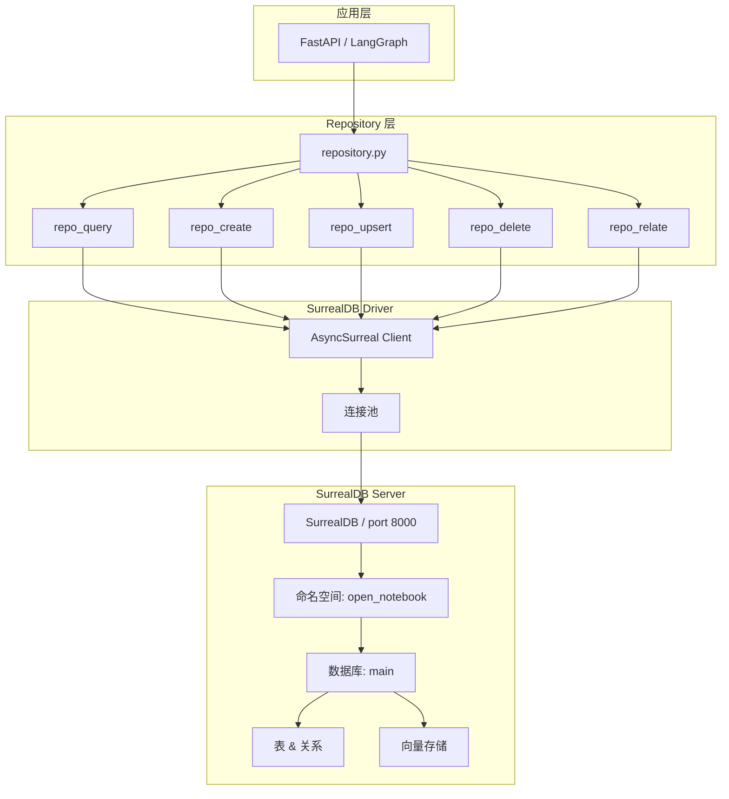
```mermaid
graph TB
    subgraph Application["应用层"]
        App[FastAPI / LangGraph]
    end

    subgraph RepoLayer["Repository 层"]
        Repo[repository.py]
        Query[repo_query]
        Create[repo_create]
        Upsert[repo_upsert]
        Delete[repo_delete]
        Relate[repo_relate]
    end

    subgraph SurrealDriver["SurrealDB Driver"]
        Driver[AsyncSurreal Client]
        Connection[连接池]
    end

    subgraph SurrealServer["SurrealDB Server"]
        SurrealDB[SurrealDB / port 8000]
        NS[命名空间: open_notebook]
        DB[数据库: main]
        Tables[表 & 关系]
        Vector[向量存储]
    end

    App --> Repo
    Repo --> Query
    Repo --> Create
    Repo --> Upsert
    Repo --> Delete
    Repo --> Relate
    Query --> Driver
    Create --> Driver
    Upsert --> Driver
    Delete --> Driver
    Relate --> Driver
    Driver --> Connection
    Connection --> SurrealDB
    SurrealDB --> NS
    NS --> DB
    DB --> Tables
    DB --> Vector
```

#### 4.5.2 Repository 模式

**核心函数**：

```python
# repository.py

async def repo_query(sql: str, params: Dict[str, Any]) -> List[Dict[str, Any]]:
    """执行 SurrealQL 查询"""
    async with AsyncSurreal("ws://localhost:8000/rpc") as db:
        await db.use("open_notebook", "main")
        return await db.query(sql, params)

async def repo_create(table: str, data: Dict[str, Any]) -> Dict[str, Any]:
    """创建记录"""
    async with AsyncSurreal("ws://localhost:8000/rpc") as db:
        await db.use("open_notebook", "main")
        return await db.create(table, data)

async def repo_upsert(table: str, id: Union[str, RecordID], data: Dict[str, Any]) -> Dict[str, Any]:
    """创建或更新记录"""
    async with AsyncSurreal("ws://localhost:8000/rpc") as db:
        await db.use("open_notebook", "main")
        return await db.upsert(table, id, data)

async def repo_relate(
    from_id: Union[str, RecordID],
    relation: str,
    to_id: Union[str, RecordID],
    data: Optional[Dict[str, Any]] = None
):
    """创建关系"""
    sql = f"RELATE {from_id}->{relation}->{to_id}"
    if data:
        sql += f" CONTENT {data}"
    return await repo_query(sql, {})
```

#### 4.5.3 数据库模式

**核心表**：

```surrealql
-- Notebook 表
DEFINE TABLE notebook SCHEMAFULL;
DEFINE FIELD name ON TABLE notebook TYPE string;
DEFINE FIELD description ON TABLE notebook TYPE string;
DEFINE FIELD archived ON TABLE notebook TYPE bool DEFAULT false;
DEFINE FIELD embedding ON TABLE notebook OPTION array;

-- Source 表
DEFINE TABLE source SCHEMAFULL;
DEFINE FIELD title ON TABLE source TYPE string;
DEFINE FIELD full_text ON TABLE source TYPE string;
DEFINE FIELD url ON TABLE source TYPE string;
DEFINE FIELD command ON TABLE source TYPE record<table, command>;
DEFINE FIELD embedding ON TABLE source OPTION array;

-- Note 表
DEFINE TABLE note SCHEMAFULL;
DEFINE FIELD content ON TABLE source TYPE string;
DEFINE FIELD type ON TABLE source TYPE string;
DEFINE FIELD embedding ON TABLE source OPTION array;

-- 关系
-- Notebook -> Source (has)
-- Notebook -> Note (artifact)
-- Note -> Source (refers_to)
-- Source -> SourceInsight
```

#### 4.5.4 自动迁移

**迁移管理器**：

```python
# async_migrate.py

class AsyncMigrationManager:
    MIGRATIONS_DIR = "./migrations"

    async def get_current_version(self) -> int:
        """获取当前数据库版本"""
        result = await repo_query("SELECT * FROM version", {})
        return result[0]["number"] if result else 0

    async def needs_migration(self) -> bool:
        """检查是否需要迁移"""
        current = await self.get_current_version()
        available = self._get_latest_migration_version()
        return current < available

    async def run_migration_up(self):
        """运行所有待执行的迁移"""
        current = await self.get_current_version()
        for version in range(current + 1, self._get_latest_migration_version() + 1):
            migration_file = f"{self.MIGRATIONS_DIR}/{version:03d}_*.surql"
            sql = read_migration_file(migration_file)
            await repo_query(sql, {})
            await repo_query(f"UPDATE version SET number = {version}", {})
            logger.success(f"Migration {version} completed")
```

**迁移文件示例**：

```
migrations/
├── 001_init_schema.surql
├── 002_add_vector_search.surql
├── 003_add_podcast_tables.surql
└── 004_add_transformation_tables.surql
```

### 4.6 工具层 (open_notebook/utils/)

#### 4.6.1 ContextBuilder

**职责**：从多个来源组装 LLM 上下文，同时遵守 token 预算。

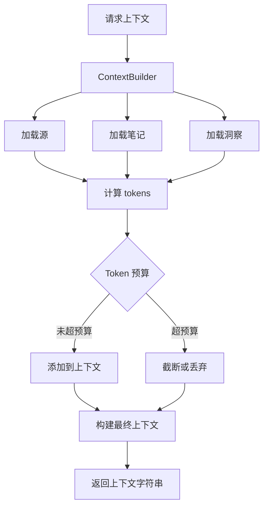
```mermaid
graph TD
    Request[请求上下文] --> CB[ContextBuilder]

    CB --> LoadSources[加载源]
    CB --> LoadNotes[加载笔记]
    CB --> LoadInsights[加载洞察]

    LoadSources --> CountTokens[计算 tokens]
    LoadNotes --> CountTokens
    LoadInsights --> CountTokens

    CountTokens --> Budget{Token 预算}

    Budget -->|未超预算| AddContext[添加到上下文]
    Budget -->|超预算| Truncate[截断或丢弃]

    AddContext --> Build[构建最终上下文]
    Truncate --> Build

    Build --> Return[返回上下文字符串]
```

**实现**：

```python
class ContextBuilder:
    async def build(
        notebook_id: str,
        token_budget: int = 120000,
        sources_to_include: Optional[List[str]] = None
    ) -> str:
        """组装上下文"""
        notebook = await Notebook.get(notebook_id)

        # 1. 加载源、笔记、洞察
        sources = await notebook.get_sources()
        notes = await notebook.get_notes()

        # 2. 按优先级排序
        # - 显式指定的 sources 优先级最高
        # - 最近更新的内容优先级高
        prioritized = _prioritize_content(sources, notes, sources_to_include)

        # 3. 在 token 预算内组装
        context_parts = []
        current_tokens = 0

        for item in prioritized:
            item_tokens = count_tokens(item.get_context())
            if current_tokens + item_tokens <= token_budget:
                context_parts.append(item.get_context())
                current_tokens += item_tokens
            else:
                # 截断或停止
                break

        return "\n\n".join(context_parts)
```

**优化策略**：

1. **Token 计数**：使用 `tiktoken` 准确估算 GPT tokens
2. **优先级排序**：
   - 显式指定的源 > 自动选择的源
   - 最近更新 > 旧内容
   - 笔记 > 源内容
3. **截断策略**：
   - 长内容截断而非完全丢弃
   - 保留关键部分（开头/结尾）

#### 4.6.2 TokenUtils

```python
class TokenUtils:
    ENCODING = tiktoken.get_encoding("cl100k_base")

    @staticmethod
    def count_tokens(text: str) -> int:
        """计算文本的 GPT token 数量"""
        return len(TokenUtils.ENCODING.encode(text))

    @staticmethod
    def truncate_to_tokens(text: str, max_tokens: int) -> str:
        """截断文本到指定 token 数"""
        tokens = TokenUtils.ENCODING.encode(text)
        if len(tokens) <= max_tokens:
            return text
        truncated = tokens[:max_tokens]
        return TokenUtils.ENCODING.decode(truncated)
```

#### 4.6.3 TextUtils

```python
class TextUtils:
    @staticmethod
    def clean_text(text: str) -> str:
        """清理文本（移除多余空白、控制字符）"""
        import re
        # 移除控制字符
        text = re.sub(r'[\x00-\x1f\x7f-\x9f]', '', text)
        # 合并多余空白
        text = re.sub(r'\s+', ' ', text)
        return text.strip()

    @staticmethod
    def split_text(text: str, chunk_size: int, overlap: int = 100) -> List[str]:
        """分割文本为块（带重叠）"""
        chunks = []
        start = 0
        while start < len(text):
            end = start + chunk_size
            chunk = text[start:end]
            chunks.append(chunk)
            start = end - overlap
        return chunks
```

---

## 5. 数据流分析

### 5.1 内容摄取流程

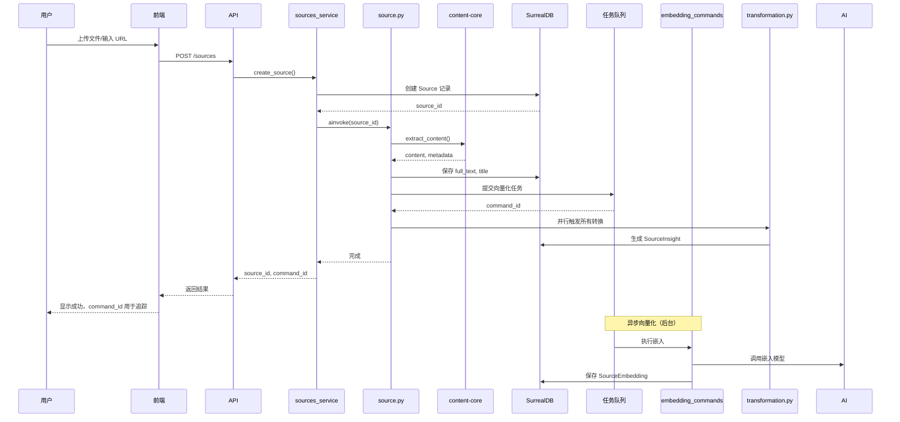
```mermaid
sequenceDiagram
    participant User as 用户
    participant UI as 前端
    participant API as API
    participant Service as sources_service
    participant Graph as source.py
    participant Content as content-core
    participant DB as SurrealDB
    participant Queue as 任务队列
    participant Embed as embedding_commands
    participant Trans as transformation.py

    User->>UI: 上传文件/输入 URL
    UI->>API: POST /sources
    API->>Service: create_source()

    Service->>DB: 创建 Source 记录
    DB-->>Service: source_id

    Service->>Graph: ainvoke(source_id)
    Graph->>Content: extract_content()
    Content-->>Graph: content, metadata

    Graph->>DB: 保存 full_text, title

    Graph->>Queue: 提交向量化任务
    Queue-->>Graph: command_id

    Graph->>Trans: 并行触发所有转换
    Trans->>DB: 生成 SourceInsight

    Graph-->>Service: 完成
    Service-->>API: source_id, command_id
    API-->>UI: 返回结果
    UI-->>User: 显示成功，command_id 用于追踪

    Note over Queue,Embed: 异步向量化（后台）
    Queue->>Embed: 执行嵌入
    Embed->>AI: 调用嵌入模型
    Embed->>DB: 保存 SourceEmbedding
```

**关键点**：
- ✅ **快速响应**：立即返回 `source_id`，不等待向量化完成
- ✅ **异步处理**：向量化通过任务队列异步执行
- ✅ **并行转换**：多个转换并行执行
- ✅ **可追踪**：返回 `command_id` 用于轮询状态

### 5.2 对话流程

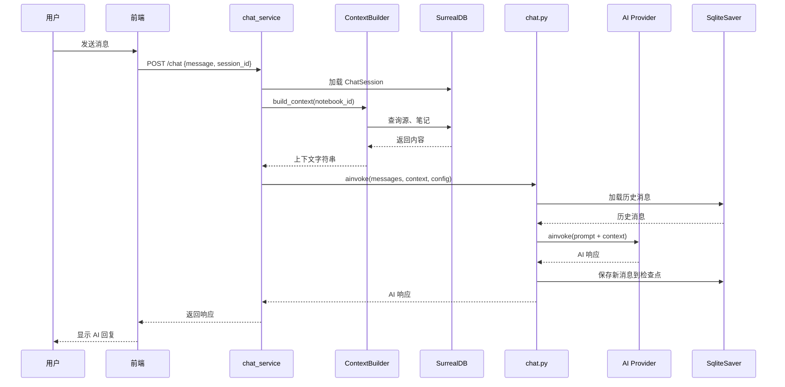
```mermaid
sequenceDiagram
    participant User as 用户
    participant UI as 前端
    participant API as chat_service
    participant CB as ContextBuilder
    participant DB as SurrealDB
    participant Graph as chat.py
    participant AI as AI Provider
    participant Checkpoint as SqliteSaver

    User->>UI: 发送消息
    UI->>API: POST /chat {message, session_id}
    API->>DB: 加载 ChatSession

    API->>CB: build_context(notebook_id)
    CB->>DB: 查询源、笔记
    DB-->>CB: 返回内容
    CB-->>API: 上下文字符串

    API->>Graph: ainvoke(messages, context, config)
    Graph->>Checkpoint: 加载历史消息
    Checkpoint-->>Graph: 历史消息

    Graph->>AI: ainvoke(prompt + context)
    AI-->>Graph: AI 响应

    Graph->>Checkpoint: 保存新消息到检查点

    Graph-->>API: AI 响应
    API-->>UI: 返回响应
    UI-->>User: 显示 AI 回复
```

**状态管理**：
- **消息历史**：通过 SqliteSaver 持久化
- **会话隔离**：每个 `chat_session_id` 独立的检查点
- **上下文注入**：每次请求动态组装上下文

### 5.3 搜索合成流程 (ask.py)

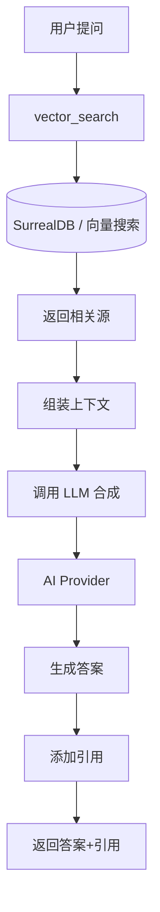
```mermaid
flowchart TD
    Start[用户提问] --> Search[vector_search]

    Search --> DB[(SurrealDB / 向量搜索)]
    DB --> Results[返回相关源]

    Results --> BuildContext[组装上下文]
    BuildContext --> Synthesize[调用 LLM 合成]

    Synthesize --> AI[AI Provider]
    AI --> Response[生成答案]

    Response --> Citations[添加引用]
    Citations --> End[返回答案+引用]
```

**vs Chat 的区别**：
- ❌ 无消息历史
- ✅ 每次独立搜索
- ✅ 返回源引用

### 5.4 播客生成流程

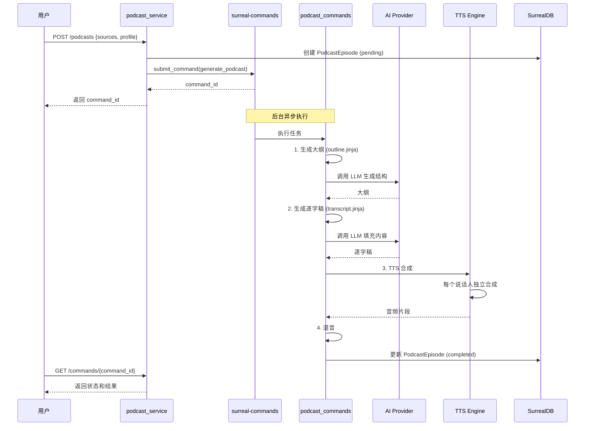
```mermaid
sequenceDiagram
    participant User as 用户
    participant API as podcast_service
    participant Queue as surreal-commands
    participant Worker as podcast_commands
    participant AI as AI Provider
    participant TTS as TTS Engine
    participant DB as SurrealDB

    User->>API: POST /podcasts {sources, profile}
    API->>DB: 创建 PodcastEpisode (pending)

    API->>Queue: submit_command(generate_podcast)
    Queue-->>API: command_id
    API-->>User: 返回 command_id

    Note over Queue,Worker: 后台异步执行

    Queue->>Worker: 执行任务
    Worker->>Worker: 1. 生成大纲 (outline.jinja)
    Worker->>AI: 调用 LLM 生成结构
    AI-->>Worker: 大纲

    Worker->>Worker: 2. 生成逐字稿 (transcript.jinja)
    Worker->>AI: 调用 LLM 填充内容
    AI-->>Worker: 逐字稿

    Worker->>TTS: 3. TTS 合成
    TTS->>TTS: 每个说话人独立合成
    TTS-->>Worker: 音频片段

    Worker->>Worker: 4. 混音
    Worker->>DB: 更新 PodcastEpisode (completed)

    User->>API: GET /commands/{command_id}
    API-->>User: 返回状态和结果
```

**关键特性**：
- ✅ **两阶段生成**：先大纲，后逐字稿
- ✅ **多说话人**：1-4 个说话人，独立配置
- ✅ **异步处理**：长时间任务不阻塞 API
- ✅ **状态追踪**：轮询 `/commands/{id}` 获取进度

---

## 6. 架构模式

### 6.1 设计模式

| 模式 | 应用位置 | 描述 |
|------|----------|------|
| **Repository** | `database/repository.py` | 数据访问抽象 |
| **Factory** | `ai/models.py` | AI 模型创建 |
| **State Machine** | `graphs/*.py` | LangGraph 工作流 |
| **Singleton** | `domain/base.py` (RecordModel) | 配置单例 |
| **Observer** | `surreal-commands` | 任务状态监听 |
| **Strategy** | `ai/provision.py` | 模型选择策略 |
| **Builder** | `utils/context_builder.py` | 上下文组装 |
| **Template Method** | `domain/base.py` (ObjectModel) | 保存/删除模板 |

### 6.2 分层架构

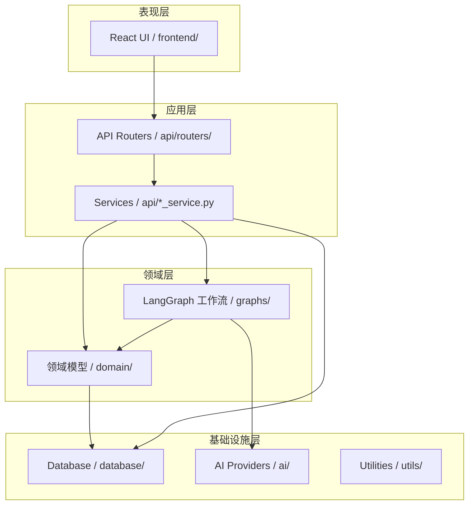
```mermaid
graph TB
    subgraph Presentation["表现层"]
        UI[React UI / frontend/]
    end

    subgraph Application["应用层"]
        Router[API Routers / api/routers/]
        Service[Services / api/*_service.py]
    end

    subgraph Domain["领域层"]
        Graph[LangGraph 工作流 / graphs/]
        Model[领域模型 / domain/]
    end

    subgraph Infrastructure["基础设施层"]
        DB[Database / database/]
        AI[AI Providers / ai/]
        Utils[Utilities / utils/]
    end

    UI --> Router
    Router --> Service
    Service --> Graph
    Service --> Model
    Graph --> Model
    Graph --> AI
    Model --> DB
    Service --> DB
```

**依赖规则**：
- ✅ 上层可以依赖下层
- ❌ 下层不能依赖上层
- ✅ 同层之间通过接口交互

### 6.3 异步模式

**全栈异步**：

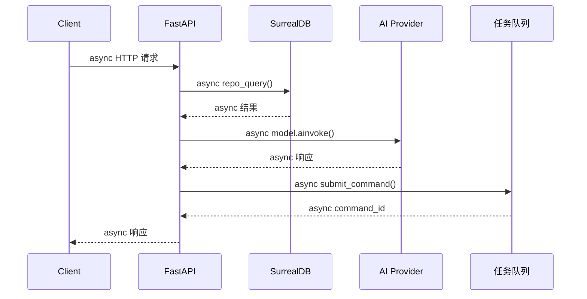
```mermaid
sequenceDiagram
    participant Client
    participant API as FastAPI
    participant DB as SurrealDB
    participant AI as AI Provider
    participant Queue as 任务队列

    Client->>API: async HTTP 请求
    API->>DB: async repo_query()
    DB-->>API: async 结果

    API->>AI: async model.ainvoke()
    AI-->>API: async 响应

    API->>Queue: async submit_command()
    Queue-->>API: async command_id

    API-->>Client: async 响应
```

**优势**：
- ✅ 高并发处理
- ✅ 非阻塞 I/O
- ✅ 资源高效利用

### 6.4 CQRS 模式

**命令查询责任分离**：

```python
# Command（写操作）
class NotebookCommand:
    async def create_notebook(name: str, description: str) -> Notebook:
        notebook = Notebook(name=name, description=description)
        return await notebook.save()

    async def update_notebook(id: str, **kwargs) -> Notebook:
        notebook = await Notebook.get(id)
        for key, value in kwargs.items():
            setattr(notebook, key, value)
        return await notebook.save()

# Query（读操作）
class NotebookQuery:
    async def get_notebook(id: str) -> Notebook:
        return await Notebook.get(id)

    async def search_notebooks(keyword: str) -> List[Notebook]:
        return await text_search(keyword, table="notebook")

    async def get_notebook_sources(id: str) -> List[Source]:
        notebook = await Notebook.get(id)
        return await notebook.get_sources()
```

---

## 7. 关键设计决策

### 7.1 为什么选择 SurrealDB？

| 特性 | SurrealDB | PostgreSQL + pgvector | MongoDB + Atlas Vector |
|------|-----------|----------------------|----------------------|
| **图关系** | ✅ 原生支持 | ❌ 需要额外表 | ✅ 原生支持 |
| **向量搜索** | ✅ 内置 | ✅ pgvector 扩展 | ✅ Atlas Vector |
| **ACID 事务** | ✅ | ✅ | ✅ |
| **查询语言** | SurrealQL | SQL | MongoDB Query |
| **学习曲线** | 中等 | 低 | 中等 |
| **部署复杂度** | 单一二进制 | 需要扩展配置 | 云服务复杂 |

**决策理由**：
1. **统一方案**：图关系 + 向量搜索在一个数据库中
2. **简化架构**：无需多个数据存储
3. **原生支持**：无需扩展或插件
4. **现代设计**：专为现代应用设计

**权衡**：
- ❌ 生态较新，社区较小
- ❌ 工具链不如 PostgreSQL 成熟
- ✅ 开发效率高

### 7.2 为什么使用 LangGraph？

| 框架 | 优势 | 劣势 |
|------|------|------|
| **LangGraph** | 状态管理、检查点、可视化 | 学习曲线 |
| **直接编码** | 简单直接 | 难以维护、无检查点 |
| **Airflow** | 成熟、DAG | 过重、不适合实时 |

**决策理由**：
1. **状态持久化**：SQLite 检查点自动保存
2. **可视化**：可导出 Mermaid 图
3. **LangChain 生态**：与 LangChain 无缝集成
4. **异步支持**：原生 async/await

### 7.3 为什么全异步？

```python
# ❌ 同步版本（阻塞）
def create_source(file_path: str) -> Source:
    content = extract_content_sync(file_path)  # 阻塞 I/O
    embedding = generate_embedding_sync(content)  # 阻塞网络
    source = Source(title=..., full_text=content)
    source.save_sync()  # 阻塞数据库
    return source

# ✅ 异步版本（非阻塞）
async def create_source(file_path: str) -> Source:
    content = await extract_content_async(file_path)  # 非阻塞
    embedding = await generate_embedding_async(content)  # 非阻塞
    source = Source(title=..., full_text=content)
    await source.save_async()  # 非阻塞
    return source
```

**性能对比**：

| 指标 | 同步版本 | 异步版本 |
|------|----------|----------|
| **并发请求** | 1 worker | 1000+ 并发 |
| **资源利用率** | 低（等待 I/O） | 高（处理其他请求） |
| **响应时间** | 串行累加 | 最长操作时间 |

### 7.4 为什么分离前端和后端？

**Monorepo vs Multi-repo**：

```
当前架构：Monorepo
open-notebook/
├── frontend/     # Next.js
├── api/          # FastAPI
└── open_notebook/ # 共享类型？

优势：
✅ 统一版本管理
✅ 共享代码和文档
✅ 简化 CI/CD

劣势：
❌ 部署耦合
❌ 技术栈独立但在一起
```

**决策**：Monorepo + 独立部署
- 前端：`docker run frontend:3000`
- 后端：`docker run api:5055`
- 数据库：`docker run surrealdb:8000`

### 7.5 为什么使用任务队列？

**同步 vs 异步**：

```mermaid
graph TB
    subgraph Sync["同步方式"]
        S1[上传文件] --> S2[向量化 30s]
        S2 --> S3[返回结果]
        S3 -.阻塞.-> S2
    end

    subgraph Async["异步方式"]
        A1[上传文件] --> A2[提交任务]
        A2 --> A3[立即返回 command_id]
        A2 --> A4[后台向量化 30s]
    end
```

**选择异步理由**：
1. **用户体验**：不阻塞 UI
2. **可扩展性**：任务可分发到多个 worker
3. **容错性**：任务失败可重试
4. **可观测性**：状态追踪

---

## 8. 扩展性分析

### 8.1 水平扩展

```mermaid
graph TB
    subgraph LoadBalancer["负载均衡层"]
        LB[Nginx / Traefik]
    end

    subgraph API_Layer["API 层"]
        API1[API 实例 1 / :5055]
        API2[API 实例 2 / :5055]
        API3[API 实例 N / :5055]
    end

    subgraph Queue["任务队列"]
        Queue[surreal-commands]
        Worker1[Worker 1]
        Worker2[Worker 2]
        WorkerN[Worker N]
    end

    subgraph Database["数据库层"]
        DB[(SurrealDB Cluster / 分布式)]
    end

    LB --> API1
    LB --> API2
    LB --> API3

    API1 --> Queue
    API2 --> Queue
    API3 --> Queue

    Queue --> Worker1
    Queue --> Worker2
    Queue --> WorkerN

    API1 --> DB
    API2 --> DB
    API3 --> DB
    Worker1 --> DB
    Worker2 --> DB
    WorkerN --> DB
```

**扩展点**：
1. **API 层**：无状态服务，可水平扩展
2. **Worker 层**：任务队列可独立扩展
3. **数据库层**：SurrealDB 分布式模式

### 8.2 垂直扩展

**资源优化**：

| 组件 | CPU 密集 | I/O 密集 | 内存密集 | 扩展建议 |
|------|----------|----------|----------|----------|
| FastAPI | ❌ | ✅ | ❌ | 增加并发连接 |
| LangGraph | ✅ | ❌ | ✅ | 更快 CPU/更多 RAM |
| SurrealDB | ✅ | ✅ | ✅ | 更快 CPU + 更多 RAM + SSD |
| Embedding | ❌ | ✅ | ❌ | GPU 加速 |

### 8.3 功能扩展

**添加新的 AI 提供商**：

```python
# 1. 在 Esperanto 中实现
class NewAIProvider(AIProvider):
    async def chat(): ...

# 2. 在 ModelManager 中注册
default_newai_model = "newai:model-name"

# 3. 在配置中添加
AI_PROVIDERS["newai"] = NewAIProvider()
```

**添加新的内容类型**：

```python
# 1. 扩展 content-core
async def extract_content_from_new_format(file_path: str) -> Tuple[str, Dict]:
    # 实现提取逻辑
    pass

# 2. 在 source.py 中使用
@content_process.register("new_format")
async def process_new_format(state: SourceState) -> SourceState:
    content, metadata = await extract_content_from_new_format(state["file_path"])
    state["content"] = content
    state["metadata"] = metadata
    return state
```

**添加新的工作流**：

```python
# 1. 创建新的 graph
# open_notebook/graphs/new_workflow.py

class NewWorkflowState(TypedDict):
    input: str
    output: str

async def process_step_1(state: NewWorkflowState) -> NewWorkflowState:
    # 处理逻辑
    return state

async def process_step_2(state: NewWorkflowState) -> NewWorkflowState:
    # 处理逻辑
    return state

# 2. 构建图
graph = StateGraph(NewWorkflowState)
graph.add_node("step1", process_step_1)
graph.add_node("step2", process_step_2)
graph.add_edge("step1", "step2")
graph.set_entry_point("step1")
workflow = graph.compile()

# 3. 从 API 调用
# api/routers/new_feature.py
@router.post("/new-workflow")
async def run_new_workflow(input: str):
    result = await workflow.ainvoke({"input": input})
    return result
```

---

## 9. 安全性考虑

### 9.1 当前安全机制

| 安全层面 | 实现 | 状态 |
|----------|------|------|
| **认证** | `PasswordAuthMiddleware` | ⚠️ 仅开发环境 |
| **CORS** | 允许所有源 | ⚠️ 需要配置 |
| **SQL 注入** | SurrealQL 参数化查询 | ✅ 安全 |
| **XSS** | React 自动转义 | ✅ 安全 |
| **CSRF** | 未实现 | ❌ 需要添加 |
| **文件上传** | 类型验证 | ⚠️ 基础 |
| **敏感数据** | 环境变量 | ✅ 安全 |
| **API 限流** | 未实现 | ❌ 需要添加 |

### 9.2 生产环境建议

**认证升级**：

```python
# ❌ 当前（不安全）
class PasswordAuthMiddleware:
    async def check_password(self, password: str) -> bool:
        return password == os.getenv("API_PASSWORD")

# ✅ 生产环境（JWT）
class JWTAuthMiddleware:
    async def verify_token(self, token: str) -> bool:
        try:
            payload = jwt.decode(token, SECRET_KEY, algorithms=["HS256"])
            return True
        except JWTError:
            return False
```

**CORS 配置**：

```python
# ❌ 当前（不安全）
app.add_middleware(
    CORSMiddleware,
    allow_origins=["*"],  # 允许所有源
)

# ✅ 生产环境
app.add_middleware(
    CORSMiddleware,
    allow_origins=["https://open-notebook.ai"],  # 指定源
    allow_credentials=True,
    allow_methods=["GET", "POST"],
    allow_headers=["Authorization"],
)
```

**文件上传安全**：

```python
# ✅ 添加验证
MAX_FILE_SIZE = 100 * 1024 * 1024  # 100MB
ALLOWED_EXTENSIONS = {".pdf", ".txt", ".md", ".docx"}

async def validate_upload(file: UploadFile):
    # 1. 大小检查
    content = await file.read()
    if len(content) > MAX_FILE_SIZE:
        raise HTTPException(400, "File too large")

    # 2. 类型检查
    ext = os.path.splitext(file.filename)[1].lower()
    if ext not in ALLOWED_EXTENSIONS:
        raise HTTPException(400, "File type not allowed")

    # 3. 病毒扫描（可选）
    # scan_for_viruses(content)
```

### 9.3 数据安全

**敏感字段保护**：

```python
class Source(BaseModel):
    title: str
    full_text: str  # ⚠️ 可能包含敏感信息
    # ✅ 添加访问控制
    async def get_full_text(self, user_id: str) -> str:
        if await self.check_access(user_id):
            return self.full_text
        raise PermissionError("Access denied")
```

**加密存储**：

```python
from cryptography.fernet import Fernet

class EncryptedField(str):
    """加密字段"""

    @classmethod
    def encrypt(cls, plaintext: str) -> "EncryptedField":
        f = Fernet(ENCRYPTION_KEY)
        return cls(f.encrypt(plaintext.encode()).decode())

    def decrypt(self) -> str:
        f = Fernet(ENCRYPTION_KEY)
        return f.decrypt(self.encode()).decode()
```

---

## 10. 性能优化

### 10.1 数据库优化

**索引策略**：

```surrealql
-- ✅ 创建索引
CREATE INDEX on_embed_field ON source (embedding OPTIONS { vector_index_type: "hsnw" });
CREATE INDEX on_notebook_name ON notebook (name);
CREATE INDEX on_source_title ON source (title);

-- ✅ 优化查询
-- 使用索引字段
SELECT * FROM source WHERE title @ "keyword";  -- 使用索引

-- ❌ 避免全表扫描
SELECT * FROM source WHERE full_text CONTAINS "keyword";  -- 全表扫描
```

**查询优化**：

```python
# ❌ N+1 查询
async def get_notebooks_with_sources():
    notebooks = await Notebook.get_all()
    for notebook in notebooks:
        sources = await notebook.get_sources()  # N 次查询
        notebook.sources = sources
    return notebooks

# ✅ 一次查询
async def get_notebooks_with_sources():
    result = await repo_query("""
        SELECT
            notebook.*,
            array::distinct(in.source) as sources
        FROM notebook
        FETCH in, source
    """, {})
    return result
```

### 10.2 缓存策略

**Redis 缓存**：

```python
import redis
import json

cache = redis.Redis(host="localhost", port=6379)

class CachedNotebook:
    @staticmethod
    async def get(id: str) -> Notebook:
        # 1. 尝试从缓存读取
        cached = cache.get(f"notebook:{id}")
        if cached:
            return Notebook(**json.loads(cached))

        # 2. 从数据库读取
        notebook = await Notebook.get(id)

        # 3. 写入缓存（TTL 1 小时）
        cache.setex(f"notebook:{id}", 3600, notebook.model_dump_json())
        return notebook
```

**缓存层级**：

```mermaid
graph LR
    A[请求] --> B{L1 缓存 / 内存}
    B -->|命中| C[返回]
    B -->|未命中| D{L2 缓存 / Redis}
    D -->|命中| C
    D -->|未命中| E[(数据库)]
    E --> F[更新缓存]
    F --> C
```

### 10.3 并发优化

**连接池**：

```python
# ❌ 每次创建新连接
async def query_surreal(sql: str):
    async with AsyncSurreal("ws://localhost:8000/rpc") as db:
        return await db.query(sql)

# ✅ 连接池
from surrealdb import AsyncSurrealPool

pool = AsyncSurrealPool(
    "ws://localhost:8000/rpc",
    min_size=5,
    max_size=20
)

async def query_surreal(sql: str):
    async with pool.acquire() as db:
        return await db.query(sql)
```

**批量操作**：

```python
# ❌ 逐个创建
async def create_sources(sources: List[Dict]):
    for source_data in sources:
        source = Source(**source_data)
        await source.save()  # N 次数据库往返

# ✅ 批量创建
async def create_sources(sources: List[Dict]):
    # SurrealDB 支持批量插入
    sql = "SELECT * FROM create_source($sources)"
    return await repo_query(sql, {"sources": sources})
```

### 10.4 前端优化

**代码分割**：

```typescript
// ✅ 路由级别代码分割
const ChatPage = lazy(() => import("./pages/ChatPage"));
const PodcastPage = lazy(() => import("./pages/PodcastPage"));

function App() {
    return (
        <Suspense fallback={<Loading />}>
            <Routes>
                <Route path="/chat" element={<ChatPage />} />
                <Route path="/podcast" element={<PodcastPage />} />
            </Routes>
        </Suspense>
    );
}
```

**数据预取**：

```typescript
// ✅ 预取下一页数据
const { data } = useQuery(["notebooks"], fetchNotebooks);

useEffect(() => {
    if (data?.hasNextPage) {
        queryClient.prefetchQuery(
            ["notebooks", data.nextPage],
            () => fetchNotebooks(data.nextPage)
        );
    }
}, [data]);
```

---

## 11. 部署架构

### 11.1 开发环境

```yaml
# docker-compose.dev.yml
version: "3.8"

services:
  surrealdb:
    image: surrealdb/surrealdb:latest
    ports:
      - "8000:8000"
    volumes:
      - ./data:/data

  api:
    build: .
    ports:
      - "5055:5055"
    environment:
      - SURREALDB_URL=ws://surrealdb:8000/rpc
    depends_on:
      - surrealdb

  frontend:
    build: ./frontend
    ports:
      - "3000:3000"
    environment:
      - NEXT_PUBLIC_API_URL=http://localhost:5055
```

**启动**：

```bash
docker-compose -f docker-compose.dev.yml up
```

### 11.2 生产环境

```yaml
# docker-compose.prod.yml
version: "3.8"

services:
  # 负载均衡
  nginx:
    image: nginx:alpine
    ports:
      - "80:80"
      - "443:443"
    volumes:
      - ./nginx.conf:/etc/nginx/nginx.conf
      - ./ssl:/etc/nginx/ssl
    depends_on:
      - api
      - frontend

  # API 集群
  api:
    image: open-notebook-api:latest
    deploy:
      replicas: 3
    environment:
      - SURREALDB_URL=ws://surrealdb:8000/rpc
      - ENVIRONMENT=production
    depends_on:
      - surrealdb

  # Worker 集群
  worker:
    image: open-notebook-worker:latest
    deploy:
      replicas: 2
    environment:
      - SURREALDB_URL=ws://surrealdb:8000/rpc

  # SurrealDB 集群
  surrealdb:
    image: surrealdb/surrealdb:latest
    ports:
      - "8000:8000"
    volumes:
      - ./data:/data
    deploy:
      replicas: 1

  # 前端（CDN）
  frontend:
    image: open-notebook-frontend:latest
    ports:
      - "3000:3000"
    environment:
      - NEXT_PUBLIC_API_URL=https://api.open-notebook.ai
```

### 11.3 Kubernetes 部署

```yaml
# k8s/deployment.yaml
apiVersion: apps/v1
kind: Deployment
metadata:
  name: open-notebook-api
spec:
  replicas: 3
  selector:
    matchLabels:
      app: api
  template:
    metadata:
      labels:
        app: api
    spec:
      containers:
      - name: api
        image: open-notebook-api:latest
        ports:
        - containerPort: 5055
        env:
        - name: SURREALDB_URL
          value: "ws://surrealdb-service:8000/rpc"
        resources:
          requests:
            memory: "512Mi"
            cpu: "500m"
          limits:
            memory: "1Gi"
            cpu: "1000m"
        livenessProbe:
          httpGet:
            path: /health
            port: 5055
          initialDelaySeconds: 30
          periodSeconds: 10
        readinessProbe:
          httpGet:
            path: /health
            port: 5055
          initialDelaySeconds: 5
          periodSeconds: 5

---
apiVersion: v1
kind: Service
metadata:
  name: api-service
spec:
  selector:
    app: api
  ports:
  - protocol: TCP
    port: 5055
    targetPort: 5055
  type: LoadBalancer
```

### 11.4 监控和日志

**日志聚合**：

```python
from loguru import logger

# 配置结构化日志
logger.add(
    "logs/api_{time}.log",
    rotation="1 day",
    retention="30 days",
    compression="zip",
    format="{time:YYYY-MM-DD HH:mm:ss} | {level} | {name}:{function}:{line} | {message}",
    enqueue=True,  # 异步写入
)

# 使用
logger.info("Source created", extra={"source_id": str(source.id), "user_id": user_id})
```

**指标监控**：

```python
from prometheus_client import Counter, Histogram

# 定义指标
source_created_counter = Counter(
    "sources_created_total",
    "Total sources created"
)

chat_duration = Histogram(
    "chat_duration_seconds",
    "Chat request duration"
)

# 使用
@chat_duration.time()
async def chat_endpoint():
    # 处理逻辑
    pass

source_created_counter.inc()
```

---

## 12. 总结与展望

### 12.1 架构优势

| 方面 | 优势 |
|------|------|
| **技术选型** | 现代技术栈，异步优先，类型安全 |
| **可扩展性** | 模块化设计，易于水平/垂直扩展 |
| **开发效率** | 自动迁移，LangGraph 可视化，类型提示 |
| **用户体验** | 快速响应，异步任务，状态追踪 |
| **数据安全** | 隐私优先，自托管选项 |
| **AI 集成** | 多提供商，智能选择，无锁定 |

### 12.2 潜在改进

| 领域 | 改进点 |
|------|--------|
| **认证** | 实现完整的 OAuth/JWT |
| **限流** | 添加 API 速率限制 |
| **缓存** | 引入 Redis 缓存层 |
| **测试** | 增加集成测试覆盖率 |
| **文档** | 完善 API 文档和架构文档 |
| **监控** | 添加 Prometheus + Grafana |
| **国际化** | 支持多语言界面 |
| **离线模式** | 支持本地 LLM 完全离线运行 |

### 12.3 社区与生态

- **开源许可**：MIT License
- **社区支持**：Discord 服务器
- **贡献指南**：CONTRIBUTING.md
- **文档完善**：完整的用户和开发文档

---

## 附录

### A. 术语表

| 术语 | 定义 |
|------|------|
| **SurrealDB** | 多模型数据库（图+文档+向量） |
| **LangGraph** | LangChain 的状态机库 |
| **Esperanto** | 多 AI 提供商统一接口库 |
| **Vector Embedding** | 文本的向量表示，用于语义搜索 |
| **Checkpoint** | LangGraph 状态持久化机制 |
| **SurrealQL** | SurrealDB 的查询语言 |

### B. 参考资料

- **项目主页**: https://github.com/lfnovo/open-notebook
- **官方网站**: https://www.open-notebook.ai
- **用户文档**: /docs/
- **API 文档**: http://localhost:5055/docs
- **SurrealDB 文档**: https://surrealdb.com/docs
- **LangGraph 文档**: https://langchain-ai.github.io/langgraph/

### C. 版本历史

| 版本 | 日期 | 主要变更 |
|------|------|----------|
| 1.0.0 | 2024-01 | 初始版本 |
| 1.1.0 | 2024-06 | 添加播客生成 |
| 1.2.0 | 2024-09 | 多提供商支持 |
| 1.2.4 | 2025-01 | 性能优化和 bug 修复 |

---

**文档版本**: 1.0
**最后更新**: 2026-01-10
**作者**: 架构分析团队
