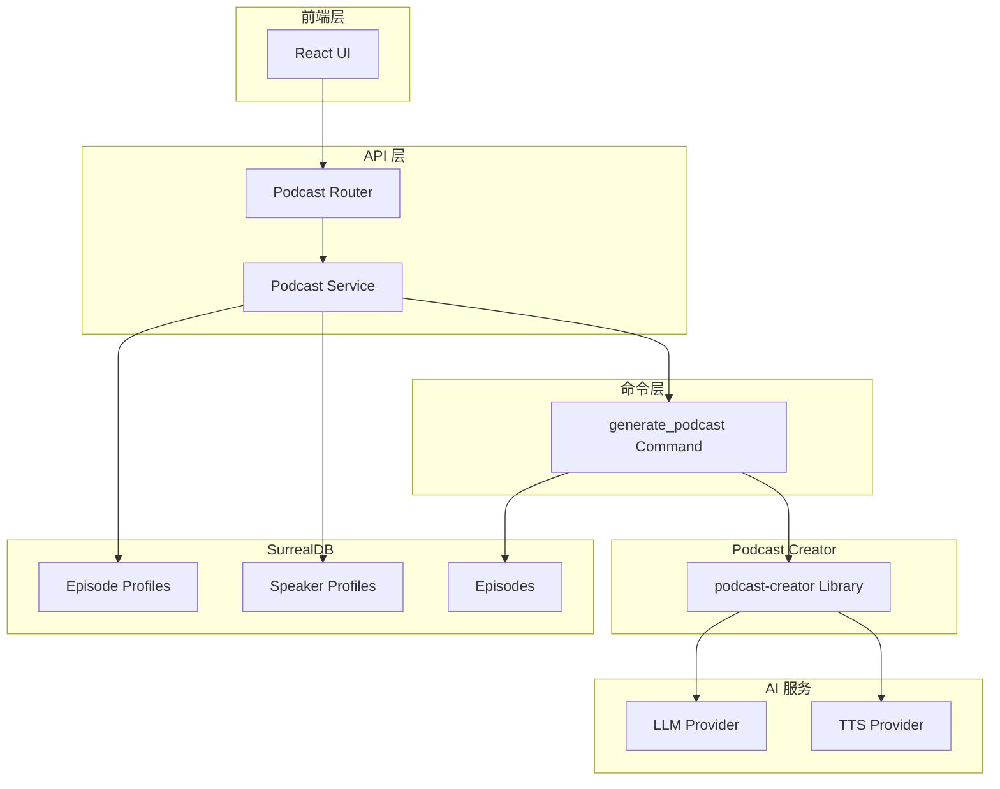
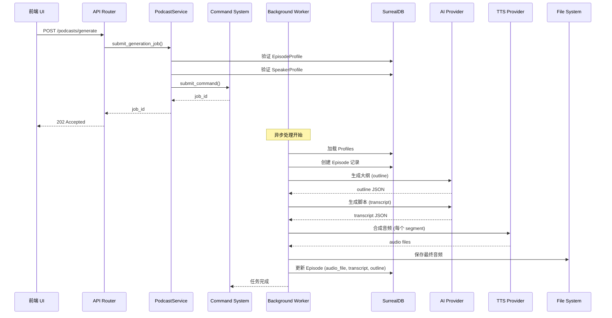

# Open Notebook - Podcast 生成指南

**作者**: Claude
**日期**: 2026-01-10
**版本**: 1.0

---

## 1. 概述

Open Notebook 提供了强大的 AI Podcast 生成功能，可以将文档、笔记和研究内容自动转换为专业的播客节目。该系统基于 **podcast-creator** 库，支持多说话人、多种 AI 模型和灵活的配置选项。

### 1.1 核心特性

- **Profile 系统**: 预定义的说话人配置和节目风格
- **异步生成**: 后台任务处理，避免阻塞请求
- **AI 驱动**: 使用 LLM 生成大纲和脚本
- **TTS 集成**: 支持多种语音合成引擎（OpenAI、ElevenLabs 等）
- **灵活配置**: 支持自定义节目长度、说话人数量、风格等
- **状态跟踪**: 实时查询生成进度和状态

### 1.2 架构概览



---

## 2. 数据模型

### 2.1 核心模型

Open Notebook 使用三个核心模型来管理 Podcast 生成：

#### 2.1.1 SpeakerProfile（说话人配置）

**表名**: `speaker_profile`

**用途**: 定义说话人的声音、背景和性格特征

**字段定义**:

| 字段 | 类型 | 必填 | 说明 |
|------|------|------|------|
| `name` | `string` | 是 | 配置名称（唯一） |
| `description` | `string` | 否 | 配置描述 |
| `tts_provider` | `string` | 是 | TTS 提供商（openai, elevenlabs 等） |
| `tts_model` | `string` | 是 | TTS 模型名称 |
| `speakers` | `array<object>` | 是 | 说话人数组（1-4 人） |

**Speakers 数组结构**:

```python
[
    {
        "name": "Dr. Alex Chen",           # 说话人名称
        "voice_id": "nova",                # 语音 ID
        "backstory": "Senior AI researcher...",  # 背景故事
        "personality": "Analytical, clear..."   # 性格特征
    }
]
```

**SurrealDB Schema**:

```sql
DEFINE TABLE IF NOT EXISTS speaker_profile SCHEMAFULL;
DEFINE FIELD IF NOT EXISTS name ON TABLE speaker_profile TYPE string;
DEFINE FIELD IF NOT EXISTS description ON TABLE speaker_profile TYPE option<string>;
DEFINE FIELD IF NOT EXISTS tts_provider ON TABLE speaker_profile TYPE string;
DEFINE FIELD IF NOT EXISTS tts_model ON TABLE speaker_profile TYPE string;
DEFINE FIELD IF NOT EXISTS speakers ON TABLE speaker_profile TYPE array<object>;
DEFINE FIELD IF NOT EXISTS speakers.*.name ON TABLE speaker_profile TYPE string;
DEFINE FIELD IF NOT EXISTS speakers.*.voice_id ON TABLE speaker_profile TYPE option<string>;
DEFINE FIELD IF NOT EXISTS speakers.*.backstory ON TABLE speaker_profile TYPE option<string>;
DEFINE FIELD IF NOT EXISTS speakers.*.personality ON TABLE speaker_profile TYPE option<string>;
DEFINE FIELD IF NOT EXISTS created ON TABLE speaker_profile TYPE datetime DEFAULT time::now();
DEFINE FIELD IF NOT EXISTS updated ON TABLE speaker_profile TYPE datetime DEFAULT time::now();

DEFINE INDEX IF NOT EXISTS idx_speaker_profile_name
ON TABLE speaker_profile COLUMNS name UNIQUE;
```

**Python 模型**:

```python
class SpeakerProfile(ObjectModel):
    table_name: ClassVar[str] = "speaker_profile"

    name: str
    description: Optional[str] = None
    tts_provider: str
    tts_model: str
    speakers: List[Dict[str, Any]]

    @field_validator("speakers")
    @classmethod
    def validate_speakers(cls, v):
        if not 1 <= len(v) <= 4:
            raise ValueError("Must have between 1 and 4 speakers")

        required_fields = ["name", "voice_id", "backstory", "personality"]
        for speaker in v:
            for field in required_fields:
                if field not in speaker:
                    raise ValueError(f"Speaker missing required field: {field}")
        return v

    @classmethod
    async def get_by_name(cls, name: str) -> Optional["SpeakerProfile"]:
        """根据名称获取配置"""
        result = await repo_query(
            "SELECT * FROM speaker_profile WHERE name = $name",
            {"name": name}
        )
        if result:
            return cls(**result[0])
        return None
```

#### 2.1.2 EpisodeProfile（节目配置）

**表名**: `episode_profile`

**用途**: 定义 Podcast 节目的生成风格和参数

**字段定义**:

| 字段 | 类型 | 必填 | 说明 |
|------|------|------|------|
| `name` | `string` | 是 | 配置名称（唯一） |
| `description` | `string` | 否 | 配置描述 |
| `speaker_config` | `string` | 是 | 关联的 SpeakerProfile 名称 |
| `outline_provider` | `string` | 是 | 大纲生成 AI 提供商 |
| `outline_model` | `string` | 是 | 大纲生成 AI 模型 |
| `transcript_provider` | `string` | 是 | 脚本生成 AI 提供商 |
| `transcript_model` | `string` | 是 | 脚本生成 AI 模型 |
| `default_briefing` | `string` | 是 | 默认节目指导说明 |
| `num_segments` | `int` | 是 | 节目段数（3-20） |

**SurrealDB Schema**:

```sql
DEFINE TABLE IF NOT EXISTS episode_profile SCHEMAFULL;
DEFINE FIELD IF NOT EXISTS name ON TABLE episode_profile TYPE string;
DEFINE FIELD IF NOT EXISTS description ON TABLE episode_profile TYPE option<string>;
DEFINE FIELD IF NOT EXISTS speaker_config ON TABLE episode_profile TYPE string;
DEFINE FIELD IF NOT EXISTS outline_provider ON TABLE episode_profile TYPE string;
DEFINE FIELD IF NOT EXISTS outline_model ON TABLE episode_profile TYPE string;
DEFINE FIELD IF NOT EXISTS transcript_provider ON TABLE episode_profile TYPE string;
DEFINE FIELD IF NOT EXISTS transcript_model ON TABLE episode_profile TYPE string;
DEFINE FIELD IF NOT EXISTS default_briefing ON TABLE episode_profile TYPE string;
DEFINE FIELD IF NOT EXISTS num_segments ON TABLE episode_profile TYPE int DEFAULT 5;
DEFINE FIELD IF NOT EXISTS created ON TABLE episode_profile TYPE datetime DEFAULT time::now();
DEFINE FIELD IF NOT EXISTS updated ON TABLE episode_profile TYPE datetime DEFAULT time::now();

DEFINE INDEX IF NOT EXISTS idx_episode_profile_name
ON TABLE episode_profile COLUMNS name UNIQUE;
```

**Python 模型**:

```python
class EpisodeProfile(ObjectModel):
    table_name: ClassVar[str] = "episode_profile"

    name: str
    description: Optional[str] = None
    speaker_config: str  # SpeakerProfile 的名称
    outline_provider: str
    outline_model: str
    transcript_provider: str
    transcript_model: str
    default_briefing: str
    num_segments: int = Field(default=5, ge=3, le=20)

    @field_validator("num_segments")
    @classmethod
    def validate_segments(cls, v):
        if not 3 <= v <= 20:
            raise ValueError("Number of segments must be between 3 and 20")
        return v

    @classmethod
    async def get_by_name(cls, name: str) -> Optional["EpisodeProfile"]:
        """根据名称获取配置"""
        result = await repo_query(
            "SELECT * FROM episode_profile WHERE name = $name",
            {"name": name}
        )
        if result:
            return cls(**result[0])
        return None
```

#### 2.1.3 PodcastEpisode（播客节目）

**表名**: `episode`

**用途**: 存储生成的播客节目及其元数据

**字段定义**:

| 字段 | 类型 | 必填 | 说明 |
|------|------|------|------|
| `name` | `string` | 是 | 节目名称 |
| `episode_profile` | `object` | 是 | 使用的 EpisodeProfile（快照） |
| `speaker_profile` | `object` | 是 | 使用的 SpeakerProfile（快照） |
| `briefing` | `string` | 是 | 完整的节目指导 |
| `content` | `string` | 是 | 源内容 |
| `audio_file` | `string` | 否 | 生成的音频文件路径 |
| `transcript` | `object` | 否 | 生成的脚本 |
| `outline` | `object` | 否 | 生成的大纲 |
| `command` | `record<command>` | 否 | 关联的后台任务 |

**SurrealDB Schema**:

```sql
DEFINE TABLE IF NOT EXISTS episode SCHEMAFULL;
DEFINE FIELD IF NOT EXISTS created ON episode DEFAULT time::now() VALUE $before OR time::now();
DEFINE FIELD IF NOT EXISTS updated ON episode DEFAULT time::now() VALUE time::now();
DEFINE FIELD IF NOT EXISTS name ON TABLE episode TYPE string;
DEFINE FIELD IF NOT EXISTS briefing ON TABLE episode TYPE option<string>;
DEFINE FIELD IF NOT EXISTS episode_profile ON TABLE episode FLEXIBLE TYPE object;
DEFINE FIELD IF NOT EXISTS speaker_profile ON TABLE episode FLEXIBLE TYPE object;
DEFINE FIELD IF NOT EXISTS transcript ON TABLE episode FLEXIBLE TYPE option<object>;
DEFINE FIELD IF NOT EXISTS outline ON TABLE episode FLEXIBLE TYPE option<object>;
DEFINE FIELD IF NOT EXISTS command ON TABLE episode TYPE option<record<command>>;
DEFINE FIELD IF NOT EXISTS content ON TABLE episode TYPE option<string>;
DEFINE FIELD IF NOT EXISTS audio_file ON TABLE episode TYPE option<string>;

DEFINE INDEX IF NOT EXISTS idx_episode_command ON TABLE episode COLUMNS command;
```

**Python 模型**:

```python
class PodcastEpisode(ObjectModel):
    table_name: ClassVar[str] = "episode"

    name: str
    episode_profile: Dict[str, Any]  # 配置快照
    speaker_profile: Dict[str, Any]  # 配置快照
    briefing: str
    content: str
    audio_file: Optional[str] = None
    transcript: Optional[Dict[str, Any]] = None
    outline: Optional[Dict[str, Any]] = None
    command: Optional[Union[str, RecordID]] = None

    async def get_job_status(self) -> Optional[str]:
        """获取关联任务的状态"""
        if not self.command:
            return None

        try:
            from surreal_commands import get_command_status
            status = await get_command_status(str(self.command))
            return status.status if status else "unknown"
        except Exception:
            return "unknown"
```

### 2.2 Profile 快照机制

**重要设计决策**:

`PodcastEpisode.episode_profile` 和 `speaker_profile` 存储 **配置快照**（dict），而非引用。这确保：

1. **配置冻结**: 已生成的节目不受后续 Profile 修改影响
2. **可追溯性**: 始终知道生成时使用的具体配置
3. **稳定性**: Profile 删除不影响已生成节目

**示例**:

```python
# 创建节目时保存配置快照
episode = PodcastEpisode(
    name="AI 技术讨论",
    episode_profile=full_model_dump(episode_profile.model_dump()),
    speaker_profile=full_model_dump(speaker_profile.model_dump()),
    # ...
)
await episode.save()
```

---

## 3. 数据库中的预置配置

### 3.1 SpeakerProfile 示例

迁移文件 `7.surrealql` 提供了三种默认配置：

#### 3.1.1 tech_experts（技术专家对话）

```json
{
    "name": "tech_experts",
    "description": "Two technical experts for tech discussions",
    "tts_provider": "openai",
    "tts_model": "gpt-4o-mini-tts",
    "speakers": [
        {
            "name": "Dr. Alex Chen",
            "voice_id": "nova",
            "backstory": "Senior AI researcher and former tech lead at major companies. Specializes in making complex technical concepts accessible.",
            "personality": "Analytical, clear communicator, asks probing questions to dig deeper into technical details"
        },
        {
            "name": "Jamie Rodriguez",
            "voice_id": "alloy",
            "backstory": "Full-stack engineer and tech entrepreneur. Loves practical applications and real-world implementations.",
            "personality": "Enthusiastic, practical-minded, great at explaining implementation details and trade-offs"
        }
    ]
}
```

#### 3.1.2 solo_expert（单人专家讲解）

```json
{
    "name": "solo_expert",
    "description": "Single expert for educational content",
    "tts_provider": "openai",
    "tts_model": "gpt-4o-mini-tts",
    "speakers": [
        {
            "name": "Professor Sarah Kim",
            "voice_id": "nova",
            "backstory": "Distinguished professor and researcher. Has a gift for making complex topics accessible to broad audiences.",
            "personality": "Patient teacher, uses analogies and examples, breaks down complex concepts step by step"
        }
    ]
}
```

#### 3.1.3 business_panel（商业分析小组）

```json
{
    "name": "business_panel",
    "description": "Business analysis panel with diverse perspectives",
    "tts_provider": "openai",
    "tts_model": "gpt-4o-mini-tts",
    "speakers": [
        {
            "name": "Marcus Thompson",
            "voice_id": "echo",
            "backstory": "Former McKinsey consultant, now startup advisor. Expert in strategic analysis and market dynamics.",
            "personality": "Strategic thinker, data-driven, excellent at identifying key insights and implications"
        },
        {
            "name": "Elena Vasquez",
            "voice_id": "shimmer",
            "backstory": "Serial entrepreneur and investor. Focuses on practical implementation and execution.",
            "personality": "Action-oriented, pragmatic, brings startup experience and execution focus"
        },
        {
            "name": "Johny Bing",
            "voice_id": "ash",
            "backstory": "Youtube celebrity and business mogul. Focuses on practical implementation and execution.",
            "personality": "Controversial, likes to question ideas and concepts. He brings a fresh perspective and always has a point to make."
        }
    ]
}
```

### 3.2 EpisodeProfile 示例

#### 3.2.1 tech_discussion（技术讨论）

```json
{
    "name": "tech_discussion",
    "description": "Technical discussion between 2 experts",
    "speaker_config": "tech_experts",
    "outline_provider": "openai",
    "outline_model": "gpt-5-mini",
    "transcript_provider": "openai",
    "transcript_model": "gpt-5-mini",
    "default_briefing": "Create an engaging technical discussion about the provided content. Focus on practical insights, real-world applications, and detailed explanations that would interest developers and technical professionals.",
    "num_segments": 5
}
```

#### 3.2.2 solo_expert（单人讲解）

```json
{
    "name": "solo_expert",
    "description": "Single expert explaining complex topics",
    "speaker_config": "solo_expert",
    "outline_provider": "openai",
    "outline_model": "gpt-5-mini",
    "transcript_provider": "openai",
    "transcript_model": "gpt-5-mini",
    "default_briefing": "Create an educational explanation of the provided content. Break down complex concepts into digestible segments, use analogies and examples, and maintain an engaging teaching style.",
    "num_segments": 4
}
```

#### 3.2.3 business_analysis（商业分析）

```json
{
    "name": "business_analysis",
    "description": "Business-focused analysis and discussion",
    "speaker_config": "business_panel",
    "outline_provider": "openai",
    "outline_model": "gpt-5-mini",
    "transcript_provider": "openai",
    "transcript_model": "gpt-5-mini",
    "default_briefing": "Analyze the provided content from a business perspective. Discuss market implications, strategic insights, competitive advantages, and actionable business intelligence.",
    "num_segments": 6
}
```

---

## 4. Podcast 生成流程

### 4.1 完整流程图



### 4.2 API 层

#### 4.2.1 提交生成任务

**Endpoint**: `POST /api/podcasts/generate`

**请求体**:

```python
class PodcastGenerationRequest(BaseModel):
    episode_profile: str          # EpisodeProfile 名称
    speaker_profile: str          # SpeakerProfile 名称
    episode_name: str             # 节目名称
    content: Optional[str] = None # 源内容（可选）
    notebook_id: Optional[str] = None  # Notebook ID（可选）
    briefing_suffix: Optional[str] = None  # 额外指导（可选）
```

**响应体**:

```python
class PodcastGenerationResponse(BaseModel):
    job_id: str                   # 任务 ID
    status: str                   # "submitted"
    message: str                  # 状态消息
    episode_profile: str          # 使用的配置
    episode_name: str             # 节目名称
```

**实现**:

```python
@router.post("/podcasts/generate", response_model=PodcastGenerationResponse)
async def generate_podcast(request: PodcastGenerationRequest):
    """提交 Podcast 生成任务（立即返回）"""
    try:
        job_id = await PodcastService.submit_generation_job(
            episode_profile_name=request.episode_profile,
            speaker_profile_name=request.speaker_profile,
            episode_name=request.episode_name,
            notebook_id=request.notebook_id,
            content=request.content,
            briefing_suffix=request.briefing_suffix,
        )

        return PodcastGenerationResponse(
            job_id=job_id,
            status="submitted",
            message=f"Podcast generation started for episode '{request.episode_name}'",
            episode_profile=request.episode_profile,
            episode_name=request.episode_name,
        )

    except Exception as e:
        logger.error(f"Error generating podcast: {str(e)}")
        raise HTTPException(
            status_code=500, detail=f"Failed to generate podcast: {str(e)}"
        )
```

#### 4.2.2 查询任务状态

**Endpoint**: `GET /api/podcasts/jobs/{job_id}`

**响应示例**:

```json
{
    "job_id": "command:123",
    "status": "completed",
    "result": {
        "success": true,
        "episode_id": "episode:456",
        "audio_file_path": "/data/podcasts/episodes/My Episode/final.mp3",
        "transcript": {...},
        "outline": {...}
    },
    "error_message": null,
    "created": "2026-01-10T10:00:00Z",
    "updated": "2026-01-10T10:05:30Z",
    "progress": null
}
```

**实现**:

```python
@router.get("/podcasts/jobs/{job_id}")
async def get_podcast_job_status(job_id: str):
    """获取 Podcast 生成任务状态"""
    try:
        status_data = await PodcastService.get_job_status(job_id)
        return status_data
    except Exception as e:
        logger.error(f"Error fetching podcast job status: {str(e)}")
        raise HTTPException(
            status_code=500, detail=f"Failed to fetch job status: {str(e)}"
        )
```

#### 4.2.3 列出所有节目

**Endpoint**: `GET /api/podcasts/episodes`

**响应示例**:

```json
[
    {
        "id": "episode:456",
        "name": "AI 技术讨论",
        "episode_profile": {...},
        "speaker_profile": {...},
        "briefing": "Create an engaging...",
        "audio_file": "/data/podcasts/...",
        "audio_url": "/api/podcasts/episodes/episode:456/audio",
        "transcript": {...},
        "outline": {...},
        "created": "2026-01-10T10:00:00Z",
        "job_status": "completed"
    }
]
```

#### 4.2.4 流式播放音频

**Endpoint**: `GET /api/podcasts/episodes/{episode_id}/audio`

**响应**: 音频文件流（`audio/mpeg`）

```python
@router.get("/podcasts/episodes/{episode_id}/audio")
async def stream_podcast_episode_audio(episode_id: str):
    """流式播放 Podcast 音频"""
    try:
        episode = await PodcastService.get_episode(episode_id)
    except Exception as e:
        raise HTTPException(status_code=404, detail=f"Episode not found: {str(e)}")

    if not episode.audio_file:
        raise HTTPException(status_code=404, detail="Episode has no audio file")

    audio_path = _resolve_audio_path(episode.audio_file)
    if not audio_path.exists():
        raise HTTPException(status_code=404, detail="Audio file not found on disk")

    return FileResponse(
        audio_path,
        media_type="audio/mpeg",
        filename=audio_path.name,
    )
```

### 4.3 Service 层

#### 4.3.1 PodcastService.submit_generation_job()

**职责**: 验证配置、准备内容、提交后台任务

**文件**: `api/podcast_service.py`

```python
class PodcastService:
    @staticmethod
    async def submit_generation_job(
        episode_profile_name: str,
        speaker_profile_name: str,
        episode_name: str,
        notebook_id: Optional[str] = None,
        content: Optional[str] = None,
        briefing_suffix: Optional[str] = None,
    ) -> str:
        """提交 Podcast 生成任务"""
        try:
            # 1. 验证 EpisodeProfile
            episode_profile = await EpisodeProfile.get_by_name(episode_profile_name)
            if not episode_profile:
                raise ValueError(f"Episode profile '{episode_profile_name}' not found")

            # 2. 验证 SpeakerProfile
            speaker_profile = await SpeakerProfile.get_by_name(speaker_profile_name)
            if not speaker_profile:
                raise ValueError(f"Speaker profile '{speaker_profile_name}' not found")

            # 3. 获取内容（从 Notebook 或直接提供）
            if not content and notebook_id:
                notebook = await Notebook.get(notebook_id)
                content = str(notebook)  # 简化处理

            if not content:
                raise ValueError("Content is required - provide either content or notebook_id")

            # 4. 准备命令参数
            command_args = {
                "episode_profile": episode_profile_name,
                "speaker_profile": speaker_profile_name,
                "episode_name": episode_name,
                "content": str(content),
                "briefing_suffix": briefing_suffix,
            }

            # 5. 确保命令模块已导入
            import commands.podcast_commands

            # 6. 提交到 surreal-commands
            job_id = submit_command("open_notebook", "generate_podcast", command_args)

            job_id_str = str(job_id)
            logger.info(f"Submitted podcast generation job: {job_id_str}")
            return job_id_str

        except Exception as e:
            logger.error(f"Failed to submit podcast generation job: {e}")
            raise HTTPException(
                status_code=500,
                detail=f"Failed to submit podcast generation job: {str(e)}",
            )
```

### 4.4 Command 层（后台任务）

#### 4.4.1 generate_podcast_command()

**职责**: 实际执行 Podcast 生成逻辑

**文件**: `commands/podcast_commands.py`

```python
@command("generate_podcast", app="open_notebook")
async def generate_podcast_command(
    input_data: PodcastGenerationInput,
) -> PodcastGenerationOutput:
    """
    使用 podcast-creator 库生成 Podcast
    """
    start_time = time.time()

    try:
        logger.info(f"Starting podcast generation for episode: {input_data.episode_name}")

        # 1. 加载 Profiles
        episode_profile = await EpisodeProfile.get_by_name(input_data.episode_profile)
        if not episode_profile:
            raise ValueError(f"Episode profile '{input_data.episode_profile}' not found")

        speaker_profile = await SpeakerProfile.get_by_name(episode_profile.speaker_config)
        if not speaker_profile:
            raise ValueError(f"Speaker profile '{episode_profile.speaker_config}' not found")

        # 2. 创建 Episode 记录（关联任务）
        briefing = episode_profile.default_briefing
        if input_data.briefing_suffix:
            briefing += f"\n\nAdditional instructions: {input_data.briefing_suffix}"

        episode = PodcastEpisode(
            name=input_data.episode_name,
            episode_profile=full_model_dump(episode_profile.model_dump()),
            speaker_profile=full_model_dump(speaker_profile.model_dump()),
            command=ensure_record_id(input_data.execution_context.command_id)
            if input_data.execution_context
            else None,
            briefing=briefing,
            content=input_data.content,
            audio_file=None,
            transcript=None,
            outline=None,
        )
        await episode.save()

        # 3. 配置 podcast-creator
        episode_profiles = await repo_query("SELECT * FROM episode_profile")
        speaker_profiles = await repo_query("SELECT * FROM speaker_profile")

        episode_profiles_dict = {profile["name"]: profile for profile in episode_profiles}
        speaker_profiles_dict = {profile["name"]: profile for profile in speaker_profiles}

        configure("speakers_config", {"profiles": speaker_profiles_dict})
        configure("episode_config", {"profiles": episode_profiles_dict})

        # 4. 创建输出目录
        output_dir = Path(f"{DATA_FOLDER}/podcasts/episodes/{input_data.episode_name}")
        output_dir.mkdir(parents=True, exist_ok=True)

        # 5. 生成 Podcast
        result = await create_podcast(
            content=input_data.content,
            briefing=briefing,
            episode_name=input_data.episode_name,
            output_dir=str(output_dir),
            speaker_config=speaker_profile.name,
            episode_profile=episode_profile.name,
        )

        # 6. 更新 Episode 记录
        episode.audio_file = str(result.get("final_output_file_path")) if result else None
        episode.transcript = {"transcript": full_model_dump(result["transcript"])} if result else None
        episode.outline = full_model_dump(result["outline"]) if result else None
        await episode.save()

        processing_time = time.time() - start_time
        logger.info(f"Successfully generated podcast episode: {episode.id} in {processing_time:.2f}s")

        return PodcastGenerationOutput(
            success=True,
            episode_id=str(episode.id),
            audio_file_path=str(result.get("final_output_file_path")) if result else None,
            transcript={"transcript": full_model_dump(result["transcript"])} if result.get("transcript") else None,
            outline=full_model_dump(result["outline"]) if result.get("outline") else None,
            processing_time=processing_time,
        )

    except Exception as e:
        processing_time = time.time() - start_time
        logger.error(f"Podcast generation failed: {e}")
        logger.exception(e)

        return PodcastGenerationOutput(
            success=False,
            processing_time=processing_time,
            error_message=str(e)
        )
```

### 4.5 podcast-creator 库集成

#### 4.5.1 库概览

**podcast-creator** 是一个 Python 库，负责：

1. **大纲生成**: 使用 LLM 根据内容和 briefing 生成节目大纲
2. **脚本生成**: 使用 LLM 根据大纲生成详细脚本（包含每个说话人的台词）
3. **音频合成**: 调用 TTS API 为每个 segment 生成音频
4. **音频拼接**: 将所有 segments 合并为最终音频文件

#### 4.5.2 配置接口

```python
from podcast_creator import configure, create_podcast

# 配置 Speakers
configure("speakers_config", {
    "profiles": {
        "tech_experts": {
            "name": "tech_experts",
            "tts_provider": "openai",
            "tts_model": "gpt-4o-mini-tts",
            "speakers": [...]
        }
    }
})

# 配置 Episodes
configure("episode_config", {
    "profiles": {
        "tech_discussion": {
            "name": "tech_discussion",
            "speaker_config": "tech_experts",
            "outline_provider": "openai",
            "outline_model": "gpt-5-mini",
            "transcript_provider": "openai",
            "transcript_model": "gpt-5-mini",
            "default_briefing": "...",
            "num_segments": 5
        }
    }
})
```

#### 4.5.3 生成接口

```python
result = await create_podcast(
    content="要转换的内容...",
    briefing="节目指导说明...",
    episode_name="My Episode",
    output_dir="/data/podcasts/episodes/My Episode",
    speaker_config="tech_experts",
    episode_profile="tech_discussion",
)
```

**返回结果**:

```python
{
    "final_output_file_path": "/data/podcasts/episodes/My Episode/final.mp3",
    "transcript": {
        "segments": [
            {
                "speaker": "Dr. Alex Chen",
                "text": "Welcome to today's discussion...",
                "start_time": 0.0,
                "end_time": 45.2
            },
            ...
        ]
    },
    "outline": {
        "title": "AI 技术讨论",
        "segments": [
            {"title": "Introduction", "summary": "..."},
            {"title": "Main Topic 1", "summary": "..."},
            ...
        ]
    }
}
```

---

## 5. 自定义 Profile

### 5.1 创建新的 SpeakerProfile

**示例**: 添加双人对话配置（中英文混合）

```python
# 方法 1: 直接创建并保存
new_speaker_profile = SpeakerProfile(
    name="chinese_tech_experts",
    description="中文技术专家对话",
    tts_provider="openai",
    tts_model="gpt-4o-mini-tts",
    speakers=[
        {
            "name": "李明博士",
            "voice_id": "nova",
            "backstory": "AI 研究员，前互联网大厂技术总监。擅长将复杂技术概念通俗化。",
            "personality": "理性清晰，善于追问细节"
        },
        {
            "name": "王芳",
            "voice_id": "alloy",
            "backstory": "全栈工程师，技术创业者。热衷于实际应用和落地实践。",
            "personality": "热情务实，擅长解释实现细节"
        }
    ]
)
await new_speaker_profile.save()

# 方法 2: 通过 API 创建
from api.episode_profiles_service import episode_profiles_service

profile = episode_profiles_service.create_speaker_profile(
    name="chinese_tech_experts",
    description="中文技术专家对话",
    tts_provider="openai",
    tts_model="gpt-4o-mini-tts",
    speakers=[...]
)
```

### 5.2 创建新的 EpisodeProfile

**示例**: 添加教育类节目配置

```python
new_episode_profile = EpisodeProfile(
    name="educational_deep_dive",
    description="深度教育解析",
    speaker_config="solo_expert",
    outline_provider="openai",
    outline_model="gpt-4o",
    transcript_provider="openai",
    transcript_model="gpt-4o",
    default_briefing="""
    Create an in-depth educational explanation of the provided content.
    Structure the explanation as follows:
    1. Introduction to the topic
    2. Historical context and background
    3. Core concepts and terminology
    4. Practical examples and applications
    5. Future trends and implications

    Use clear language, avoid jargon where possible, and include
    real-world analogies to help listeners understand complex ideas.
    """,
    num_segments=8
)
await new_episode_profile.save()
```

### 5.3 使用 Briefing Suffix

**动态修改节目指导**:

```python
# 基础 briefing 来自 EpisodeProfile
# briefing_suffix 提供额外指导

job_id = await PodcastService.submit_generation_job(
    episode_profile_name="tech_discussion",
    speaker_profile_name="tech_experts",
    episode_name="量子计算基础",
    content="量子计算的研究内容...",
    briefing_suffix="""
    特别要求：
    - 重点解释量子比特和叠加态的概念
    - 使用日常生活中的类比
    - 避免过于复杂的数学公式
    - 包含对当前量子计算发展水平的讨论
    """
)
```

---

## 6. 使用数据库数据生成 Podcast

### 6.1 从 Notebook 生成

**场景**: 将整个研究笔记转换为 Podcast

```python
# API 调用
response = requests.post("http://localhost:5055/api/podcasts/generate", json={
    "episode_profile": "tech_discussion",
    "speaker_profile": "tech_experts",
    "episode_name": "量子计算研究总结",
    "notebook_id": "notebook:abc123",  # 从 Notebook 获取内容
    "briefing_suffix": "Focus on practical applications"
})

job_id = response.json()["job_id"]
```

**实现细节**:

```python
# Service 层处理
if not content and notebook_id:
    notebook = await Notebook.get(notebook_id)

    # 方法 1: 直接转换为字符串
    content = str(notebook)

    # 方法 2: 获取 Notebook 上下文（更智能）
    if hasattr(notebook, "get_context"):
        context = await notebook.get_context(context_size="long")
        # context 包含: sources, notes, insights, full_text
        content = format_context_as_text(context)
```

### 6.2 从 Source 生成

**场景**: 将单个文档转换为 Podcast

```python
# 先获取 Source
source = await Source.get("source:xyz789")

# 使用 Source 的 full_text 生成
job_id = await PodcastService.submit_generation_job(
    episode_profile_name="solo_expert",
    speaker_profile_name="solo_expert",
    episode_name=source.title or "文档讲解",
    content=source.full_text  # 使用 Source 的完整文本
)
```

### 6.3 从多个 Notes 生成

**场景**: 将精选笔记转换为 Podcast

```python
# 获取 Notebook 的 Notes
notebook = await Notebook.get("notebook:abc123")
notes = await notebook.get_notes()

# 组合 Notes 内容
combined_content = "\n\n".join([
    f"## {note.title}\n\n{note.content}"
    for note in notes
    if note.content
])

# 生成 Podcast
job_id = await PodcastService.submit_generation_job(
    episode_profile_name="business_analysis",
    speaker_profile_name="business_panel",
    episode_name="商业洞察总结",
    content=combined_content
)
```

### 6.4 从 Insights 生成

**场景**: 基于 AI 生成的洞察创建讨论

```python
# 获取 Source 的所有 Insights
source = await Source.get("source:xyz789")
insights = await source.get_insights()

# 格式化 Insights
insights_text = "\n\n".join([
    f"{insight.insight_type}: {insight.content}"
    for insight in insights
])

# 生成 Podcast
job_id = await PodcastService.submit_generation_job(
    episode_profile_name="tech_discussion",
    speaker_profile_name="tech_experts",
    episode_name=f"关于 {source.title} 的讨论",
    content=insights_text,
    briefing_suffix="Base the discussion on these AI-generated insights"
)
```

---

## 7. 高级特性

### 7.1 错误处理

#### 7.1.1 GPT-5 Extended Thinking 问题

**问题**: 某些 GPT-5 模型使用 extended thinking（`<thinking>` 标签），导致 JSON 解析失败

**解决方案**: 使用其他模型

```python
# podcast_commands.py 中的错误处理
error_msg = str(e)
if "Invalid json output" in error_msg or "Expecting value" in error_msg:
    error_msg += (
        "\n\nNOTE: This error commonly occurs with GPT-5 models that use extended thinking. "
        "The model may be putting all output inside <thinking> tags, leaving nothing to parse. "
        "Try using gpt-4o, gpt-4o-mini, or gpt-4-turbo instead in your episode profile."
    )
```

#### 7.1.2 TTS 失败处理

**问题**: TTS API 调用失败（网络问题、配额限制等）

**podcast-creator 处理**:
- 自动重试（可配置重试次数）
- 失败时生成静音音频占位
- 继续处理后续 segments

### 7.2 任务状态跟踪

#### 7.2.1 状态查询

**状态值**:
- `pending`: 任务已提交，等待处理
- `running`: 任务正在执行
- `completed`: 任务成功完成
- `failed`: 任务失败
- `unknown`: 状态未知

**查询方式**:

```python
# 方式 1: 通过 job_id 查询
from surreal_commands import get_command_status

status = await get_command_status(job_id)
print(status.status)  # "completed"
print(status.result)  # {...}

# 方式 2: 通过 Episode 查询
episode = await PodcastEpisode.get("episode:456")
job_status = await episode.get_job_status()
print(job_status)  # "completed"
```

#### 7.2.2 进度监控

**当前限制**: surreal-commands 不提供细粒度进度

**Workaround**: 通过 Episode 记录的更新推断进度

```python
async def monitor_progress(episode_id: str):
    episode = await PodcastEpisode.get(episode_id)

    while True:
        status = await episode.get_job_status()
        if status in ["completed", "failed"]:
            break

        # 检查哪些字段已更新
        progress = []
        if episode.outline:
            progress.append("大纲已生成")
        if episode.transcript:
            progress.append("脚本已生成")
        if episode.audio_file:
            progress.append("音频已生成")

        print(f"进度: {', '.join(progress) if progress else '处理中...'}")
        await asyncio.sleep(5)
```

### 7.3 文件管理

#### 7.3.1 音频文件路径

**存储位置**: `{DATA_FOLDER}/podcasts/episodes/{episode_name}/`

**目录结构**:

```
/data/podcasts/
├── episodes/
│   ├── Episode_1/
│   │   ├── segment_0.mp3
│   │   ├── segment_1.mp3
│   │   ├── ...
│   │   └── final.mp3
│   ├── Episode_2/
│   │   └── ...
```

**路径存储**: Episode.audio_file 存储完整路径

```python
# 示例
episode.audio_file = "/data/podcasts/episodes/My Episode/final.mp3"
```

#### 7.3.2 删除 Episode

**级联删除**: 删除 Episode 时同时删除音频文件

```python
@router.delete("/podcasts/episodes/{episode_id}")
async def delete_podcast_episode(episode_id: str):
    """删除 Podcast Episode 及其音频文件"""
    try:
        episode = await PodcastService.get_episode(episode_id)

        # 删除物理音频文件
        if episode.audio_file:
            audio_path = Path(episode.audio_file)
            if audio_path.exists():
                audio_path.unlink()
                logger.info(f"Deleted audio file: {audio_path}")

        # 删除数据库记录
        await episode.delete()

        return {"message": "Episode deleted successfully", "episode_id": episode_id}

    except Exception as e:
        logger.error(f"Error deleting podcast episode: {str(e)}")
        raise HTTPException(status_code=500, detail=f"Failed to delete episode: {str(e)}")
```

---

## 8. 最佳实践

### 8.1 配置 Profile

#### 8.1.1 选择合适的 AI 模型

**大纲生成**:
- 使用快速模型（gpt-4o-mini, gpt-5-mini）
- 大纲结构相对简单，不需要最强模型

**脚本生成**:
- 使用质量较高的模型（gpt-4o, claude-3-5-sonnet）
- 脚本质量直接影响节目效果

**示例配置**:

```python
# 成本优先
EpisodeProfile(
    name="cost_effective",
    outline_provider="openai",
    outline_model="gpt-4o-mini",      # 便宜
    transcript_provider="openai",
    transcript_model="gpt-4o-mini",   # 便宜
)

# 质量优先
EpisodeProfile(
    name="high_quality",
    outline_provider="anthropic",
    outline_model="claude-3-5-sonnet-20241022",  # 高质量
    transcript_provider="anthropic",
    transcript_model="claude-3-5-sonnet-20241022",  # 高质量
)
```

#### 8.1.2 优化 Briefing

**好的 Briefing**:

```
Create an engaging technical discussion about quantum computing.
Target audience: Software developers with basic physics knowledge.
Structure:
1. Introduction (what is quantum computing)
2. Key concepts (qubits, superposition, entanglement)
3. Current applications and limitations
4. Future prospects

Style: Conversational but technically accurate.
Use analogies to explain complex concepts.
Avoid overly academic language.
Include practical examples.
```

**避免的 Briefing**:

```
Make a podcast about quantum computing.  # 太模糊
```

### 8.2 内容准备

#### 8.2.1 内容长度

**推荐**: 2000-8000 字

**原因**:
- 太短（< 2000 字）: 节目内容单薄
- 太长（> 8000 字）: 可能超出模型上下文窗口

**处理长内容**:

```python
# 方法 1: 分段生成
content_parts = split_long_content(content, max_length=5000)
for i, part in enumerate(content_parts):
    await PodcastService.submit_generation_job(
        episode_profile_name="tech_discussion",
        speaker_profile_name="tech_experts",
        episode_name=f"主题 Part {i+1}",
        content=part
    )

# 方法 2: 摘要后生成
summary = await summarize_content(content)
await PodcastService.submit_generation_job(
    episode_profile_name="tech_discussion",
    speaker_profile_name="tech_experts",
    episode_name="主题摘要",
    content=summary
)
```

#### 8.2.2 内容格式化

**Markdown 格式**:

```markdown
# 量子计算基础

## 什么是量子计算

量子计算是一种利用量子力学原理...

## 关键概念

### 量子比特 (Qubit)
量子比特是量子计算的基本单位...

### 叠加态 (Superposition)
叠加态允许量子比特同时处于多种状态...
```

**纯文本格式**:

```
量子计算基础

什么是量子计算
量子计算是一种利用量子力学原理...

关键概念
量子比特 (Qubit): 量子计算的基本单位...
叠加态 (Superposition): 允许量子比特同时处于多种状态...
```

### 8.3 性能优化

#### 8.3.1 并发控制

**当前设计**: 串行处理（一次生成一个 Podcast）

**原因**: 
- TTS API 有速率限制
- 避免 GPU 内存溢出
- 确保生成质量

**未来优化**: 支持有限并发（如 2-3 个任务）

#### 8.3.2 缓存策略

**当前限制**: 无缓存

**建议缓存**:

```python
# 缓存大纲（如果内容相同）
@lru_cache(maxsize=100)
async def generate_outline(content_hash: str, profile: str):
    # 生成大纲逻辑
    pass

# 缓存 TTS 音频（如果文本相同）
@lru_cache(maxsize=500)
async def generate_tts(text: str, voice_id: str):
    # TTS 合成逻辑
    pass
```

### 8.4 错误恢复

#### 8.4.1 任务重试

**自动重试**: surreal-commands 配置重试策略

```python
@command(
    "generate_podcast",
    app="open_notebook",
    retry={
        "max_attempts": 3,
        "wait_strategy": "exponential_jitter",
        "wait_min": 5,
        "wait_max": 60,
        "retry_on": [ConnectionError, TimeoutError],
    },
)
async def generate_podcast_command(...):
    # ...
```

#### 8.4.2 失败处理

**永久失败**: 
- TTS API 密钥无效
- 内容格式错误
- Profile 配置错误

**处理策略**:

```python
# 检查失败原因
status = await get_command_status(job_id)
if status.status == "failed":
    error = status.error_message

    if "API key" in error:
        # 更新 TTS 密钥
        pass
    elif "Invalid JSON" in error:
        # 切换模型
        pass
    elif "Profile not found" in error:
        # 修复配置
        pass
```

---

## 9. 故障排查

### 9.1 常见问题

#### 9.1.1 任务一直处于 pending 状态

**原因**: Worker 未启动

**解决**:
```bash
# 启动 surreal-commands worker
python -m surreal_commands.worker --app open_notebook
```

#### 9.1.2 生成失败：Profile not found

**原因**: Profile 未创建或名称拼写错误

**解决**:
```python
# 检查现有 Profiles
episode_profiles = await EpisodeProfile.get_all()
speaker_profiles = await SpeakerProfile.get_all()

print("Episode Profiles:", [p.name for p in episode_profiles])
print("Speaker Profiles:", [p.name for p in speaker_profiles])
```

#### 9.1.3 音频文件无法播放

**原因**: 
- TTS 生成失败
- 文件路径错误
- 文件权限问题

**排查**:
```python
episode = await PodcastEpisode.get("episode:456")
print(f"Audio file: {episode.audio_file}")

# 检查文件是否存在
from pathlib import Path
audio_path = Path(episode.audio_file)
print(f"Exists: {audio_path.exists()}")
print(f"Size: {audio_path.stat().st_size if audio_path.exists() else 0} bytes")
```

#### 9.1.4 JSON 解析错误

**原因**: LLM 返回非 JSON 格式内容

**解决**: 切换模型或调整 briefing

```python
# 避免使用 GPT-5 extended thinking 模型
EpisodeProfile(
    transcript_model="gpt-4o",  # ✅
    # transcript_model="gpt-5",  # ❌
)
```

### 9.2 日志调试

#### 9.2.1 启用详细日志

```python
# 配置 loguru
from loguru import logger
logger.add("podcast_debug.log", level="DEBUG")
```

#### 9.2.2 关键日志点

**提交任务**:
```
INFO: Submitted podcast generation job: command:123 for episode 'My Episode'
```

**加载 Profiles**:
```
INFO: Loaded episode profile: tech_discussion
INFO: Loaded speaker profile: tech_experts
```

**生成中**:
```
INFO: Starting podcast generation with podcast-creator...
INFO: Generated briefing (length: 234 chars)
INFO: Created output directory: /data/podcasts/episodes/My Episode
```

**完成**:
```
INFO: Successfully generated podcast episode: episode:456 in 123.45s
```

**失败**:
```
ERROR: Podcast generation failed: ...
```

---

## 10. 总结

### 10.1 核心要点

1. **Profile 系统**: SpeakerProfile + EpisodeProfile = 完整配置
2. **异步处理**: API 立即返回，后台执行生成
3. **配置快照**: Episode 存储生成时的 Profile，确保可追溯性
4. **数据库集成**: 直接从 Notebook/Source/Notes 生成 Podcast
5. **灵活扩展**: 支持自定义 Profile 和 Briefing

### 10.2 数据流程


### 10.3 文件位置

**模型定义**: `open_notebook/podcasts/models.py`
**命令实现**: `commands/podcast_commands.py`
**API 服务**: `api/podcast_service.py`
**API 路由**: `api/routers/podcasts.py`
**数据库迁移**: `open_notebook/database/migrations/7.surrealql`

### 10.4 扩展建议

**短期**:
- 添加进度回调机制
- 支持更多 TTS 提供商
- 优化长内容处理

**中期**:
- 支持批量生成
- 添加音频后处理（降噪、均衡）
- 支持自定义 Intro/Outro

**长期**:
- 支持视频生成（数字人）
- 实时交互式 Podcast
- 多语言翻译

---

**文档版本**: 1.0
**最后更新**: 2026-01-10
