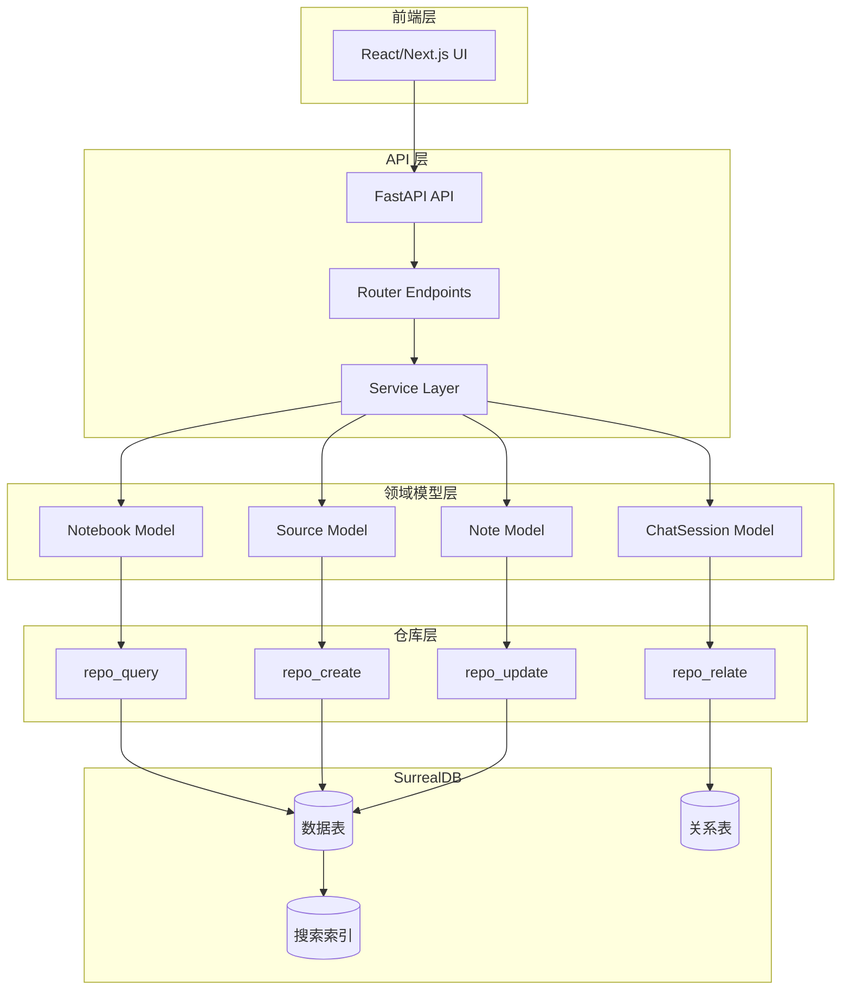
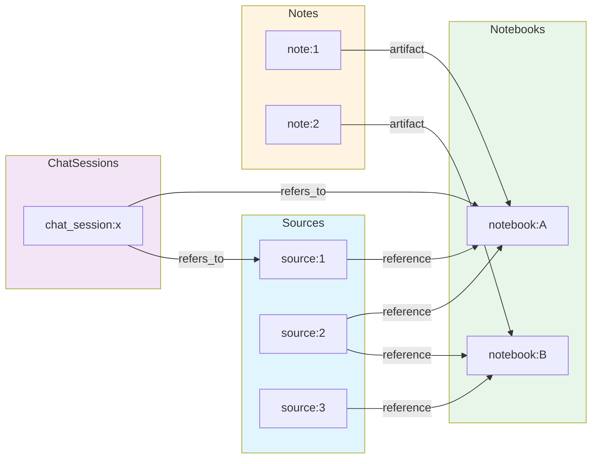
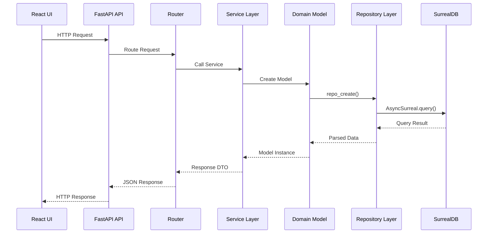

# Open Notebook - SurrealDB 使用指南

**作者**: Claude
**日期**: 2026-01-10
**版本**: 1.0

---

## 1. 概述

Open Notebook 使用 **SurrealDB** 作为其后端数据库，这是一个现代化的多模型数据库，结合了图数据库、文档数据库和关系数据库的特性。本文档详细介绍 Open Notebook 如何使用 SurrealDB，包括数据模型定义、图结构设计和应用交互模式。

### 1.1 为什么选择 SurrealDB？

- **图数据库特性**: 支持记录之间的复杂关系查询
- **向量搜索**: 内置向量相似度搜索，支持语义检索
- **全文搜索**: 内置 BM25 全文搜索引擎
- **灵活的 Schema**: 支持 SCHEMAFULL 和 SCHEMALESS 模式
- **异步 Python 客户端**: 原生支持 async/await，与 FastAPI 完美集成
- **类型安全**: 使用 Pydantic 模型进行数据验证

### 1.2 架构概览



---

## 2. 数据模型定义

### 2.1 核心 Domain 模型

Open Notebook 使用 **Pydantic** 模型定义数据结构，并通过继承 `ObjectModel` 或 `RecordModel` 基类来获得持久化能力。

#### 2.1.1 ObjectModel - 可变记录基类

`ObjectModel` 是所有可变数据模型的基类（如 Notebook、Source、Note），提供自动 ID 分配、时间戳和嵌入向量支持。

**文件位置**: `open_notebook/domain/base.py`

**核心特性**:
- 自动生成/管理 ID（格式: `table_name:uuid`）
- 自动时间戳管理（`created`, `updated`）
- 可选的自动嵌入向量生成
- CRUD 操作方法（`save()`, `delete()`, `get()`）
- 关系管理（`relate()`）

**示例模型定义**:

```python
from open_notebook.domain.base import ObjectModel
from pydantic import field_validator
from open_notebook.exceptions import InvalidInputError

class Notebook(ObjectModel):
    table_name: ClassVar[str] = "notebook"

    name: str
    description: str
    archived: Optional[bool] = False

    @field_validator("name")
    @classmethod
    def name_must_not_be_empty(cls, v):
        if not v.strip():
            raise InvalidInputError("Notebook name cannot be empty")
        return v
```

**关键字段**:
- `table_name`: 类变量，指定 SurrealDB 表名
- `id`: 可选字段，自动生成 `notebook:uuid` 格式
- `created` / `updated`: 自动管理的时间戳
- `nullable_fields`: 类变量，声明哪些字段可以为 None

#### 2.1.2 RecordModel - 单例配置基类

`RecordModel` 用于单例配置对象（如 ContentSettings、DefaultPrompts），每个类只有一个固定 ID 的记录。

**示例使用**:

```python
class ContentSettings(RecordModel):
    record_id: ClassVar[str] = "open_notebook:content_settings"
    table_name: ClassVar[str] = "record"

    speech_to_text_engine: str = "groq"
    text_to_speech_engine: str = "openai"
    embedding_engine: str = "openai"

    @classmethod
    async def get_instance(cls) -> "ContentSettings":
        """获取或创建单例实例"""
        instance = cls()
        await instance._load_from_db()
        return instance
```

### 2.2 核心数据模型

#### 2.2.1 Notebook（笔记本）

**表名**: `notebook`

**字段定义**:

| 字段 | 类型 | 必填 | 说明 |
|------|------|------|------|
| `name` | `string` | 否 | 笔记本名称 |
| `description` | `string` | 否 | 描述信息 |
| `archived` | `bool` | 否 | 是否已归档 |

**SurrealDB Schema**:

```sql
DEFINE TABLE IF NOT EXISTS notebook SCHEMAFULL;

DEFINE FIELD IF NOT EXISTS name ON TABLE notebook TYPE option<string>;
DEFINE FIELD IF NOT EXISTS description ON TABLE notebook TYPE option<string>;
DEFINE FIELD IF NOT EXISTS archived ON TABLE notebook TYPE option<bool> DEFAULT False;

DEFINE FIELD IF NOT EXISTS created ON notebook DEFAULT time::now() VALUE $before OR time::now();
DEFINE FIELD IF NOT EXISTS updated ON notebook DEFAULT time::now() VALUE time::now();
```

**关系导航**:

```python
# 获取关联的 Sources
async def get_sources(self) -> List["Source"]:
    srcs = await repo_query(
        """
        select * omit source.full_text from (
        select in as source from reference where out=$id
        fetch source
    ) order by source.updated desc
    """,
        {"id": ensure_record_id(self.id)},
    )
    return [Source(**src["source"]) for src in srcs] if srcs else []

# 获取关联的 Notes
async def get_notes(self) -> List["Note"]:
    srcs = await repo_query(
        """
    select * omit note.content, note.embedding from (
        select in as note from artifact where out=$id
        fetch note
    ) order by note.updated desc
    """,
        {"id": ensure_record_id(self.id)},
    )
    return [Note(**src["note"]) for src in srcs] if srcs else []

# 获取关联的 ChatSessions
async def get_chat_sessions(self) -> List["ChatSession"]:
    srcs = await repo_query(
        """
    select * from (
        select
        <- chat_session as chat_session
        from refers_to
        where out=$id
        fetch chat_session
    )
    order by chat_session.updated desc
    """,
        {"id": ensure_record_id(self.id)},
    )
    return [ChatSession(**src["chat_session"][0]) for src in srcs] if srcs else []
```

#### 2.2.2 Source（内容来源）

**表名**: `source`

**字段定义**:

| 字段 | 类型 | 必填 | 说明 |
|------|------|------|------|
| `asset` | `object` | 否 | 资源信息（文件路径、URL） |
| `title` | `string` | 否 | 标题 |
| `topics` | `array<string>` | 否 | 主题标签 |
| `full_text` | `string` | 否 | 完整文本内容 |
| `command` | `record<command>` | 否 | 关联的后台任务 |

**SurrealDB Schema**:

```sql
DEFINE TABLE IF NOT EXISTS source SCHEMAFULL;

DEFINE FIELD IF NOT EXISTS
    asset
    ON TABLE source
    FLEXIBLE TYPE option<object>;

DEFINE FIELD IF NOT EXISTS title ON TABLE source TYPE option<string>;
DEFINE FIELD IF NOT EXISTS topics ON TABLE source TYPE option<array<string>>;
DEFINE FIELD IF NOT EXISTS full_text ON TABLE source TYPE option<string>;

DEFINE FIELD IF NOT EXISTS created ON source DEFAULT time::now() VALUE $before OR time::now();
DEFINE FIELD IF NOT EXISTS updated ON source DEFAULT time::now() VALUE time::now();
```

**关键方法**:

```python
class Source(ObjectModel):
    table_name: ClassVar[str] = "source"

    # 提交向量化任务（fire-and-forget 模式）
    async def vectorize(self) -> str:
        """提交向量化任务，返回 command_id"""
        if not self.full_text:
            raise ValueError(f"Source {self.id} has no text to vectorize")

        command_id = submit_command(
            "open_notebook",
            "vectorize_source",
            {"source_id": str(self.id)}
        )
        return str(command_id)

    # 获取任务状态
    async def get_status(self) -> Optional[str]:
        """获取关联任务的处理状态"""
        if not self.command:
            return None
        from surreal_commands import get_command_status
        status = await get_command_status(str(self.command))
        return status.status if status else "unknown"

    # 添加到 Notebook
    async def add_to_notebook(self, notebook_id: str) -> Any:
        """建立与 Notebook 的关系"""
        return await self.relate("reference", notebook_id)

    # 添加 Insight
    async def add_insight(self, insight_type: str, content: str) -> Any:
        """生成并存储带嵌入向量的洞察"""
        EMBEDDING_MODEL = await model_manager.get_embedding_model()
        embedding = (await EMBEDDING_MODEL.aembed([content]))[0] if EMBEDDING_MODEL else []

        return await repo_query(
            """
            CREATE source_insight CONTENT {
                "source": $source_id,
                "insight_type": $insight_type,
                "content": $content,
                "embedding": $embedding,
            };""",
            {
                "source_id": ensure_record_id(self.id),
                "insight_type": insight_type,
                "content": content,
                "embedding": embedding,
            },
        )
```

#### 2.2.3 Note（笔记）

**表名**: `note`

**字段定义**:

| 字段 | 类型 | 必填 | 说明 |
|------|------|------|------|
| `title` | `string` | 否 | 标题 |
| `summary` | `string` | 否 | 摘要（已废弃） |
| `content` | `string` | 否 | 笔记内容 |
| `note_type` | `string` | 否 | 类型：human / ai |
| `embedding` | `array<float>` | 是 | 内容的嵌入向量 |

**SurrealDB Schema**:

```sql
DEFINE TABLE IF NOT EXISTS note SCHEMAFULL;

DEFINE FIELD IF NOT EXISTS title ON TABLE note TYPE option<string>;
DEFINE FIELD IF NOT EXISTS summary ON TABLE note TYPE option<string>;
DEFINE FIELD IF NOT EXISTS content ON TABLE note TYPE option<string>;
DEFINE FIELD IF NOT EXISTS note_type ON TABLE note TYPE option<string>;
DEFINE FIELD IF NOT EXISTS embedding ON TABLE note TYPE array<float>;

DEFINE FIELD IF NOT EXISTS created ON note DEFAULT time::now() VALUE $before OR time::now();
DEFINE FIELD IF NOT EXISTS updated ON note DEFAULT time::now() VALUE time::now();
```

**嵌入向量自动生成**:

```python
class Note(ObjectModel):
    table_name: ClassVar[str] = "note"

    def needs_embedding(self) -> bool:
        """Note 需要生成嵌入向量以支持搜索"""
        return True

    def get_embedding_content(self) -> Optional[str]:
        """返回用于生成嵌入向量的内容"""
        return self.content

    # ObjectModel.save() 会自动调用上述方法生成向量
    async def add_to_notebook(self, notebook_id: str) -> Any:
        """建立与 Notebook 的关系"""
        return await self.relate("artifact", notebook_id)
```

#### 2.2.4 SourceEmbedding（文本块）

**表名**: `source_embedding`

**用途**: 存储 Source 文本分块后的嵌入向量，用于向量搜索

**字段定义**:

| 字段 | 类型 | 必填 | 说明 |
|------|------|------|------|
| `source` | `record<source>` | 是 | 关联的 Source |
| `order` | `int` | 是 | 块的顺序 |
| `content` | `string` | 是 | 文本块内容 |
| `embedding` | `array<float>` | 是 | 嵌入向量 |

**SurrealDB Schema**:

```sql
DEFINE TABLE IF NOT EXISTS source_embedding SCHEMAFULL;
DEFINE FIELD IF NOT EXISTS source ON TABLE source_embedding TYPE record<source>;
DEFINE FIELD IF NOT EXISTS order ON TABLE source_embedding TYPE int;
DEFINE FIELD IF NOT EXISTS content ON TABLE source_embedding TYPE string;
DEFINE FIELD IF NOT EXISTS embedding ON TABLE source_embedding TYPE array<float>;
```

#### 2.2.5 SourceInsight（内容洞察）

**表名**: `source_insight`

**用途**: 存储 AI 生成的 Source 洞察（摘要、主题、关键点等）

**字段定义**:

| 字段 | 类型 | 必填 | 说明 |
|------|------|------|------|
| `source` | `record<source>` | 是 | 关联的 Source |
| `insight_type` | `string` | 是 | 洞察类型（summary、topics、key_points） |
| `content` | `string` | 是 | 洞察内容 |
| `embedding` | `array<float>` | 是 | 嵌入向量 |

**SurrealDB Schema**:

```sql
DEFINE TABLE IF NOT EXISTS source_insight SCHEMAFULL;
DEFINE FIELD IF NOT EXISTS source ON TABLE source_insight TYPE record<source>;
DEFINE FIELD IF NOT EXISTS insight_type ON TABLE source_insight TYPE string;
DEFINE FIELD IF NOT EXISTS content ON TABLE source_insight TYPE string;
DEFINE FIELD IF NOT EXISTS embedding ON TABLE source_insight TYPE array<float>;
```

**级联删除事件**:

```sql
DEFINE EVENT IF NOT EXISTS source_delete ON TABLE source WHEN ($after == NONE) THEN {
    delete source_embedding where source == $before.id;
    delete source_insight where source == $before.id;
};
```

#### 2.2.6 ChatSession（聊天会话）

**表名**: `chat_session`

**字段定义**:

| 字段 | 类型 | 必填 | 说明 |
|------|------|------|------|
| `title` | `string` | 否 | 会话标题 |
| `model_override` | `string` | 否 | 模型覆盖配置 |

**SurrealDB Schema**:

```sql
DEFINE TABLE IF NOT EXISTS chat_session SCHEMALESS;
```

**关系管理**:

```python
class ChatSession(ObjectModel):
    table_name: ClassVar[str] = "chat_session"
    nullable_fields: ClassVar[set[str]] = {"model_override"}

    async def relate_to_notebook(self, notebook_id: str) -> Any:
        """关联到 Notebook"""
        return await self.relate("refers_to", notebook_id)

    async def relate_to_source(self, source_id: str) -> Any:
        """关联到 Source"""
        return await self.relate("refers_to", source_id)
```

---

## 3. 图结构设计

### 3.1 关系表定义

SurrealDB 使用专门的关系表（RELATION TYPE）来连接记录。Open Notebook 定义了三种关系类型：

#### 3.1.1 reference - Source 到 Notebook

```sql
DEFINE TABLE IF NOT EXISTS reference
TYPE RELATION
FROM source TO notebook;
```

**语义**: Source "属于" Notebook（多对多）

**示例**: 一个 PDF 文档可以被添加到多个研究笔记本

**创建关系**:

```python
source = await Source.get("source:123")
await source.add_to_notebook("notebook:456")
```

**查询关系**:

```python
# 获取 Notebook 的所有 Sources
notebook = await Notebook.get("notebook:456")
sources = await notebook.get_sources()
```

#### 3.1.2 artifact - Note 到 Notebook

```sql
DEFINE TABLE IF NOT EXISTS artifact
TYPE RELATION
FROM note TO notebook;
```

**语义**: Note "是" Notebook 的一部分（多对多）

**示例**: 一条笔记可以存在于多个笔记本中

**创建关系**:

```python
note = Note(title="量子计算基础", content="量子比特...")
await note.save()
await note.add_to_notebook("notebook:456")
```

**查询关系**:

```python
# 获取 Notebook 的所有 Notes
notebook = await Notebook.get("notebook:456")
notes = await notebook.get_notes()
```

#### 3.1.3 refers_to - ChatSession 到 Notebook/Source

```sql
DEFINE TABLE IF NOT EXISTS refers_to
TYPE RELATION
FROM chat_session TO notebook;
```

**语义**: ChatSession "引用" Notebook 或 Source（多对多）

**示例**: 一个聊天会话可以关联到特定的研究上下文

**创建关系**:

```python
session = ChatSession(title="关于量子计算的讨论")
await session.save()
await session.relate_to_notebook("notebook:456")
await session.relate_to_source("source:123")
```

**查询关系**:

```python
# 获取 Notebook 的所有 ChatSessions
notebook = await Notebook.get("notebook:456")
sessions = await notebook.get_chat_sessions()
```

### 3.2 关系图总览



### 3.3 图遍历查询

#### 3.3.1 导航查询模式

**查询 Notebook 的所有 Sources（排除大字段）**:

```sql
select * omit source.full_text from (
    select in as source from reference where out=$id
    fetch source
) order by source.updated desc
```

**查询 Notebook 的所有 Notes（排除大字段）**:

```sql
select * omit note.content, note.embedding from (
    select in as note from artifact where out=$id
    fetch note
) order by note.updated desc
```

**查询 ChatSession 关联的 Notebook**:

```sql
select * from (
    select
    <- chat_session as chat_session
    from refers_to
    where out=$id
    fetch chat_session
)
order by chat_session.updated desc
```

#### 3.3.2 关系创建模式

**使用 Repository 层函数**:

```python
from open_notebook.database.repository import repo_relate

await repo_relate(
    source="source:123",
    relationship="reference",
    target="notebook:456",
    data={"created_at": "2026-01-10"}  # 可选的关系数据
)
```

**使用 Domain Model 方法**:

```python
source = await Source.get("source:123")
await source.relate("reference", "notebook:456")
```

---

## 4. 搜索功能

### 4.1 全文搜索

Open Notebook 使用 SurrealDB 的 BM25 全文搜索引擎实现关键词搜索。

#### 4.1.1 文本分析器配置

```sql
DEFINE ANALYZER IF NOT EXISTS my_analyzer
TOKENIZERS blank,class,camel,punct
FILTERS snowball(english), lowercase;
```

**分词器（Tokenizers）**:
- `blank`: 按空白字符分词
- `class`: 类名分词（驼峰命名）
- `camel`: 驼峰命名分词
- `punct`: 标点符号分词

**过滤器（Filters）**:
- `snowball(english)`: 英文词干提取
- `lowercase`: 转换为小写

#### 4.1.2 搜索索引定义

```sql
-- Source 标题索引
DEFINE INDEX IF NOT EXISTS idx_source_title
ON TABLE source COLUMNS title
SEARCH ANALYZER my_analyzer BM25 HIGHLIGHTS;

-- Source 全文索引
DEFINE INDEX IF NOT EXISTS idx_source_full_text
ON TABLE source COLUMNS full_text
SEARCH ANALYZER my_analyzer BM25 HIGHLIGHTS;

-- SourceEmbedding 内容索引
DEFINE INDEX IF NOT EXISTS idx_source_embed_chunk
ON TABLE source_embedding COLUMNS content
SEARCH ANALYZER my_analyzer BM25 HIGHLIGHTS;

-- SourceInsight 内容索引
DEFINE INDEX IF NOT EXISTS idx_source_insight
ON TABLE source_insight COLUMNS content
SEARCH ANALYZER my_analyzer BM25 HIGHLIGHTS;

-- Note 内容索引
DEFINE INDEX IF NOT EXISTS idx_note
ON TABLE note COLUMNS content
SEARCH ANALYZER my_analyzer BM25 HIGHLIGHTS;

-- Note 标题索引
DEFINE INDEX IF NOT EXISTS idx_note_title
ON TABLE note COLUMNS title
SEARCH ANALYZER my_analyzer BM25 HIGHLIGHTS;
```

#### 4.1.3 全文搜索函数

```sql
DEFINE FUNCTION IF NOT EXISTS fn::text_search(
    $query_text: string,
    $match_count: int,
    $sources: bool,
    $show_notes: bool
) {
    -- Source 标题搜索
    let $source_title_search =
        IF $sources {(
            SELECT id, title, search::highlight('`', '`', 1) as content, id as parent_id,
                   math::max(search::score(1)) AS relevance
            FROM source
            WHERE title @1@ $query_text
            GROUP BY id)}
        ELSE { [] };

    -- Source 文本块搜索
    let $source_embedding_search =
         IF $sources {(
             SELECT id as id, source.title as title,
                    search::highlight('`', '`', 1) as content,
                    source.id as parent_id,
                    math::max(search::score(1)) AS relevance
            FROM source_embedding
            WHERE content @1@ $query_text
            GROUP BY id)}
        ELSE { [] };

    -- Source 全文搜索
    let $source_full_search =
         IF $sources {(
            SELECT source.id as id, source.title as title,
                   search::highlight('`', '`', 1) as content,
                   source.id as parent_id,
                   math::max(search::score(1)) AS relevance
            FROM source
            WHERE full_text @1@ $query_text
            GROUP BY id)}
        ELSE { [] };

    -- SourceInsight 搜索
    let $source_insight_search =
         IF $sources {(
             SELECT id, insight_type + " - " + source.title as title,
                    search::highlight('`', '`', 1) as content,
                    source.id as parent_id,
                    math::max(search::score(1)) AS relevance
            FROM source_insight
            WHERE content @1@ $query_text
            GROUP BY id)}
        ELSE { [] };

    -- Note 搜索
    let $note_title_search =
         IF $show_notes {(
             SELECT id, title, search::highlight('`', '`', 1) as content,
                    id as parent_id,
                    math::max(search::score(1)) AS relevance
            FROM note
            WHERE title @1@ $query_text
            GROUP BY id)}
        ELSE { [] };

     let $note_content_search =
         IF $show_notes {(
             SELECT id, title, search::highlight('`', '`', 1) as content,
                    id as parent_id,
                    math::max(search::score(1)) AS relevance
            FROM note
            WHERE content @1@ $query_text
            GROUP BY id)}
        ELSE { [] };

    -- 合并结果
    let $source_chunk_results = array::union($source_embedding_search, $source_full_search);
    let $source_asset_results = array::union($source_title_search, $source_insight_search);
    let $source_results = array::union($source_chunk_results, $source_asset_results);
    let $note_results = array::union($note_title_search, $note_content_search);
    let $final_results = array::union($source_results, $note_results);

    RETURN (SELECT id, title, content, parent_id, math::max(relevance) as relevance
            from $final_results
            where id is not None
            group by id, title, content, parent_id
            ORDER BY relevance DESC LIMIT $match_count);
};
```

#### 4.1.4 Python 调用接口

```python
async def text_search(
    keyword: str, results: int, source: bool = True, note: bool = True
):
    if not keyword:
        raise InvalidInputError("Search keyword cannot be empty")
    try:
        search_results = await repo_query(
            """
            select *
            from fn::text_search($keyword, $results, $source, $note)
            """,
            {"keyword": keyword, "results": results, "source": source, "note": note},
        )
        return search_results
    except Exception as e:
        logger.error(f"Error performing text search: {str(e)}")
        raise DatabaseOperationError(e)
```

**使用示例**:

```python
# 在 Source 和 Note 中搜索 "量子计算"
results = await text_search(
    keyword="量子计算",
    results=10,
    source=True,
    note=True
)
```

### 4.2 向量搜索（语义搜索）

SurrealDB 内置向量相似度计算，支持余弦相似度（cosine similarity）搜索。

#### 4.2.1 向量搜索函数

```sql
DEFINE FUNCTION IF NOT EXISTS fn::vector_search(
    $query: array<float>,
    $match_count: int,
    $sources: bool,
    $show_notes: bool,
    $min_similarity: float
) {
    -- SourceEmbedding 向量搜索
    let $source_embedding_search =
        IF $sources {(
            SELECT
                id,
                source.title as title,
                content,
                source.id as parent_id,
                vector::similarity::cosine(embedding, $query) as similarity
            FROM source_embedding
            WHERE vector::similarity::cosine(embedding, $query) >= $min_similarity
            ORDER BY similarity DESC
            LIMIT $match_count
        )}
        ELSE { [] };

    -- SourceInsight 向量搜索
    let $source_insight_search =
        IF $sources {(
            SELECT
                id,
                insight_type + ' - ' + source.title as title,
                content,
                source.id as parent_id,
                vector::similarity::cosine(embedding, $query) as similarity
            FROM source_insight
            WHERE vector::similarity::cosine(embedding, $query) >= $min_similarity
            ORDER BY similarity DESC
            LIMIT $match_count
        )}
        ELSE { [] };

    -- Note 向量搜索
    let $note_content_search =
        IF $show_notes {(
            SELECT
                id,
                title,
                content,
                id as parent_id,
                vector::similarity::cosine(embedding, $query) as similarity
            FROM note
            WHERE vector::similarity::cosine(embedding, $query) >= $min_similarity
            ORDER BY similarity DESC
            LIMIT $match_count
        )}
        ELSE { [] };

    -- 合并结果
    let $all_results = array::union(
        array::union($source_embedding_search, $source_insight_search),
        $note_content_search
    );

    RETURN (
        SELECT
            id, title, content, parent_id,
            math::max(similarity) as similarity
        FROM $all_results
        GROUP BY id
        ORDER BY similarity DESC
        LIMIT $match_count
    );
};
```

#### 4.2.2 Python 调用接口

```python
async def vector_search(
    keyword: str,
    results: int,
    source: bool = True,
    note: bool = True,
    minimum_score=0.2,
):
    if not keyword:
        raise InvalidInputError("Search keyword cannot be empty")
    try:
        EMBEDDING_MODEL = await model_manager.get_embedding_model()
        if EMBEDDING_MODEL is None:
            raise ValueError("EMBEDDING_MODEL is not configured")

        # 将查询文本转换为向量
        embed = (await EMBEDDING_MODEL.aembed([keyword]))[0]

        # 执行向量搜索
        search_results = await repo_query(
            """
            SELECT * FROM fn::vector_search($embed, $results, $source, $note, $minimum_score);
            """,
            {
                "embed": embed,
                "results": results,
                "source": source,
                "note": note,
                "minimum_score": minimum_score,
            },
        )
        return search_results
    except Exception as e:
        logger.error(f"Error performing vector search: {str(e)}")
        raise DatabaseOperationError(e)
```

**使用示例**:

```python
# 语义搜索 "人工智能的历史发展"
results = await vector_search(
    keyword="人工智能的历史发展",
    results=10,
    source=True,
    note=True,
    minimum_score=0.3  # 相似度阈值
)
```

---

## 5. 数据库迁移

### 5.1 迁移系统架构

Open Notebook 使用自定义的异步迁移系统，基于 SurrealQL 脚本。

**文件位置**: `open_notebook/database/async_migrate.py`

**核心类**:

- `AsyncMigration`: 单个迁移包装器
- `AsyncMigrationRunner`: 序列执行多个迁移
- `AsyncMigrationManager`: 主迁移管理器

### 5.2 迁移文件结构

**迁移文件命名**:
- 升级: `N.surrealql`
- 降级: `N_down.surrealql`
- 其中 `N` 为迁移版本号（1-9）

**文件位置**: `open_notebook/database/migrations/`

**现有迁移**:

```
1.surrealql      - 初始化核心表和索引
1_down.surrealql - 回滚迁移 1
2.surrealql      - 添加 note_type 字段
2_down.surrealql - 移除 note_type 字段
3.surrealql      - 添加 chat_session 和 refers_to 关系
3_down.surrealql - 回滚迁移 3
...
9.surrealql      - 最新迁移
9_down.surrealql - 回滚迁移 9
```

### 5.3 迁移执行流程

#### 5.3.1 API 启动时自动迁移

**文件**: `api/main.py`

```python
from open_notebook.database.async_migrate import AsyncMigrationManager

@asynccontextmanager
async def lifespan(app: FastAPI):
    # 启动时执行迁移
    migration_manager = AsyncMigrationManager()
    await migration_manager.run_migration_up()

    yield

    # 清理资源
    await cleanup()
```

#### 5.3.2 迁移版本管理

**版本表**: `_sbl_migrations`

```sql
-- SurrealDB 自动创建
CREATE _sbl_migrations:1 SET version = 1, applied_at = time::now();
```

**查询当前版本**:

```python
async def get_latest_version() -> int:
    """获取当前数据库版本"""
    try:
        versions = await repo_query("SELECT * FROM _sbl_migrations ORDER BY version;")
        if not versions:
            return 0
        return max(version["version"] for version in versions)
    except Exception:
        return 0  # 迁移表不存在时返回 0
```

#### 5.3.3 执行迁移

```python
class AsyncMigrationManager:
    def __init__(self):
        self.up_migrations = [
            AsyncMigration.from_file("open_notebook/database/migrations/1.surrealql"),
            AsyncMigration.from_file("open_notebook/database/migrations/2.surrealql"),
            # ...
        ]
        self.down_migrations = [
            AsyncMigration.from_file("open_notebook/database/migrations/1_down.surrealql"),
            # ...
        ]

    async def run_migration_up(self):
        """执行所有待处理的迁移"""
        current_version = await self.get_current_version()

        if await self.needs_migration():
            await self.runner.run_all()
            new_version = await self.get_current_version()
            logger.info(f"Migration successful. New version: {new_version}")
```

### 5.4 添加新迁移

**步骤**:

1. **创建迁移文件**:

```bash
# 创建迁移 10
touch open_notebook/database/migrations/10.surrealql
touch open_notebook/database/migrations/10_down.surrealql
```

2. **编写升级脚本** (`10.surrealql`):

```sql
-- 添加新字段
DEFINE FIELD IF NOT EXISTS new_field ON TABLE source TYPE string;

-- 创建新表
DEFINE TABLE IF NOT EXISTS new_table SCHEMAFULL;
DEFINE FIELD IF NOT EXISTS name ON TABLE new_table TYPE string;
```

3. **编写降级脚本** (`10_down.surrealql`):

```sql
-- 移除字段
REMOVE FIELD new_field ON TABLE source;

-- 删除表
REMOVE TABLE new_table;
```

4. **更新迁移管理器** (`async_migrate.py`):

```python
class AsyncMigrationManager:
    def __init__(self):
        self.up_migrations = [
            # ... 现有迁移
            AsyncMigration.from_file("open_notebook/database/migrations/10.surrealql"),  # 添加
        ]
        self.down_migrations = [
            # ... 现有迁移
            AsyncMigration.from_file("open_notebook/database/migrations/10_down.surrealql"),  # 添加
        ]
```

---

## 6. App 与 SurrealDB 交互

### 6.1 交互架构图



### 6.2 Repository 层（数据访问层）

**文件**: `open_notebook/database/repository.py`

#### 6.2.1 连接管理

```python
from contextlib import asynccontextmanager
from surrealdb import AsyncSurreal

@asynccontextmanager
async def db_connection():
    """数据库连接上下文管理器"""
    db = AsyncSurreal(get_database_url())

    # 签录
    await db.signin({
        "username": os.environ.get("SURREAL_USER"),
        "password": get_database_password(),
    })

    # 选择命名空间和数据库
    await db.use(
        os.environ.get("SURREAL_NAMESPACE"),
        os.environ.get("SURREAL_DATABASE")
    )

    try:
        yield db
    finally:
        await db.close()
```

**环境变量**:

```bash
SURREAL_URL=ws://localhost:8000/rpc
SURREAL_USER=root
SURREAL_PASSWORD=root
SURREAL_NAMESPACE=production
SURREAL_DATABASE=open_notebook
```

**向后兼容**:

```python
def get_database_url():
    """支持旧格式环境变量"""
    surreal_url = os.getenv("SURREAL_URL")
    if surreal_url:
        return surreal_url

    # 旧格式
    address = os.getenv("SURREAL_ADDRESS", "localhost")
    port = os.getenv("SURREAL_PORT", "8000")
    return f"ws://{address}/rpc:{port}"
```

#### 6.2.2 CRUD 操作

**查询**:

```python
async def repo_query(
    query_str: str, vars: Optional[Dict[str, Any]] = None
) -> List[Dict[str, Any]]:
    """执行 SurrealQL 查询"""
    async with db_connection() as connection:
        result = parse_record_ids(await connection.query(query_str, vars))
        if isinstance(result, str):
            raise RuntimeError(result)
        return result
```

**创建**:

```python
async def repo_create(table: str, data: Dict[str, Any]) -> Dict[str, Any]:
    """创建新记录"""
    data.pop("id", None)  # 移除 ID（自动生成）
    data["created"] = datetime.now(timezone.utc)
    data["updated"] = datetime.now(timezone.utc)

    async with db_connection() as connection:
        return parse_record_ids(await connection.insert(table, data))
```

**更新**:

```python
async def repo_update(table: str, id: str, data: Dict[str, Any]) -> List[Dict[str, Any]]:
    """更新记录"""
    data.pop("id", None)
    data["updated"] = datetime.now(timezone.utc)

    record_id = f"{table}:{id}" if ":" not in id else id
    query = f"UPDATE {record_id} MERGE $data;"

    result = await repo_query(query, {"data": data})
    return parse_record_ids(result)
```

**删除**:

```python
async def repo_delete(record_id: Union[str, RecordID]):
    """删除记录"""
    async with db_connection() as connection:
        return await connection.delete(ensure_record_id(record_id))
```

**关系操作**:

```python
async def repo_relate(
    source: str, relationship: str, target: str, data: Optional[Dict[str, Any]] = None
) -> List[Dict[str, Any]]:
    """创建关系"""
    if data is None:
        data = {}
    query = f"RELATE {source}->{relationship}->{target} CONTENT $data;"
    return await repo_query(query, {"data": data})
```

### 6.3 Domain 层（领域模型层）

#### 6.3.1 ObjectModel 基类

**核心方法**:

```python
class ObjectModel(BaseModel):
    id: Optional[str] = None
    table_name: ClassVar[str] = ""
    created: Optional[datetime] = None
    updated: Optional[datetime] = None

    async def save(self) -> None:
        """保存记录（创建或更新）"""
        self.model_validate(self.model_dump(), strict=True)
        data = self._prepare_save_data()
        data["updated"] = datetime.now().strftime("%Y-%m-%d %H:%M:%S")

        # 自动生成嵌入向量
        if self.needs_embedding():
            embedding_content = self.get_embedding_content()
            if embedding_content:
                EMBEDDING_MODEL = await model_manager.get_embedding_model()
                data["embedding"] = (await EMBEDDING_MODEL.aembed([embedding_content]))[0]

        if self.id is None:
            # 创建新记录
            data["created"] = datetime.now().strftime("%Y-%m-%d %H:%M:%S")
            repo_result = await repo_create(self.__class__.table_name, data)
        else:
            # 更新现有记录
            repo_result = await repo_update(self.__class__.table_name, self.id, data)

        # 更新实例属性
        result_list = repo_result if isinstance(repo_result, list) else [repo_result]
        for key, value in result_list[0].items():
            if hasattr(self, key):
                setattr(self, key, value)

    @classmethod
    async def get(cls, id: str) -> "ObjectModel":
        """根据 ID 获取记录（多态解析）"""
        table_name = id.split(":")[0] if ":" in id else id

        # 多态解析：根据 table_name 找到对应的子类
        if cls.table_name and cls.table_name == table_name:
            target_class = cls
        else:
            target_class = cls._get_class_by_table_name(table_name)

        result = await repo_query("SELECT * FROM $id", {"id": ensure_record_id(id)})
        if result:
            return target_class(**result[0])
        else:
            raise NotFoundError(f"{table_name} with id {id} not found")

    async def delete(self) -> bool:
        """删除记录"""
        return await repo_delete(self.id)

    async def relate(self, relationship: str, target_id: str, data: Optional[Dict] = {}) -> Any:
        """创建关系"""
        return await repo_relate(
            source=self.id,
            relationship=relationship,
            target=target_id,
            data=data
        )
```

#### 6.3.2 多态解析

`ObjectModel.get()` 使用 **多态解析**，根据 ID 前缀自动确定子类类型：

```python
# ID 格式: "table_name:uuid"
source = await ObjectModel.get("source:123")  # 返回 Source 实例
notebook = await ObjectModel.get("notebook:456")  # 返回 Notebook 实例
note = await ObjectModel.get("note:789")  # 返回 Note 实例
```

**实现原理**:

```python
@classmethod
def _get_class_by_table_name(cls, table_name: str) -> Optional[Type["ObjectModel"]]:
    """根据 table_name 查找子类"""
    def get_all_subclasses(c: Type["ObjectModel"]) -> List[Type["ObjectModel"]]:
        all_subclasses: List[Type["ObjectModel"]] = []
        for subclass in c.__subclasses__():
            all_subclasses.append(subclass)
            all_subclasses.extend(get_all_subclasses(subclass))
        return all_subclasses

    for subclass in get_all_subclasses(ObjectModel):
        if hasattr(subclass, "table_name") and subclass.table_name == table_name:
            return subclass
    return None
```

### 6.4 API 层

#### 6.4.1 典型 Endpoint 实现

**创建 Notebook**:

```python
from fastapi import APIRouter, HTTPException
from open_notebook.domain.notebook import Notebook

router = APIRouter(prefix="/notebooks", tags=["notebooks"])

@router.post("/")
async def create_notebook(request: NotebookCreateRequest) -> NotebookResponse:
    """创建新笔记本"""
    try:
        notebook = Notebook(
            name=request.name,
            description=request.description,
            archived=False
        )
        await notebook.save()

        return NotebookResponse(
            id=str(notebook.id),
            name=notebook.name,
            description=notebook.description,
            archived=notebook.archived
        )
    except Exception as e:
        raise HTTPException(status_code=500, detail=str(e))
```

**获取 Notebook 的 Sources**:

```python
@router.get("/{notebook_id}/sources")
async def get_notebook_sources(notebook_id: str) -> List[SourceResponse]:
    """获取笔记本的所有 Sources"""
    try:
        notebook = await Notebook.get(notebook_id)
        sources = await notebook.get_sources()

        return [
            SourceResponse(
                id=str(source.id),
                title=source.title,
                topics=source.topics
            )
            for source in sources
        ]
    except Exception as e:
        raise HTTPException(status_code=500, detail=str(e))
```

**搜索**:

```python
from open_notebook.domain.notebook import text_search, vector_search

@router.get("/search/text")
async def text_search_endpoint(
    keyword: str,
    results: int = 10,
    source: bool = True,
    note: bool = True
) -> List[SearchResult]:
    """全文搜索"""
    search_results = await text_search(keyword, results, source, note)
    return [
        SearchResult(
            id=r["id"],
            title=r["title"],
            content=r["content"],
            relevance=r["relevance"]
        )
        for r in search_results
    ]

@router.get("/search/vector")
async def vector_search_endpoint(
    keyword: str,
    results: int = 10,
    source: bool = True,
    note: bool = True,
    minimum_score: float = 0.2
) -> List[SearchResult]:
    """向量搜索"""
    search_results = await vector_search(keyword, results, source, note, minimum_score)
    return [
        SearchResult(
            id=r["id"],
            title=r["title"],
            content=r["content"],
            similarity=r["similarity"]
        )
        for r in search_results
    ]
```

#### 6.4.2 异步任务处理

**向量化任务**:

```python
@router.post("/sources/{source_id}/vectorize")
async def vectorize_source(source_id: str) -> Dict[str, str]:
    """提交向量化任务"""
    source = await Source.get(source_id)
    command_id = await source.vectorize()
    return {"command_id": command_id}
```

**查询任务状态**:

```python
@router.get("/commands/{command_id}")
async def get_command_status(command_id: str):
    """查询任务状态"""
    from surreal_commands import get_command_status

    status = await get_command_status(command_id)
    return {
        "id": str(status.id),
        "status": status.status,
        "result": status.result,
        "error": status.error_message
    }
```

---

## 7. 最佳实践

### 7.1 数据建模

#### 7.1.1 选择合适的模型基类

- **ObjectModel**: 用于需要多个实例的业务实体（Notebook、Source、Note）
- **RecordModel**: 用于单例配置对象（ContentSettings、DefaultPrompts）

#### 7.1.2 字段类型选择

| SurrealDB 类型 | Pydantic 类型 | 说明 |
|----------------|---------------|------|
| `option<string>` | `Optional[str]` | 可选字符串 |
| `array<string>` | `List[str]` | 字符串数组 |
| `record<table>` | `str` | 关联记录 ID |
| `array<float>` | `List[float]` | 向量 |

#### 7.1.3 索引策略

- **全文索引**: 为需要文本搜索的字段创建 SEARCH 索引
- **向量索引**: SurrealDB 自动为向量字段创建索引
- **唯一索引**: 使用 `DEFINE FIELD` 的 `assert` 约束

```sql
DEFINE FIELD IF NOT EXISTS email ON TABLE user
TYPE string
ASSERT $value != None AND $value != ""
ASSERT !::exists(SELECT VALUE FROM user WHERE email = $value AND id != $this.id);
```

### 7.2 查询优化

#### 7.2.1 避免 N+1 查询

**反模式**:

```python
# N+1 查询
notebook = await Notebook.get("notebook:1")
sources = await notebook.get_sources()
for source in sources:
    insights = await source.get_insights()  # 每个源执行一次查询
```

**优化模式**:

```python
# 单次查询获取所有数据
notebook = await Notebook.get("notebook:1")
sources_with_insights = await repo_query(
    """
    SELECT *,
        (SELECT * FROM source_insight WHERE source = $parent.id) as insights
    FROM source
    WHERE in IN (SELECT in FROM reference WHERE out = $notebook_id)
    """,
    {"notebook_id": ensure_record_id(notebook.id)}
)
```

#### 7.2.2 使用 FETCH 预加载

```sql
-- 预加载关联记录
SELECT * FROM notebook FETCH source, note;
```

#### 7.2.3 排除大字段

```sql
-- 排除 full_text 和 embedding 等大字段
SELECT * OMIT source.full_text, note.embedding FROM ...;
```

### 7.3 事务处理

#### 7.3.1 SurrealDB 事务

```python
async def transfer_note(source_id: str, from_notebook: str, to_notebook: str):
    """转移 Source 到另一个 Notebook（事务）"""
    query = """
    BEGIN TRANSACTION;

    -- 删除旧关系
    DELETE reference WHERE out=$source_id AND in=$from_notebook;

    -- 创建新关系
    RELATE $source_id->reference->$to_notebook;

    COMMIT TRANSACTION;
    """

    await repo_query(query, {
        "source_id": ensure_record_id(source_id),
        "from_notebook": ensure_record_id(from_notebook),
        "to_notebook": ensure_record_id(to_notebook),
    })
```

#### 7.3.2 错误重试

**事务冲突自动重试**:

```python
# Repository 层会自动抛出 RuntimeError（可重试）
# Commands 层配置重试策略

@command(
    "process_source",
    app="open_notebook",
    retry={
        "max_attempts": 15,
        "wait_strategy": "exponential_jitter",
        "wait_min": 1,
        "wait_max": 120,
        "retry_on": [RuntimeError],
        "retry_log_level": "debug",
    },
)
async def process_source_command(input_data: SourceProcessingInput):
    # ... 事务操作
    pass
```

### 7.4 性能优化

#### 7.4.1 批量操作

**批量创建 Notes**:

```python
notes_data = [
    {"title": "Note 1", "content": "..."},
    {"title": "Note 2", "content": "..."},
    {"title": "Note 3", "content": "..."},
]

# 使用 repo_insert
from open_notebook.database.repository import repo_insert

await repo_insert("note", notes_data, ignore_duplicates=True)
```

#### 7.4.2 向量化优化

**分块提交向量化任务**:

```python
# Source.vectorize() 自动将文本分块，每个块作为独立任务
# 避免阻塞 HTTP 连接池

command_id = await source.vectorize()
# 返回立即，后台处理
```

#### 7.4.3 连接池管理

**当前限制**:
- 每个 `repo_*` 操作创建新连接
- 适合 HTTP 请求作用域操作
- 高吞吐场景需要实现连接池

**未来优化**:

```python
# 连接池实现（待实现）
from surrealdb import SurrealPool

pool = SurrealPool(
    url=get_database_url(),
    max_connections=10,
)

async with pool.acquire() as db:
    result = await db.query("SELECT * FROM notebook")
```

### 7.5 安全最佳实践

#### 7.5.1 参数化查询

**正确**:

```python
await repo_query(
    "SELECT * FROM notebook WHERE name = $name",
    {"name": user_input}
)
```

**错误**:

```python
# SQL 注入风险
await repo_query(f"SELECT * FROM notebook WHERE name = '{user_input}'")
```

#### 7.5.2 权限控制

**生产环境**:
- 使用 SurrealDB 的 RBAC（基于角色的访问控制）
- 为 API 创建专用用户账号
- 限制表级权限（SELECT、INSERT、UPDATE、DELETE）

```sql
-- 创建 API 用户
CREATE USER api_user ON DATABASE
    PASSWORD 'secure_password'
    ROLES {api_role};

-- 创建角色
DEFINE ROLE api_role;
    GRANT SELECT, INSERT, UPDATE, DELETE ON TABLE notebook TO api_role;
    GRANT SELECT, INSERT, UPDATE, DELETE ON TABLE source TO api_role;
```

---

## 8. 常见问题

### 8.1 ID 格式问题

**问题**: `repo_update()` 接受两种 ID 格式

```python
# 两种格式都可以
await repo_update("notebook", "notebook:123", data)
await repo_update("notebook", "123", data)
```

**解决方案**: 统一使用 `table:id` 格式

### 8.2 RecordID 类型转换

**问题**: SurrealDB 返回 `RecordID` 对象，需要转换为字符串

```python
from surrealdb import RecordID
from open_notebook.database.repository import parse_record_ids

# 自动递归转换
result = await repo_query("SELECT * FROM notebook")
result = parse_record_ids(result)  # RecordID → string
```

### 8.3 时间戳格式

**问题**: Pydantic datetime 与 SurrealDB string 格式不兼容

```python
# Pydantic 模型使用 datetime
created: Optional[datetime] = None

# 保存时转换为字符串
data["created"] = datetime.now().strftime("%Y-%m-%d %H:%M:%S")

# 读取时自动解析
@field_validator("created", "before")
@classmethod
def parse_datetime(cls, value):
    if isinstance(value, str):
        return datetime.fromisoformat(value.replace("Z", "+00:00"))
    return value
```

### 8.4 多态解析失败

**问题**: `ObjectModel.get()` 无法解析子类

**原因**: 子类未导入，不在 `__subclasses__()` 列表中

**解决方案**:

```python
# 确保所有子类已导入
from open_notebook.domain.notebook import Notebook, Source, Note, ChatSession

source = await ObjectModel.get("source:123")  # 成功解析
```

---

## 9. 总结

Open Notebook 通过以下方式深度集成 SurrealDB：

1. **数据模型定义**: 使用 Pydantic + ObjectModel/RecordModel 基类
2. **图结构设计**: RELATION 表（reference、artifact、refers_to）
3. **搜索功能**: BM25 全文搜索 + 向量相似度搜索
4. **数据交互**: Repository 层抽象 + 异步连接管理
5. **迁移系统**: 自动执行 SurrealQL 脚本

### 9.1 架构优势

- **类型安全**: Pydantic 模型验证
- **异步优先**: async/await 模式
- **图查询**: 复杂关系导航
- **向量搜索**: 内置语义检索
- **灵活 Schema**: SCHEMAFULL + SCHEMALESS 混合

### 9.2 改进空间

- 连接池管理（当前每次操作创建新连接）
- 查询结果缓存（Redis 集成）
- 分页查询优化（LIMIT/OFFSET 替代方案）
- 批量操作性能提升

### 9.3 参考资源

- **SurrealDB 官方文档**: https://surrealdb.com/docs
- **SurrealDB Python 客户端**: https://github.com/surrealdb/surrealdb.py
- **Open Notebook 源码**: `vendors/open-notebook/`
- **迁移脚本**: `vendors/open-notebook/open_notebook/database/migrations/`

---

**文档版本**: 1.0
**最后更新**: 2026-01-10
